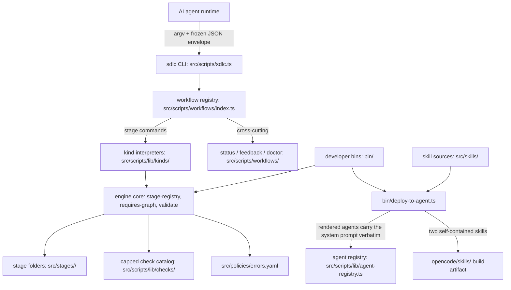

# architecture.md

## Tech Stack

<!-- docs-gen:begin id="architecture-tech-stack" -->
| Layer | Technology | Version | Evidence |
| --- | --- | --- | --- |
| Schema validation | ajv + ajv-formats | ^8.20.0 / ^3.0.1 | src/scripts/lib/schema.ts |
| Test runner | node --test (built-in) | — | package.json (scripts) |
| Runtime | Node.js | >=20 | package.json (engines) |
| Bundling | tsup (single ESM entry, noExternal) | ^8.5.1 | tsup.config.ts |
| Language | TypeScript (ESM, strict) | ^7.0.2 | tsconfig.json |
| Config/artifact format | YAML | ^2.5.1 | src/scripts/lib/yaml-io.ts |
<!-- docs-gen:end id="architecture-tech-stack" -->

## Component Boundaries

## Folder Responsibilities

| Folder | Declared Role | Actual Exports/Entry | Mismatch? | Evidence |
|--------|-------------------|----------------------|-----------|----------|
| src/scripts/ | CLI runtime: dispatch, workflow resolution, envelope | src/scripts/sdlc.ts (npm bin `sdlc`) | No | package.json, src/scripts/sdlc.ts |
| src/scripts/lib/ | Engine core: discovery, requires-DAG + acceptance gate, validation orchestrator, artifact-path resolver, step machine, delegation-directive composer, agent registry + kind permission contracts + prompt markers, help contract (usage + flags maps + closed-vocabulary guard) | stage-registry.ts, requires-graph.ts, validate.ts, artifact-paths.ts, agent-registry.ts, agent-permissions.ts, agent-prompt-marker.ts, delegation.ts, help.ts | No | src/scripts/lib/ |
| src/scripts/lib/checks/ | Capped catalog of eleven named generic structural checks; array selections address nested collections through segment([].segment)* path selectors resolved by the shared artifact-path resolver | index.ts catalog | No | src/scripts/lib/checks/index.ts, src/scripts/lib/artifact-paths.ts |
| src/scripts/lib/kinds/ | Four kind interpreters (authoring, review, tasks, aggregator); the authoring creation path evaluates the acceptance gate (evaluateGate reused; blocked STAGE_GATE_BLOCKED envelope, no artifact written) and instantiates artifacts without predecessor-version stamping (baseVersion helper and init step predicates removed) | authoring.ts, review.ts, tasks.ts, aggregator.ts | No | src/scripts/lib/kinds/ |
| src/scripts/lib/deploy/platforms/ | Deployment-layer platform renderer registry: platform + version → renderer (directory, naming, frontmatter, permission translation) | index.ts (getRenderer), opencode.ts (v1/v2) | No | src/scripts/lib/deploy/platforms/ |
| src/scripts/workflows/ | Cross-cutting commands (changes inventory, status, feedback, doctor) + single skillManifest | index.ts (resolveWorkflow, listWorkflows), changes.ts (read-only changes inventory — also the skill's change-identification surface) | No | src/scripts/workflows/index.ts |
| src/stages/ | Structural source of truth: 9 stage folders, declarative config | stage.yaml per folder (5 authoring/tasks, 4 review) | No | src/stages/ |
| src/agents/ | Agent definitions: one YAML file per agent, discovered by scan, validated by the engine-owned agent meta-schema | <agent-id>.yaml per agent (6 shipped) | No | src/agents/, src/schemas/agent.schema.yaml |
| src/skills/ | Version-controlled skill sources: knowledge-init (deployed) + agent-audit and improvement-review (dev-only, excluded from the deployed bundle); improvement-review is the first dev-only skill to bundle scripts (four deterministic helpers under scripts/) | src/skills/knowledge-init/SKILL.md, src/skills/agent-audit/SKILL.md, src/skills/improvement-review/SKILL.md + scripts/ | No | src/skills/ |
| src/policies/ | YAML asset layer: single central policy | src/policies/errors.yaml | No | src/policies/ |
| src/schemas/ | YAML asset layer: meta-schemas; the agent.schema.yaml model enum is live-endpoint-fed (sorted opencode/<id> qualifications from GET http://opencode.ai/zen/go/v1/models, migrated from opencode-go/*) rather than hand-maintained | stage.schema.yaml, agent.schema.yaml, cli-envelope.schema.yaml, docs-delta.schema.yaml | No | src/schemas/ |
| bin/ | Developer CLI tooling: validation, lint, deployment | deploy-to-agent.ts, lint-artifact.ts, validate-{schemas,policies,templates}.ts | No | bin/ |
| test/ | Unit + e2e suites | node --test test/unit, test/e2e | No | package.json (scripts) |
| docs/current/ | Living docs, created only by knowledge-init, maintained by direct change-time updates (one per code change, AGENTS.md §3) and knowledge extraction | 9 documents; the routing map lives in AGENTS.md §4 | No | src/skills/knowledge-init/SKILL.md, AGENTS.md §3, §4 |

## Integration Points

| Boundary | Caller | Callee | Protocol | Evidence |
|----------|--------|--------|----------|----------|
| Agent ↔ CLI | AI agent | sdlc CLI | argv in; frozen 7-field JSON envelope out | src/schemas/cli-envelope.schema.yaml, src/scripts/sdlc.ts |
| Deploy → runtime | bin/deploy-to-agent.ts | .opencode/skills/ | file copy + manifest.json per skill | bin/deploy-to-agent.ts |
| Deploy → agents | bin/deploy-to-agent.ts | <dest>/agents/<agent-id>.md | renderer per platform/version; v2 file-write permissions carry path-scoped deny rules for docs/changes/** (change artifacts are modified only via the CLI); skills stay platform-uniform | bin/deploy-to-agent.ts, src/scripts/lib/deploy/platforms/ |
| Deploy → agent prompts | loadAgentRegistry | rendered agent file body | no composition — renderers emit the agent's system_prompt verbatim from the YAML, with the output-discipline text carried inline per agent | src/scripts/lib/agent-registry.ts, src/scripts/lib/deploy/platforms/opencode.ts |
| Skill source → deploy | bin/deploy-to-agent.ts | src/skills/knowledge-init/SKILL.md | file copy (fail names missing source) | bin/deploy-to-agent.ts |
| CLI → stage config | kind interpreters | src/stages/<id>/*.yaml | YAML load at startup | src/scripts/lib/stage-registry.ts |
| Validation layers | validateArtifact | ajv (schema) → named checks → semantic checklist → review gate | function call, single orchestrator | src/scripts/lib/validate.ts |
| Check declarations → artifact paths | named structural checks + next-id allocation | src/scripts/lib/artifact-paths.ts (shared resolver) | segment([].segment)* path specs resolved against the artifact document; malformed paths abort validation against the stage schema; planning validates tasks[].acceptance_ids through path-addressed ref-exists into the nested per-requirement criteria arrays; next_ids specs accept string or string[] | src/scripts/lib/artifact-paths.ts, src/scripts/lib/checks/, src/scripts/lib/ids.ts |
| Lint → validation | bin/lint-artifact.ts | validateArtifact | same path as internal finalize | bin/lint-artifact.ts |

## Module Import Edges

Local ESM import edges between repo modules, resolved from relative specifiers by a static scan (generated; interactive exploration belongs to codegraph):

<!-- docs-gen:begin id="architecture-import-graph" -->
| From (module) | To (module) | Import edges |
| --- | --- | --- |
| bin/ | src/scripts/lib/ | 21 |
| bin/ | src/scripts/lib/checks/ | 1 |
| bin/ | src/scripts/lib/deploy/platforms/ | 1 |
| bin/ | src/scripts/lib/docs-gen/ | 2 |
| bin/ | src/scripts/lib/docs-gen/providers/ | 1 |
| bin/ | src/scripts/workflows/ | 1 |
| src/scripts/ | src/scripts/lib/ | 2 |
| src/scripts/ | src/scripts/workflows/ | 1 |
| src/scripts/lib/ | src/scripts/lib/ | 42 |
| src/scripts/lib/ | src/scripts/lib/checks/ | 1 |
| src/scripts/lib/ | src/scripts/lib/kinds/ | 1 |
| src/scripts/lib/checks/ | src/scripts/lib/ | 20 |
| src/scripts/lib/checks/ | src/scripts/lib/checks/ | 22 |
| src/scripts/lib/deploy/platforms/ | src/scripts/lib/ | 3 |
| src/scripts/lib/deploy/platforms/ | src/scripts/lib/deploy/platforms/ | 2 |
| src/scripts/lib/docs-gen/ | src/scripts/lib/ | 1 |
| src/scripts/lib/docs-gen/ | src/scripts/lib/docs-gen/ | 10 |
| src/scripts/lib/docs-gen/providers/ | src/scripts/lib/ | 4 |
| src/scripts/lib/docs-gen/providers/ | src/scripts/lib/checks/ | 1 |
| src/scripts/lib/docs-gen/providers/ | src/scripts/lib/docs-gen/ | 23 |
| src/scripts/lib/docs-gen/providers/ | src/scripts/lib/docs-gen/providers/ | 8 |
| src/scripts/lib/kinds/ | src/scripts/lib/ | 57 |
| src/scripts/lib/kinds/ | src/scripts/lib/docs-gen/ | 1 |
| src/scripts/lib/kinds/ | src/scripts/lib/kinds/ | 4 |
| src/scripts/workflows/ | src/scripts/lib/ | 32 |
| src/scripts/workflows/ | src/scripts/lib/kinds/ | 1 |
| src/scripts/workflows/ | src/scripts/workflows/ | 5 |
| src/skills/improvement-review/scripts/ | src/skills/improvement-review/scripts/ | 1 |
<!-- docs-gen:end id="architecture-import-graph" -->