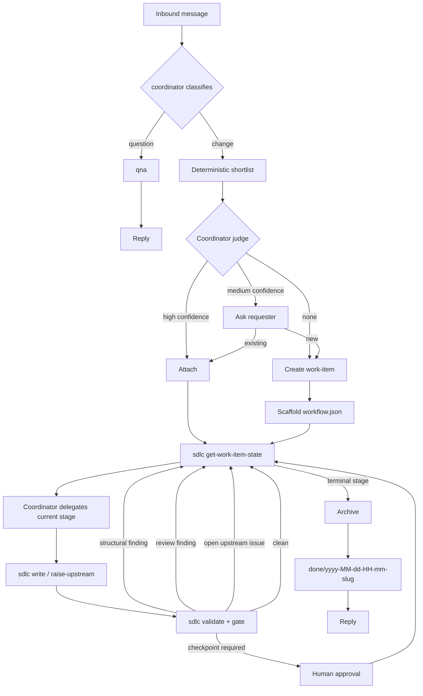

# Specification — Agentic SDLC Toolkit (v0.9.2)

## 1. Purpose

A portable-enough set of agents, skills, and one deterministic CLI that lets a software project be managed end-to-end by AI coding agents — intake, triage, work-item lifecycle, question-answering — with a human able to step in at declared checkpoints but not required to drive.

Load-bearing invariant: **no hidden state**.

The work-item's current state is derived from versioned artifacts plus the work-item's versioned workflow definition. Non-derivable control state lives in `workflow.json`, which is itself versioned. No session memory is required for resumption. No un-versioned scratch state participates in workflow decisions. The system is cold-resumable.

Two commitments:

* **Structure only what must be checked.** Relational fields such as IDs, references, revisions, stage relationships, and workflow definitions are structured so deterministic validation can walk them. Content fields remain prose.
* **Mechanical and semantic findings are separate.** Structural defects are automatically blocking and non-negotiable. Semantic judgment belongs to the reviewer.

### 1.1 Data-driven workflow invariant

The workflow engine has **no built-in knowledge of stage names**.

`deriveWorkItemState` MUST NOT contain literals such as:

* `requirements`
* `design`
* `planning`
* `implementation`
* `archive`

A work-item may instead use stages named `specification`, `architecture`, `build`, `verify`, `release`, or any other valid stage IDs.

Changing a stage name, artifact filename, or workflow shape must require configuration/data changes only, not CLI code changes.

### 1.2 Normative language

In this document:

* **MUST** means a required implementation contract.
* **SHOULD** means a strong default that may be changed only with an explicit recorded decision.
* **MAY** means optional.

Where this document and another document disagree, the contract in this document is authoritative until superseded by a versioned amendment.

---

## 2. Problem Statement

Ad-hoc agent use produces four recurring failures:

1. context bloat,
2. untracked work,
3. inconsistent rigor,
4. state that lives only in a session.

A fifth failure is the presence of artifacts that look structured but are never checked: cycles, orphaned requirements, dangling references, stale revisions, and nominal traceability can survive review and surface during implementation.

The toolkit addresses these by separating:

* durable artifacts from session context,
* deterministic validation from semantic review,
* workflow definition from workflow execution,
* stage names from stage semantics.

---

## 3. Goals / Non-Goals

### Goals

**G1.** A coordinator classifies inbound messages as question or change and routes them.

**G2.** A durable filesystem lifecycle exists under `docs/work-items/`.

**G3.** One deterministic CLI (`sdlc`) performs all mechanical operations.

**G4.** Agent, skill, command, and tool-adapter definitions are authored for OpenCode.

**G5.** Installation is within OpenCode configuration (project-local by default; user-global may be supported); there is no shared service.

**G6.** Workflow selection is data-driven and recorded with rationale.

**G7.** Type is tracked independently of workflow.

**G8.** Graph-level artifact integrity is mechanically validated: cycles, orphans, dangling references, revision staleness, and invalid workflow references.

**G9.** The deterministic CLI has a single external runtime dependency: Node.

**G10.** Different work-items may use different stage arrays.

**G11.** A stage may be renamed, replaced, omitted, or reordered according to workflow rules without changing CLI code.

**G12.** Work-item state derivation is a pure function of the stage registry, workflow definition, and versioned work-item artifacts.

**G13.** OpenCode agents can be restricted to the tools and subagents required by their role.

**G14.** Human approval is not an agent capability.

### Non-Goals

**NG1.** Multi-repo orchestration.

**NG2.** Portability to platforms other than OpenCode in v1.

**NG3.** Parallel work-items within one repository.

**NG4.** A GUI.

**NG5.** Per-field lineage. `based_on` remains per artifact.

**NG6.** Compilers or canonical-source tooling. Deferred until a second target exists.

**NG7.** A machine-maintained navigation index for work-items or living documents.

---

## 4. Glossary

| Term              | Definition                                                                                                   |
| ----------------- | ------------------------------------------------------------------------------------------------------------ |
| Coordinator       | Primary agent that classifies requests, matches/creates work-items, selects workflows, and delegates stages. |
| Work-item         | A unit of change under `docs/work-items/<slug>/`.                                                            |
| Workflow          | The ordered stage sequence assigned to one work-item. Stored in `workflow.json`.                             |
| Stage             | One executable unit in a workflow. Its behavior is defined by the stage registry.                            |
| Stage registry    | `.opencode/tools/sdlc/config/stages.yaml`; defines stage semantics once.                                     |
| Workflow template | Optional named workflow in `.opencode/tools/sdlc/config/workflows.yaml`; used only to propose an initial stage array. |
| Type              | Registry-driven work category, independent of workflow.                                                      |
| Stage artifact    | A machine artifact produced by a stage through `sdlc_write`. Author and review stage artifacts are the two kinds. |
| Control artifact  | A machine or narrative file that is not produced by a stage: `workflow.json`, `init.md`, `upstream-issues.json`, approval artifacts, and terminal completion artifacts. |
| Artifact          | Umbrella term covering both stage artifacts and control artifacts.                                           |
| Review            | A stage that evaluates another stage's artifact against a semantic checklist.                                |
| Gate              | A review completion condition. In v1: `findings.length == 0`.                                                |
| Finding           | Blocking defect.                                                                                             |
| Observation       | Non-blocking reviewer note.                                                                                  |
| Upstream issue    | A finding raised by a later stage against an earlier author stage.                                           |
| `based_on`        | Per-artifact map of upstream stage artifact revisions observed when the artifact was authored.               |
| Checkpoint        | Human approval required before a stage may execute.                                                          |
| Terminal stage    | Stage whose completion represents the end of the workflow, normally by creating an audit artifact and moving the work-item to `done/`. A workflow MUST end with a terminal stage. |
| `WorkItemState`   | The structured, derived result of the state-derivation function. It contains `status`, `stage`, and `reason`. It is a container, not a status. |
| `WorkItemState.status` | The derived discriminant field: `uninitialized`, `invalid`, `active`, `blocked`, `abandoned`, or `done`. |
| Persisted status  | The `status` field stored in `workflow.json`: `active` or `abandoned`.                                        |
| `deriveWorkItemState` | The pure core function: `(derivation_input) -> WorkItemState`. No I/O, path resolution, config loading, model calls, or writes. |
| `getWorkItemState` | The CLI/agent facade: `(slug) -> WorkItemState`. Resolves repository, work-item location (including `done/`), and stage registry, then delegates to `deriveWorkItemState` for live work-items. |
| `workflow.json`   | Versioned work-item control artifact containing workflow, status, type, history, freeze state, and reasons.  |

---

## 5. Contract priorities and invariants

This document is the normative project contract. Implementation detail belongs in `implementation.md`, the source tree, and tests; this document defines the boundaries that those artifacts MUST preserve.

The load-bearing contracts are:

1. canonical source and deployed OpenCode package are separate;
2. work-item state is cold-resumable and derives only from versioned work-item data plus an explicitly recorded registry/config snapshot;
3. workflow behavior is data-driven and contains no stage-name semantics in CLI code;
4. mechanical validation and semantic review remain separate;
5. human approval, abandonment, and post-freeze workflow amendment are human terminal operations;
6. one deterministic Node toolkit runtime performs all mechanical operations;
7. agents use the OpenCode adapter but do not become a second workflow runtime;
8. deployed files are generated from canonical source and are never edited as the source of truth.

**Implementation changes MUST NOT alter normative behavior or invariants without a corresponding specification amendment. Implementation details MAY change freely when the specification remains satisfied.**

---

## 6. OpenCode capability baseline

The v1 architecture is aligned with OpenCode capabilities in the pinned supported version range.

Pinned contract:

```text
supported_opencode_version: ">=1.0.0 <2.0.0"
opencode_config_schema: "opencode/v2"
```

Phase 0 MUST verify the exact tested release before implementation proceeds.

### 6.1 Agents and subagents

OpenCode supports primary agents and subagents. Primary agents can invoke subagents through the Task mechanism, and task permissions can restrict which subagents are available to a given agent. Custom agents can define their own models, prompts, and permissions.

Therefore:

* `coordinator` is a primary agent.
* `author`, `stage-reviewer`, and `archiver` are subagents.
* The coordinator's subagent permission is limited to those agents.
* The workflow engine chooses *which stage* to run; the registry chooses *which actor* handles that stage.

No custom SDK-based subagent orchestration is required for v1.

### 6.2 Permissions

OpenCode permissions restrict tools and subagents by role.

The toolkit requires:

* agents cannot use `sdlc_approve` or `sdlc_abandon`;
* reviewer agents cannot edit project files;
* stage agents cannot invoke arbitrary subagents;
* direct machine-artifact writes use `sdlc_write`;
* `sdlc_amend_workflow --stage` is callable by the coordinator only, and only when the current stage is the configured workflow-authoring stage and the workflow is not frozen;
* after freeze, workflow amendment requires the human terminal path;
* terminal execution is performed by the coordinator through the deterministic CLI; it is not delegated to a separate script agent.

These are access controls, not cryptographic identity guarantees.

### 6.3 Direct agent writes

Agents MAY edit code when required by their stage. Agents MUST NOT directly write work-item machine artifacts. The normal path for machine artifacts is `sdlc_write`.

This is enforced by:

1. OpenCode permission hardening for normal operation,
2. deterministic validator detection of out-of-band changes.

It is not an absolute security boundary. If an implementation agent has shell access, it can potentially modify files. The validator MUST detect schema, revision, and `based_on` inconsistencies caused by out-of-band writes.

### 6.4 Runtime boundary

The deterministic toolkit CLI remains Node/TypeScript.

OpenCode's `.opencode` adapter layer is TypeScript/JavaScript because that is OpenCode's native custom-tool mechanism. The adapter is not a second workflow runtime; it is an integration layer that invokes the Node CLI.

Runtime invariant:

> **One deterministic toolkit runtime: Node. OpenCode-native adapter code may use OpenCode's supported TypeScript/JavaScript tool mechanism.**

---

## 7. Roles & actors

| Actor                   | Type          | Responsibility                                                                 |
| ----------------------- | ------------- | ------------------------------------------------------------------------------ |
| Stakeholder / developer | Human         | Sends requests, answers classification/matching questions, performs approvals and abandonments. |
| coordinator             | Primary agent | Classifies, matches/creates work-items, proposes workflow, delegates stages.   |
| author                  | Subagent      | Authors the artifact for its assigned stage.                                   |
| stage-reviewer          | Subagent      | Reviews the artifact for its assigned review stage.                            |
| archiver                | Subagent      | Keeps `docs/current/` up to date; invokes archive mechanics.                   |
| script                  | Deterministic | Runs a terminal or mechanical stage handler.                                   |

### 7.1 Actor enum

The stage registry `actor` field MUST be one of:

```text
author
stage-reviewer
script
```

The coordinator is not a stage actor. It delegates agent stages and invokes deterministic `script` stages through the CLI.

The archiver is not a stage actor. It is a subagent invoked by the coordinator through the `archive-work-item` skill before a terminal archive operation.

`script` actors are only valid for mechanical or terminal stages. A terminal `script` stage MUST declare a supported `terminal.command` and `completion_file`.

### 7.2 Skills

Skills are invoked by agents and are not workflow actors.

* `qna` — stateless Q&A over the codebase or web. No work-item writes.
* `work-item-scaffold` — chooses slug, summary, type, and initial workflow proposal; invokes scaffolding script.
* `archive-work-item` — coordinates living-document decisions and invokes archive mechanics.

### 7.3 Agent properties

| Agent          | Persona                     | Responsibility                                                                   |
| -------------- | --------------------------- | -------------------------------------------------------------------------------- |
| coordinator    | Router, classifier, matcher | Classifies, matches/creates work-items, proposes workflow, delegates stages.     |
| author         | Technical author/engineer   | Authors the artifact for its assigned stage.                                     |
| stage-reviewer | Adversarial reviewer        | Reviews the artifact for its assigned review stage.                              |
| archiver       | Librarian                   | Keeps `docs/current/` up to date; invokes `sdlc archive`.                        |

The deployed per-agent permissions — allowed tools, denied tools, and subagent restrictions — are in §20.8.

### 7.4 No self-review

The registry MUST NOT allow the same stage invocation to review its own output.

A review stage declares its target stage explicitly:

```yaml
review:
  target: build
```

The validator rejects a review stage whose target is itself.

### 7.5 Approval authenticity

No agent is granted the `sdlc_approve` custom tool. No agent is granted the `sdlc_abandon` tool.

`sdlc approve` and `sdlc abandon` remain human terminal operations.

For additional protection:

* agent profiles deny the `sdlc_approve` and `sdlc_abandon` tools,
* coordinator and reviewer agents do not receive shell access,
* implementation agents receive only the shell access required by the repository and explicitly deny the `sdlc approve` and `sdlc abandon` command patterns,
* `sdlc approve` and `sdlc abandon` require an interactive terminal,
* the CLI records the approving or abandoning identity and exact current revisions.

This is an agent-access boundary, not a claim of cryptographic human identity.

### 7.6 Archiver scope

The archiver keeps project documentation current when decisions, capabilities, glossary entries, or other durable knowledge change as a result of the work-item.

The archiver MAY:

* read the work-item and the repository,
* create, edit, or delete files under `docs/current/`,
* invoke `sdlc archive` to move the work-item to `docs/work-items/done/yyyy-MM-dd-HH-mm-<slug>/`.

The archiver MUST NOT:

* edit code,
* edit any project file outside `docs/current/`,
* approve, amend a workflow, abandon, or write work-item machine artifacts.

Documentation edits are the archiver's own semantic judgment; the deterministic `sdlc archive` command performs only the mechanical move and the `archive.md` bookkeeping.

---

## 8. Workflow model

### 8.1 Workflow is per work-item

Every work-item contains its own workflow definition:

```json
{
  "revision": 1,
  "status": "active",
  "type": "feature",
  "stages": [
    "define",
    "define-review",
    "design",
    "design-review",
    "plan",
    "plan-review",
    "build",
    "build-review",
    "release"
  ],
  "freeze_after": "define",
  "frozen_at": null,
  "workflow_authoring_stage": "define",
  "stage_rationale": "External dependency and architectural boundary require design review."
}
```

This is the source of truth.

Two work-items may have completely different workflows:

```json
{
  "stages": [
    "specification",
    "specification-review",
    "build",
    "verify",
    "release"
  ]
}
```

and:

```json
{
  "stages": [
    "incident-intake",
    "mitigation",
    "verification",
    "release"
  ]
}
```

No CLI code changes are required.

### 8.2 Stage registry

The registry defines stage semantics, not workflows.

The names used in examples are examples only. A project can define its own stage IDs. `deriveWorkItemState` treats all registry-defined stages identically.

### 8.3 Stage semantics

A stage may declare:

* actor,
* prompt template,
* artifact file,
* artifact schema,
* upstream stage inputs,
* review target,
* review checklist,
* review rework target,
* checkpoint requirement,
* terminal handler,
* completion mode,
* workflow-authoring permission.

`workflow.json.type` MUST resolve to a type declared in `types.yaml`. Type semantics are registry data and are not inferred from stage names.

No workflow semantics are encoded in the stage name.

### 8.4 Completion modes

A stage MUST declare one of:

```text
artifact
review_gate
terminal
```

`artifact` stages complete when their artifact exists, validates, and is not stale.

`review_gate` stages complete when the latest round for the review artifact clears the gate.

`terminal` stages complete when their terminal handler has run and the work-item has been moved to `done/`.

### 8.5 Workflow templates

Named workflow templates are optional.

If present, the selected workflow is copied into `workflow.json`.

After scaffold, `workflow.json` is authoritative. Changing `workflows.yaml` does not silently change an existing work-item.

A work-item may also use a custom stage array not present in `workflows.yaml`.

### 8.6 Freeze timing

`freeze_after` names a stage ID or is `null`.

* If `freeze_after` is `null`, the workflow is frozen at scaffold time.
* Otherwise, the workflow freezes immediately when that stage's completion condition becomes satisfied.

When the current stage is the configured freeze point and its completion condition is satisfied, `sdlc_write` (or the deterministic operation that completes that stage) updates `workflow.json.frozen_at` in the same transaction as the completion change. State derivation never writes `frozen_at`.

A freeze point MUST be at or after the workflow-authoring stage. If `freeze_after` is `null`, `workflow_authoring_stage` MUST also be `null` because the workflow is frozen at scaffold time. If an authoring stage is configured, it MUST occur at or before `freeze_after`.

There is no ambiguity about whether a following review delays the freeze: the freeze point is the configured stage's own completion.

### 8.7 Terminal reachability

A workflow MUST end with a terminal stage. Workflow validation rejects a stage array whose last stage does not have `completion.mode: terminal`.

This is validated:

* at scaffold time, before `workflow.json` is written;
* at every `sdlc amend-workflow` invocation, before the amendment is committed.

A workflow that fails this check is not written. If an invalid workflow is somehow present on disk, `sdlc validate` reports a workflow-global finding and `deriveWorkItemState` returns `invalid`.

### 8.8 Workflow amendment

Before freeze, the coordinator may amend the workflow only while the current stage equals `workflow_authoring_stage`. The amendment is made on behalf of the workflow-authoring stage; the stage agent itself does not receive the amendment tool.

An amendment may change:

* stage array,
* type,
* stage rationale,
* freeze point.

Every amendment:

1. increments `workflow.json.revision`;
2. appends one `stage_history` entry containing the complete resulting workflow fields and a reason;
3. recomputes and records the registry/config snapshot;
4. is validated before commit.

After freeze, the stage array is immutable by ordinary execution. A human may explicitly amend through `sdlc amend-workflow --human`; the amendment is recorded in `stage_history` and the registry/config snapshot is refreshed.

There is no silent insertion of a stage by a later stage.

### 8.9 `sdlc amend-workflow` authorization

Grammar:

```text
sdlc amend-workflow <slug> \
  --stages <json-file> \
  --freeze-after <stage|null> \
  --reason <text> \
  [--type <type>] \
  [--stage <stage-id> | --human]
```

If `--stage` is supplied:

1. the workflow MUST not be frozen;
2. `--stage` MUST equal the current stage;
3. `--stage` MUST equal `workflow_authoring_stage`;
4. the coordinator identity is recorded as the actor performing the amendment.

Otherwise the command exits with authorization failure (exit 4) or current-state conflict (exit 5) as applicable.

If `--human` is supplied:

1. an interactive TTY MUST be present;
2. the command is allowed before or after freeze;
3. the human identity is recorded in `stage_history`.

If neither is supplied, the command fails with invalid invocation (exit 2).

### 8.10 Multiple live work-items

A repository MAY contain multiple non-archived work-items. There is no one-active-pipeline restriction in v1.

Each work-item has its own `workflow.json`, workflow revision, registry/config snapshot, and state. Repository-level mutation locking applies to individual work-item operations; it does not serialize unrelated work-items.

Matching therefore remains meaningful across multiple live work-items, and two work-items MAY use different stage arrays concurrently.

---

## 9. Request flow



The flow does not assume any particular stage name.

---

## 10. Coordinator decision logic

### 10.1 Classification

* Question: seeks information and does not request repository modification.
* Change: requests modification or identifies itself as feature, bugfix, refactor, improvement, incident remediation, etc.
* Ambiguous: ask one clarifying question.
* Classification questions MUST NOT elicit requirements, acceptance criteria, scope, or design.

Those belong to workflow stages.

### 10.2 Work-item matching

Matching is deliberately two-step.

1. Deterministic shortlist:

   * search `docs/work-items/*/init.md`,
   * inspect frontmatter and summary,
   * exclude `done/`.
2. Coordinator judges the shortlist.

| Confidence | Behavior                 |
| ---------- | ------------------------ |
| High       | Attach automatically.    |
| Medium     | Ask requester to choose. |
| Low / none | Create a new work-item.  |

No LLM is invoked over the entire work-item corpus.

### 10.3 Workflow selection

The coordinator proposes:

* type,
* stage array,
* freeze point,
* rationale,
* workflow-authoring stage if any.

The coordinator may select a named workflow template or construct a custom stage array from the registry.

The coordinator MUST NOT infer workflow behavior from stage names.

The workflow engine only validates that every stage ID exists and that the stage contracts form a valid sequence.

### 10.4 Workflow amendment before freeze

Before freeze, the coordinator may amend the workflow on behalf of the designated workflow-authoring stage through `sdlc amend-workflow --stage`. After freeze, only the human terminal path may amend.

---

## 11. Work-item state derivation

### 11.1 Two-layer contract

State derivation has a CLI facade and a pure core:

```text
getWorkItemState(slug) -> WorkItemState

deriveWorkItemState(input) -> WorkItemState
```

The facade performs I/O. It resolves the repository and work-item, loads the recorded workflow, registry, artifacts, approvals, upstream issues, and policy snapshot, verifies that the installed registry matches the recorded registry hash, then passes those parsed values to the pure core.

The pure core performs no I/O, path resolution, configuration loading, model calls, or writes. It consumes only the explicit `DerivationInput` supplied by the facade.

If the work-item is under `docs/work-items/done/`, the facade returns `done` without invoking the core.

### 11.2 Derivation input

The pure core receives an explicit immutable input containing:

```text
workflow
registry snapshot
policy snapshot
stage artifacts
review artifacts
upstream issues
approvals
terminal completion evidence
```

The policy snapshot contains the resolved values that affect derivation, including `review.max_rounds` and `review.max_open_upstream_issues`. The workflow records the SHA-256 hash of the registry snapshot used for the work-item.

This makes state derivation deterministic without making the core responsible for filesystem or configuration access.

### 11.3 Purity and no hidden state

`deriveWorkItemState` MUST:

* perform no I/O;
* perform no writes;
* perform no model calls;
* contain no workflow-specific stage-name assumptions;
* use only the explicit derivation input.

A work-item is therefore cold-resumable from its versioned artifacts plus the registry/config snapshot recorded in `workflow.json`. If the installed registry does not match the recorded hash, derivation returns `invalid` rather than silently changing the meaning of an in-flight work-item.

`getWorkItemState` performs reads only.

### 11.4 Status separation

Persisted workflow status is:

```text
active
abandoned
```

Derived status is:

```text
uninitialized
invalid
active
blocked
abandoned
done
```

`blocked` is derived when the review round cap is exhausted. It is not persisted.

`done` is produced only by the facade when the work-item is located under `docs/work-items/done/`.

### 11.5 State type

```ts
type WorkItemState =
  | { status: "uninitialized"; stage: null; reason: "workflow.json absent" }
  | { status: "invalid"; stage: null; reason: string }
  | { status: "abandoned"; stage: null; reason: string }
  | { status: "blocked"; stage: null; reason: string }
  | { status: "active"; stage: StageId; reason: ActiveReason }
  | { status: "done"; stage: null; reason: "all workflow stages complete" };
```

`stage` is non-null only for `active` state.

### 11.6 Bootstrap behavior

If `workflow.json` does not exist, the facade returns:

```json
{
  "status": "uninitialized",
  "stage": null,
  "reason": "workflow.json absent"
}
```

It MUST NOT infer a stage.

### 11.7 Derivation precedence

1. archived location -> `done` (facade only);
2. missing workflow -> `uninitialized`;
3. invalid workflow, registry hash, or policy snapshot -> `invalid`;
4. persisted `abandoned` -> `abandoned`;
5. blocking structural/schema finding -> `invalid` or the active stage implicated by the finding, according to the validator contract;
6. open upstream issue -> earliest valid target stage;
7. walk workflow stages using their declared completion mode:
   * checkpoint absent/stale -> `active` at the checkpoint stage;
   * artifact absent -> `active` at that stage;
   * stale declared input -> `active` at that stage;
   * review absent/stale -> `active` at the review stage;
   * closed review gate with rounds remaining -> `active` at its declared rework stage;
   * closed review gate at the round cap -> `blocked`;
   * incomplete terminal stage -> `active` at the terminal stage;
8. a valid workflow that reaches its terminal completion is expected to be moved to `done/`; a live work-item with completed terminal evidence but no move returns `active` with `terminal_recovery_required`.

The validator MUST NOT also report normal lifecycle conditions such as `artifact_absent`, `awaiting_approval`, `review_stale`, or `terminal_pending` as structural findings. Those are state conditions consumed by derivation.

### 11.8 Core algorithm

The pure core walks the workflow's stage IDs in order and evaluates each stage using only the registry semantics and explicit input data. It never reads a path or resolves a configuration key. Unknown completion modes, missing registry entries, invalid references, or malformed workflow structures are invalid inputs and yield `invalid`.

The CLI facade is responsible for assembling the input and for archived-path handling. The implementation MUST test the facade and core against the same fixtures.

### 11.9 Freeze

Freeze is an explicit workflow mutation performed by the operation that completes the configured freeze point. The pure core only observes `frozen_at` and validates that post-freeze amendments are authorized.

### 11.10 Invariants

1. Every workflow stage ID exists in the recorded stage registry.
2. Every stage appears at most once in a workflow.
3. Every review target is earlier than the review stage and is an author stage.
4. Every review rework target exists in the workflow.
5. Every declared artifact input exists in the workflow and precedes its consumer.
6. `reviewed_revision <= target_artifact.revision`.
7. `based_on` cannot claim revisions newer than the referenced artifact.
8. A frozen workflow cannot be changed except through the explicit amendment operation.
9. An unparseable artifact is a blocking validation finding, not an absent artifact.
10. CLI writes are atomic or journaled.
11. State derivation performs no writes.
12. A terminal stage is not `done` until the facade observes the work-item under `docs/work-items/done/`.
13. `WorkItemState.stage` is null unless `status == "active"`.
14. A workflow MUST end with a terminal stage.

---

## 12. Upstream issues and `based_on`

### 12.1 Raising

Any author or reviewer stage may raise an upstream issue.

```json
{
  "id": "UP-001",
  "raised_by_stage": "build-review",
  "raised_at": "...",
  "target_stage": "design",
  "target_artifact": "design.json",
  "target_revision_seen": 1,
  "text": "...",
  "status": "open",
  "resolution": null,
  "supersedes": null
}
```

`upstream-issues.json` is created on the first `raise-upstream` call. Before that, its absence is equivalent to `{ "issues": [] }`.

The CLI validates that:

* target stage exists,
* target stage is earlier,
* target stage is an author stage,
* target artifact matches the registry,
* open issue count does not exceed the configured cap.

The cap counts open issues only. Resolved and superseded issues do not count.

### 12.2 Resolution

Only the target stage resolves an issue.

Resolution happens in the same logical operation as the artifact revision.

```json
{
  "status": "resolved",
  "resolution": {
    "resolved_by_revision": 2,
    "decision": "Updated the design to..."
  }
}
```

Never reopen an issue.

If the fix is inadequate, create a new issue with:

```json
{
  "supersedes": "UP-001"
}
```

If the superseded issue is still open, it is automatically closed with resolution:

```text
superseded by UP-002
```

A supersedes chain is allowed. The validator rejects cycles.

A target stage may have multiple open issues, subject to the cap.

### 12.3 `based_on`

Every author artifact carries:

```json
{
  "revision": 2,
  "based_on": {
    "design": 4
  }
}
```

The keys are stage IDs, not hardcoded filenames.

The CLI computes `based_on` from the stage registry.

If the registry says:

```yaml
artifact:
  inputs:
    - design
    - specification
```

the resulting artifact may contain:

```json
{
  "based_on": {
    "design": 4,
    "specification": 2
  }
}
```

The author does not choose these revisions.

`based_on` is a stage-ID to revision map everywhere. Markdown frontmatter uses the same shape:

```yaml
based_on:
  define: 1
```

Author artifacts MUST contain `based_on`. When the stage declares no inputs, `based_on` is `{}`.

### 12.4 Revision propagation

If `design` moves from revision 4 to revision 5, every later artifact whose `based_on.design == 4` becomes stale.

No propagation flag or counter is stored.

---

## 13. Reviews and gates

There are two review streams.

| Source    | Stream         | Blocks? |
| --------- | -------------- | ------- |
| Validator | `findings`     | Yes     |
| Reviewer  | `findings`     | Yes     |
| Reviewer  | `observations` | No      |

Gate:

```text
gate_cleared = findings.length == 0
```

Observations never count toward review rounds.

### 13.1 Review artifact

Every review artifact has its own revision.

```json
{
  "stage": "design-review",
  "revision": 2,
  "target": "design",
  "rounds": [
    {
      "round": 1,
      "reviewed_revision": 1,
      "findings": [
        {
          "id": "F-001",
          "check_id": "DR-005",
          "text": "...",
          "evidence": "..."
        }
      ],
      "observations": [
        {
          "id": "OB-001",
          "check_id": "DR-004",
          "text": "...",
          "evidence": "..."
        }
      ],
      "gate_cleared": false,
      "checks_answered": {
        "DR-001": "section ...",
        "DR-005": "absent"
      }
    }
  ]
}
```

The CLI owns:

* review artifact `revision`,
* round numbering,
* `reviewed_revision`,
* `gate_cleared`.

The reviewer supplies:

* `findings`,
* `observations`,
* `checks_answered`.

One `sdlc_write` call for a review stage creates exactly one round.

The latest round is the round with the highest `round` number.

Empty findings are valid and clear the gate.

Observations from prior rounds remain visible but do not affect the gate.

### 13.2 Validator checks for reviews

Validator checks:

* every checklist item is answered,
* reviewed revisions are monotone,
* `gate_cleared` matches `findings.length`,
* IDs are unique,
* referenced check IDs exist,
* review target matches the registry,
* review artifact target and checklist match the registry; role separation is enforced by agent permissions, not inferred from free-form identity,
* review artifact revision is monotone.

### 13.3 Round cap

`review.max_rounds` is a per-work-item policy value recorded in `workflow.json.policy_snapshot`.

When the latest review round is closed and the configured cap has been reached, derivation returns:

```json
{
  "status": "blocked",
  "stage": null,
  "reason": "max_rounds_reached"
}
```

The block is derived, not persisted. A new review round can be created only by the normal rework path; changing policy for an existing work-item requires an explicit workflow/policy amendment so that cold resumption remains deterministic.

### 13.4 `sdlc gate`

`sdlc gate <slug> <stage>` evaluates the current validator state for the target and the latest review round only.

A consistent result is:

```json
{
  "stage": "design-review",
  "target": "design",
  "gate_cleared": true,
  "validator_findings": [],
  "latest_round": {
    "round": 1,
    "reviewed_revision": 1,
    "findings": [],
    "observations": [],
    "gate_cleared": true
  },
  "blockers": []
}
```

The command does not alter workflow state.

---

## 14. Human terminal operations

Three operations are human-only: approval, abandonment, and post-freeze workflow amendment. None is exposed as an OpenCode agent tool.

### 14.1 Approval artifact

```json
{
  "stage": "build",
  "work_item": "add-oauth-login",
  "approver": "alice@example.com",
  "approved_at": "2026-09-15T15:00:00Z",
  "approval_type": "pre_stage",
  "workflow_revision": 2,
  "work_item_revision": {
    "define": 2,
    "plan": 1
  },
  "fingerprint_sha256": "...",
  "notes": "Approved after review."
}
```

### 14.2 Approval freshness

Approval freshness is computed, not interpreted.

```text
approval_fingerprint(stage, workflow, registry, work_item)
```

returns:

```json
{
  "workflow_revision": 2,
  "artifact_revisions": {
    "define": 2,
    "plan": 1
  }
}
```

`artifact_revisions` contains the revisions of all prior workflow stages that influence the approved stage. The default influence set is the transitive closure of the approved stage's declared `artifact.inputs`, computed over the workflow.

The approval is stale if:

* `workflow.json.revision` differs from `workflow_revision`, or
* any artifact revision differs from `artifact_revisions`.

The CLI computes `fingerprint_sha256` over the canonical JSON of the fingerprint object.

### 14.3 Approver identity

`sdlc approve` requires an interactive terminal.

Approver identity is obtained from `--approver <identity>` when supplied. If it is omitted, the CLI MAY use an environment- or platform-provided local identity; if no identity is available, approval fails. Git is not a runtime dependency.

### 14.4 Human-only path

`sdlc approve`:

1. confirms the stage is awaiting approval,
2. confirms the approval applies to the current fingerprint,
3. requires an interactive terminal,
4. records approver identity,
5. writes the approval artifact atomically.

No OpenCode agent receives the approval tool.

### 14.5 Abandonment

Abandoning a work-item is a human terminal operation. It records both the persisted status and an explicit abandonment object/history entry so that the decision is auditable.

`sdlc abandon <slug> --reason <text>`:

1. requires an interactive TTY; otherwise exits with authorization failure (exit 4),
2. requires the work-item to be live (not under `docs/work-items/done/`); otherwise exits with current-state conflict (exit 5),
3. requires `--reason`; otherwise exits with invalid invocation (exit 2),
4. records the abandoner identity,
5. sets `workflow.json.status` to `abandoned`,
6. sets `workflow.json.abandoned` to `{ "reason": "...", "at": "...", "by": "..." }`,
7. appends a `stage_history` entry,
8. increments `workflow.json.revision`.

No OpenCode agent is granted this tool. It is not exported by `tools/sdlc.ts`.

The operation is atomic. Re-abandoning an already-abandoned work-item is a no-op that returns the existing `workflow.json`.

---

## 15. Configuration

Runtime policy is stored in:

```text
.opencode/tools/sdlc/config.yaml
```

Example:

```yaml
qna:
  tool_call_ceiling: 20
  escalate_if_multiple_components: true

review:
  max_rounds: 3
  max_open_upstream_issues: 5
```

The values that affect an existing work-item are resolved at scaffold time and copied into `workflow.json.policy_snapshot`. Subsequent global/project configuration changes do not silently change an existing work-item.

`stages.yaml`, `types.yaml`, and the schemas/checks that participate in deterministic validation are covered by the recorded registry hash. A registry change requires a new installation/configuration snapshot and an explicit workflow amendment before an existing work-item can continue under the new registry.

Project-local and global installations are alternatives, not merged configuration sources. OpenCode resolution selects the active installation; that installation's config is used.

### 15.1 Installation scope and configuration precedence

Configuration resolution follows OpenCode's own tool resolution. Whichever installation OpenCode resolves determines the configuration:

* if the project-local `.opencode/tools/sdlc.ts` is resolved, the project-local `.opencode/tools/sdlc/config.yaml` is used;
* otherwise the global installation's config is used;
* built-in defaults apply only where the resolved config is silent.

Global and project configuration are never merged. They do not fall back to each other.

`sdlc doctor` reports a shadowed installation if one exists — for example, a global installation present when the project-local installation is active — as informational output only. Shadowing does not change resolution.

Work-item lifecycle data remains project-owned under `docs/work-items/`.

---

## 16. Repository layout (contract)

### 16.1 Work-items

```text
docs/
  work-items/
    <slug>/
      init.md
      workflow.json

      <stage artifact files defined by workflow>

      upstream-issues.json

      approvals/
        <stage>.json

      .sdlc.lock
      .sdlc-txn.json

    done/
      yyyy-MM-dd-HH-mm-<slug>/
        ...
        archive.md
```

There is deliberately **no `index.md`**.

The filesystem itself is the index.

### 16.2 Living documents

```text
docs/
  current/
    decisions/
    architecture/
    operations/
```

`docs/current/` is optional.

The archiver updates only living documents explicitly affected by the work-item.

There is no `docs/current/index.md`.

Agents can discover living documents through normal filesystem search and `rg`.

---

## 17. Artifact contracts

### 17.1 Common stage-artifact metadata

Every stage artifact MUST contain:

```json
{
  "revision": 1
}
```

Author stage artifacts MUST also contain:

```json
{
  "based_on": {}
}
```

Review stage artifacts MUST contain:

```json
{
  "stage": "design-review",
  "revision": 1,
  "target": "design",
  "rounds": []
}
```

The CLI computes `revision` and `based_on`. Callers do not choose them.

A machine artifact carries `revision` only when at least one mechanism in this document consumes it:

* author and review stage artifacts — required by §12.3, §12.4, §13.2;
* `workflow.json` — required by §14.2 approval freshness.

`init.md`, `upstream-issues.json`, and approval artifacts are control artifacts. Their schemas are defined in §17.2, §12.1, and §14.1 respectively, and none carries a file-level `revision`, because no mechanism consumes one.

### 17.2 `init.md`

Immutable after scaffold.

```markdown
---
slug: add-oauth-login
created_at: 2026-09-15T14:32:00Z
requester: alice@example.com
classification: change
summary: Add OAuth login
initial_type: feature
tags: [auth, oauth]
---

# Request

<verbatim inbound request>

# Coordinator notes

<intake notes>
```

No evolving state belongs here.

### 17.3 `workflow.json`

`workflow.json` is the versioned control artifact and MUST contain the fields required to resume the work-item deterministically:

```json
{
  "revision": 2,
  "status": "active",
  "type": "feature",
  "stages": ["define", "define-review", "build", "build-review", "release"],
  "freeze_after": "define",
  "frozen_at": "2026-09-15T15:00:00Z",
  "workflow_authoring_stage": "define",
  "stage_rationale": "...",
  "registry_sha256": "...",
  "policy_snapshot": {
    "review.max_rounds": 3,
    "review.max_open_upstream_issues": 5
  },
  "abandoned": null,
  "stage_history": []
}
```

`stage_history` entries record the resulting workflow, reason, timestamp, and actor identity. The history is audit data; current fields are authoritative for current execution.

The `abandoned` object is present only when status is `abandoned`.

The schema for `workflow.json` belongs in `config/schemas/`; this section defines only the load-bearing contract.

### 17.4 Author artifacts

Author artifacts contain:

```json
{
  "revision": 2,
  "based_on": {
    "design": 4
  }
}
```

The CLI computes both fields.

The author supplies the substantive content.

### 17.5 Domain artifact schemas

Domain artifact schemas are not embedded in this specification. They live under:

```text
.opencode/tools/sdlc/config/schemas/
```

A stage registry entry selects a schema by ID. The schema defines the domain fields; the common artifact contract defines only the machine metadata (`revision` and, for author artifacts, `based_on`).

For example, a project MAY define a `specification` schema containing requirements and acceptance criteria, but that vocabulary is not part of the workflow engine contract.

Schema-specific validator checks live beside the schema and MUST declare their input schema.

### 17.6 Approval artifact

See §14.1.

### 17.7 Built-in archive completion artifact (`archive.md`)

```markdown
---
archived_at: 2026-09-15T16:00:00Z
work_item: add-oauth-login
docs_updated:
  - doc: docs/current/decisions/0007-oauth.md
    change: created
    source_artifact: design.json
no_update_reason: null
---

# Summary

# Outcomes

# Follow-ups
```

If no living document changed:

```yaml
docs_updated: []
no_update_reason: "No durable living documentation was affected."
```

A built-in `archive.md` with neither is invalid.

---

## 18. Validator vs reviewer

### 18.1 Generic validator

The validator answers mechanically provable questions. It validates workflow structure, schemas, references, revisions, registry/config snapshot integrity, and artifact metadata.

Examples:

* every workflow stage ID exists;
* the workflow ends in a terminal stage;
* stage actors and completion modes are valid;
* review targets and rework targets are valid;
* declared artifact inputs exist and precede their consumer;
* `based_on` entries resolve and are not newer than their source revisions;
* artifact revisions are monotone;
* registry/config snapshot hashes are valid;
* required artifact metadata is present;
* IDs and declared references are unique and resolvable according to the schema/registry.

Lifecycle conditions such as "artifact not yet written", "awaiting approval", "review gate closed", and "terminal move pending" are state-derivation conditions, not validator findings.

### 18.2 Schema-specific validator

Schema-specific checks run only when the selected artifact schema declares them. They MUST be mechanically provable from the declared schema and artifact data.

Examples include acyclicity of an explicitly declared dependency graph and referential integrity of declared IDs. Substantive questions such as whether task coverage is adequate belong to the reviewer.

Generic checks live under `config/checks/generic/`; schema-specific checks live under `config/checks/schemas/<schema>.yaml`.

### 18.3 Finding schema

Every validator finding has:

```json
{
  "code": "...",
  "severity": "blocking",
  "stage": "...",
  "implicated_stage": "...",
  "path": "...",
  "message": "..."
}
```

Workflow-global findings use `implicated_stage: null`.

### 18.4 Finding precedence

If structural/schema findings exist:

1. workflow-global findings produce `invalid`;
2. otherwise the earliest implicated workflow stage is returned as `active` with a validator reason.

State derivation separately evaluates lifecycle conditions after structural validation succeeds.

### 18.5 Reviewer

The reviewer answers questions requiring substantive judgment, including adequacy, proportionality, semantic correctness, evidence quality, and justification of deviations.

### 18.6 Rule for new validator checks

A validator check MUST be explainable as mechanically and provably wrong when it fires. If resolving the finding requires substantive judgment, it belongs in the reviewer.

---

## 19. CLI contract

### 19.1 Common rules

All commands output machine-readable JSON by default.

Human-readable output MAY be requested with `--human`.

Errors are written to stderr as:

```json
{
  "error": {
    "code": "STAGE_NOT_CURRENT",
    "message": "...",
    "details": {}
  }
}
```

Exit codes:

| Code | Meaning |
| ---- | ------- |
| 0 | success |
| 2 | invalid invocation |
| 3 | repository/configuration error |
| 4 | authorization/approval failure |
| 5 | current-state conflict or stale operation |
| 6 | validation failure |
| 7 | gate closed or workflow blocked |
| 8 | recovery required |
| 9 | internal error |

### 19.2 Command specifications

#### `sdlc scaffold <slug> --type <type> --stages <json-file> --freeze-after <stage|null> --reason <text>`

* stdout: created work-item summary.
* exit 0: scaffolded.
* exit 5: another live work-item with the same slug exists.
* exit 6: workflow/type/configuration validation failed.
* exit 2: invalid invocation.
* exit 3: repository/configuration error.

The scaffold operation creates `init.md` and `workflow.json`, including the registry/config snapshot used for the work-item.

#### `sdlc get-work-item-state <slug>`

* stdout: `WorkItemState` JSON.
* exit 0: successful derivation.
* exit 2: invalid invocation.
* exit 3: repository/configuration error.

This is the CLI facade. It performs reads only and writes nothing.

#### `sdlc validate <slug> [--stage X]`

* stdout: `{ "valid": bool, "findings": [] }`.
* exit 0: valid.
* exit 6: findings exist.
* exit 2: invalid invocation.
* exit 3: repository/configuration error.

#### `sdlc write <slug> <stage> [--file X | --stdin]`

* stdin: JSON payload.
* stdout: `{ "stage": "...", "revision": N, "based_on": {}, "file": "..." }`.
* exit 0: written.
* exit 5: stage is not current.
* exit 6: payload invalid.
* exit 2: invalid invocation.
* exit 3: repository/configuration error.

The caller cannot choose `revision` or `based_on`.

#### `sdlc gate <slug> <stage>`

* stdout: gate state JSON.
* exit 0: gate evaluated.
* exit 7: gate closed or workflow blocked.
* exit 2: invalid invocation.
* exit 3: repository/configuration error.

#### `sdlc approve <slug> <stage>`

* human terminal only.
* stdout: approval artifact JSON.
* exit 0: approved.
* exit 4: not a TTY or no approver identity.
* exit 5: stage is not awaiting approval or the fingerprint is stale.
* exit 2: invalid invocation.
* exit 3: repository/configuration error.

Re-approving the same stage and fingerprint is a no-op: it returns the existing approval artifact unchanged. Approval artifacts are stable for a given fingerprint.

#### `sdlc abandon <slug> --reason <text>`

* human terminal only.
* stdout: updated `workflow.json`.
* exit 0: abandoned (or already abandoned).
* exit 4: not a TTY.
* exit 5: work-item is not live (already under `done/`).
* exit 2: invalid invocation (including a missing `--reason`).
* exit 3: repository/configuration error.

#### `sdlc raise-upstream <slug> --stage X --target Y --text ... [--target-revision N]`

* stdout: issue JSON.
* exit 0: appended.
* exit 5: invalid target or cap exceeded.
* exit 2: invalid invocation.
* exit 3: repository/configuration error.

#### `sdlc resolve-upstream <slug> --issue UP-001 --stage X --artifact <file> --resolution ...`

* stdout: `{ "issue": {}, "artifact": {} }`.
* exit 0: resolved and target artifact revised.
* exit 5: resolving stage is not the target stage or the target revision is stale.
* exit 2: invalid invocation.
* exit 3: repository/configuration error.

#### `sdlc amend-workflow <slug> --stages <file> --freeze-after <stage|null> --reason <text> [--type <type>] [--stage X | --human]`

* stdout: updated `workflow.json`.
* exit 0: amended.
* exit 4: authorization failure.
* exit 5: stage/state conflict or frozen workflow on the non-human path.
* exit 2: invalid invocation.
* exit 3: repository/configuration error.

#### `sdlc archive <slug> [--stdin | --file X]`

* stdin/file: the archiver-supplied archive record, including the required metadata and narrative sections.
* stdout: archive result JSON.
* exit 0: archived.
* exit 7: workflow not complete.
* exit 8: recovery required.
* exit 2: invalid invocation.
* exit 3: repository/configuration error.

The work-item is moved to `docs/work-items/done/yyyy-MM-dd-HH-mm-<slug>/`. The timestamp uses the timestamp of the archive operation.

#### `sdlc install --target <repo> --scope project|global [--force]`

* stdout: installation result JSON.
* exit 0: installed.
* exit 5: existing installation without `--force`.
* exit 2: invalid invocation.
* exit 3: repository/runtime/configuration error.

The bootstrap form may invoke the same CLI from `dist/`.

#### `sdlc doctor`

* stdout: diagnostic JSON.
* exit 0: diagnostics completed.
* exit 3: required runtime/configuration failure.

The command reports active and shadowed installations, registry/config hash mismatches, and OpenCode compatibility without changing state.

#### `sdlc list`

* stdout: array of work-item summaries.
* exit 0: success.
* exit 2: invalid invocation.
* exit 3: repository/configuration error.

### 19.3 `sdlc list` state derivation

`sdlc list` derives the canonical `WorkItemState` for each live work-item and reports `done` for items under `done/`. It does not invent additional persisted statuses.

Display subtypes such as `awaiting approval` or `stale` MAY be rendered from the active reason, but the canonical status remains the `WorkItemState.status` value.

### 19.4 Atomicity, locking, and transactions

Single-file writes:

1. write to `path.tmp` in the same directory,
2. fsync,
3. rename over `path`,
4. fsync directory where supported.

Multi-file operations:

* `resolve-upstream`
* `archive`
* `abandon`
* `sdlc write` when it also freezes the workflow

MUST use a transaction journal.

Journal file:

```text
docs/work-items/<slug>/.sdlc-txn.json
```

Transaction steps:

1. acquire exclusive `.sdlc.lock`,
2. write journal with operation ID, intended writes, and backups,
3. apply operations,
4. mark journal `committed`,
5. remove journal and backups,
6. release lock.

On CLI startup, if a journal exists:

* if state is `prepared`, restore backups and remove journal,
* if state is `committed`, complete remaining operations and remove journal.

If recovery cannot be completed, the CLI exits with recovery required.

Concurrent mutating invocations MUST fail fast if the lock cannot be acquired.

`amend-workflow` uses the single-file atomic-write pattern.

### 19.5 Idempotency and stale-operation behavior

`sdlc write` is not idempotent by default. Each successful write creates a new revision.

If the current stage changes between a read and a write, `sdlc write` exits with current-stage conflict.

`sdlc approve` is idempotent for the same fingerprint. Re-approving the same stage and fingerprint returns the existing approval artifact unchanged. `approved_at` records when the human approved that fingerprint and is not modified by re-approval. If the fingerprint has changed, the previous approval is stale and a fresh approval is required.

`sdlc abandon` is idempotent for the same work-item. Re-abandoning an already-abandoned work-item returns the existing `workflow.json` unchanged. Re-abandoning a `done` work-item exits with current-state conflict (exit 5).

---

## 20. OpenCode integration (contract)

### 20.1 Coordinator

The coordinator is a project-local OpenCode agent.

Its subagent permissions allow:

```text
author
stage-reviewer
archiver
```

and deny everything else.

OpenCode's subagent permission system supports restricting which subagents a primary agent can invoke.

### 20.2 Stage agent selection

The coordinator MUST NOT branch on stage names. It uses the registry definition for the current stage.

Instead:

```text
state = sdlc_get_work_item_state(slug)
definition = stages.yaml[state.stage]
actor = definition.actor
template = definition.template
```

The coordinator MUST inspect `state.status` and only read `state.stage` when `state.status == "active"`.

This means adding:

```yaml
security-review:
  actor: stage-reviewer
```

automatically gives the coordinator enough information to delegate it.

### 20.3 Author

One author agent is sufficient.

The stage registry selects the template:

```yaml
define:
  template: define

design:
  template: design

plan:
  template: plan

build:
  template: implementation
```

The author agent receives:

* current stage definition,
* declared upstream artifacts,
* relevant repository context,
* checklist where applicable.

It does not receive the entire work-item by default.

### 20.4 Reviewer

The reviewer receives:

* target artifact,
* target stage definition,
* review checklist,
* relevant upstream artifacts as declared,
* repository context needed to assess evidence.

It writes only its review artifact.

### 20.5 Archiver and terminal stages

The archiver is not a stage actor. When the current stage is terminal, the coordinator first invokes the `archive-work-item` skill, which drives the archiver subagent.

The archiver updates living documents under `docs/current/` and MUST NOT edit code or project files outside `docs/current/`.

After the documentation step is complete, the coordinator passes the archiver's archive record to the terminal stage's declared deterministic command. For the built-in archive terminal this is `sdlc archive <slug> --stdin`. The CLI validates/writes the completion artifact and moves the work-item to `done/`.

A terminal stage therefore has a real execution path: registry -> coordinator -> deterministic CLI. The `script` actor is not a separately spawned agent.

### 20.6 Custom tools

OpenCode custom tools are project-local TypeScript/JavaScript and may export multiple separately named tools.

Therefore:

```text
.opencode/tools/sdlc.ts
```

can expose:

```text
sdlc_scaffold
sdlc_get_work_item_state
sdlc_validate
sdlc_write
sdlc_gate
sdlc_raise_upstream
sdlc_resolve_upstream
sdlc_archive
sdlc_list
sdlc_amend_workflow
```

`sdlc_approve` and `sdlc_abandon` are not exposed to OpenCode agents.

Agent permissions explicitly deny:

```text
sdlc_approve
sdlc_abandon
```

while allowing the other tools as appropriate.

### 20.7 Permission matrix

| Agent | Allowed | Denied |
| ----- | ------- | ------ |
| coordinator | read, subagents: author/stage-reviewer/archiver, all non-human SDLC tools, including pre-freeze `sdlc_amend_workflow` | `sdlc_approve`, `sdlc_abandon`, arbitrary shell, arbitrary subagents |
| author | read, edit code, `sdlc_write`, `sdlc_raise_upstream` | `sdlc_approve`, `sdlc_abandon`, `sdlc_amend_workflow`, reviewer tools |
| stage-reviewer | read, `sdlc_write`, `sdlc_raise_upstream` | edit project files, `sdlc_approve`, `sdlc_abandon`, `sdlc_amend_workflow` |
| archiver | read, edit files under `docs/current/`, `sdlc_archive` | edit code, edit project files outside `docs/current/`, `sdlc_approve`, `sdlc_abandon`, `sdlc_amend_workflow` |

---

## 21. Architecture principles

| ID       | Principle                                                    |
| -------- | ------------------------------------------------------------ |
| PRIN-001 | Context hygiene by delegation.                               |
| PRIN-002 | Script what is deterministic.                                |
| PRIN-003 | No hidden state.                                             |
| PRIN-004 | Versioned audit trail.                                       |
| PRIN-005 | No self-review.                                              |
| PRIN-006 | Platform-native in v1.                                       |
| PRIN-007 | Per-repo, no shared service.                                 |
| PRIN-008 | Workflow rigor is data-driven.                               |
| PRIN-009 | Approvals are files, not chat acknowledgements.              |
| PRIN-010 | Binary gating: findings block, observations do not.          |
| PRIN-011 | Structure relational fields only.                            |
| PRIN-012 | Mechanical and semantic findings are separate.               |
| PRIN-013 | One author agent, many stage templates by default.           |
| PRIN-014 | One deterministic toolkit runtime: Node.                     |
| PRIN-015 | Registry-driven stages, types, and checks.                   |
| PRIN-016 | Approval capability is excluded from agent toolsets.         |
| PRIN-017 | State derivation contains no workflow-specific stage names.  |
| PRIN-018 | No derived navigation index. The filesystem is the index.    |
| PRIN-019 | State is a container; status is a field.                     |
| PRIN-020 | The pure core takes its inputs explicitly; the CLI facade hides I/O. |

---

## 22. Non-functional requirements

| ID | Requirement |
| --- | --- |
| NFR-001 | Any workflow can be resumed cold from versioned files and its recorded registry/config snapshot. |
| NFR-002 | Duplicate matching does not invoke an LLM over the full corpus. |
| NFR-003 | A packaged installation can be installed with one installer invocation. |
| NFR-004 | Human-only operations require their declared terminal path. |
| NFR-005 | Workflows function with arbitrary valid subsets and orderings of registered stages. |
| NFR-006 | State derivation is linear in workflow length plus referenced artifacts. |
| NFR-007 | Performance targets are implementation acceptance criteria, not workflow semantics. |
| NFR-008 | The deterministic toolkit runtime requires Node; Git is not required by the runtime. |
| NFR-009 | CLI-mediated writes are atomic or journaled. |
| NFR-010 | Changing workflow stage names requires no CLI source change. |
| NFR-011 | Multiple live work-items may use different workflow arrays concurrently. |
| NFR-012 | Source-to-deployment parity is tested. |
| NFR-013 | OpenCode integration is pinned to a tested version range and config schema. |
| NFR-014 | `deriveWorkItemState` performs no I/O and consumes only explicit inputs. |

---

## 23. Assumptions

| ID      | Assumption                                                                                                   |
| ------- | ------------------------------------------------------------------------------------------------------------ |
| ASM-001 | The pinned OpenCode release supports project-local agents, custom tools, commands, and granular permissions. |
| ASM-002 | Git may be present in target repositories but is not a runtime dependency of the toolkit. |
| ASM-003 | Multiple live work-items are supported within one repository.                                  |
| ASM-004 | Node is available wherever the toolkit CLI runs.                                                             |
| ASM-005 | OpenCode's agent/subagent and permission APIs remain compatible with the pinned toolkit release.             |
| ASM-006 | Project-local `.opencode` configuration is committed with the repository.                                    |

---

## 24. Open questions

| ID | Question | Status |
| --- | --- | --- |
| OQ-001 | Which stages require human approval? | Workflow-specific configuration. |
| OQ-002 | Should Q&A always cite sources? | Open. |
| OQ-003 | How should binary/large implementation files be summarized? | Open. |
| OQ-004 | Should the target stage or its review stage verify an upstream fix? | Open; current default is target-stage resolution followed by normal review. |
| OQ-005 | When a second platform appears, is a compiler needed? | Deferred until a second target exists. |
| OQ-006 | Do particular stages need different model/temperature settings? | Open; default remains one author agent. |

---

## 25. Risks

| ID       | Risk                                                           | Mitigation                                                                                                                                                              |
| -------- | -------------------------------------------------------------- | ----------------------------------------------------------------------------------------------------------------------------------------------------------------------- |
| RISK-001 | Workflow-selection criteria are too coarse.                    | Track workflow amendments and improve templates from evidence.                                                                                                          |
| RISK-002 | One author agent produces inconsistent rigor across templates. | Stage-specific prompts, schemas, and reviews; split only if evidence requires it.                                                                                       |
| RISK-003 | Duplicate matching produces false positives.                   | Conservative threshold; ambiguous cases ask.                                                                                                                            |
| RISK-004 | Stage agent receives undeclared context.                       | Stage registry declares work-item inputs; coordinator follows it.                                                                                                       |
| RISK-005 | `based_on` chain becomes inconsistent.                         | CLI computes it; validator checks it.                                                                                                                                   |
| RISK-006 | Upstream issues proliferate.                                   | Hard per-work-item cap on open issues.                                                                                                                                  |
| RISK-007 | Artifacts are hand-edited out of order.                        | Validator checks workflow ordering and revision invariants.                                                                                                             |
| RISK-008 | Semantic checklists become stale.                              | Version in Git; review effectiveness periodically.                                                                                                                      |
| RISK-009 | Observations are ignored.                                      | Surface observation counts in `sdlc list` and archive summary.                                                                                                          |
| RISK-010 | `workflow.json` becomes free-form state.                       | JSON Schema, CLI-only workflow writes, append-only history.                                                                                                             |
| RISK-011 | Node is unavailable.                                           | Installation checks Node before enabling the toolkit.                                                                                                                   |
| RISK-012 | An agent bypasses a human-only operation through shell access. | Human-only commands require an interactive terminal; approval/abandonment are not exported; amendment access is limited to the coordinator pre-freeze and the human path post-freeze. |
| RISK-013 | Atomic rename behaves unexpectedly on an unusual filesystem.   | Validator rejects malformed files; transaction journal supports recovery; recovery is via Git.                                                                          |
| RISK-014 | Stage registry semantics become too complex.                   | Keep registry vocabulary small; add a new semantic primitive only when a real workflow requires it.                                                                     |
| RISK-015 | Deployed files drift from canonical source.                    | Source-to-deployment parity tests and generated-file markers.                                                                                                           |
| RISK-016 | The facade and pure core drift in behavior.                    | Facade is a thin wrapper; parity tests exercise both against the same fixtures.                                                                                          |

---

## 26. Success criteria — v1 definition of done

* A request goes from natural-language message to an archived, fully-audited work-item without manual file editing.
* At least two materially different workflow shapes complete end-to-end.
* `deriveWorkItemState` passes a fixture where the initial stage is renamed from `define` to `specification` without any CLI source change.
* `deriveWorkItemState` contains no literal reference to `requirements`, `design`, `implementation`, or `archive`.
* A work-item can use any valid subset of registered stages whose declared dependencies and terminal path resolve.
* A work-item can use a custom stage array not present in `workflows.yaml`.
* A workflow whose last stage is not terminal is rejected at scaffold and amend time.
* `sdlc validate` catches:

  * dependency cycle,
  * dangling reference,
  * revision inversion,
  * stale `based_on`,
  * invalid stage ID,
  * review targeting a later stage,
  * invalid registry/config snapshot.
* `deriveWorkItemState` correctly routes on:

  * uninitialized workflow,
  * invalid workflow,
  * open upstream issue,
  * stale review,
  * stale `based_on`,
  * closed review gate,
  * maximum review rounds,
  * abandoned status,
  * missing approval,
  * stale approval,
  * terminal completion,
  * terminal recovery required.
* `getWorkItemState` returns `done` when and only when the work-item is located under `docs/work-items/done/`.
* `WorkItemState.stage` is `null` whenever `WorkItemState.status != "active"`.
* No `index.md` is created or required.
* `sdlc list` works using filesystem state alone.
* Living documents can be updated without a machine-maintained index.
* A packaged toolkit installs into a fresh repository with one installer invocation.
* OpenCode coordinator can invoke permitted stage subagents.
* Agents cannot invoke `sdlc_approve` or `sdlc_abandon`.
* Approval and abandonment require the human terminal path.
* `getWorkItemState` and `deriveWorkItemState` perform no writes.
* All CLI-mediated writes are atomic or journaled, including freeze transitions and multi-file operations.
* Installation and deterministic toolkit execution require Node; OpenCode-native adapters use only the platform's supported TS/JS integration layer.
* Source-to-deployment parity tests pass.
* OpenCode version and config schema are pinned and verified.

---

## 27. Prior art

Patterns adopted rather than reinvented:

* filesystem as source of truth,
* append-only review trail,
* no self-review,
* approvals as explicit artifacts,
* living-document graduation on archive,
* observations for non-blocking review feedback,
* stage arrays,
* HITL checkpoints calibrated to blast radius,
* explicit upstream issue routing.

The v0.9.2 design keeps the normative contract small and moves implementation detail into source, configuration, schemas, and tests.
