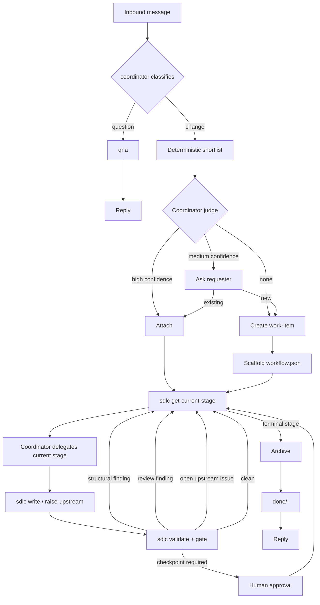

# Project Initiation — Agentic SDLC Toolkit (v0.8.0)

---

document_type: project-init;;;

project_slug: agentic-sdlc
version: 0.8.0
status: draft
created: 2026-09-15
updated: 2026-09-17
platform_scope: opencode-only
first_target: opencode
deployment_model: per-repo
--------------------------

## 1. Purpose

A portable-enough set of agents, skills, and one deterministic CLI that lets a software project be managed end-to-end by AI coding agents — intake, triage, work-item lifecycle, question-answering — with a human able to step in at declared checkpoints but not required to drive.

Load-bearing invariant: **no hidden state**.

Current stage is derived from versioned artifacts plus the work-item's versioned workflow definition. Non-derivable control state lives in `workflow.json`, which is itself versioned. No session memory is required for resumption. No un-versioned scratch state participates in workflow decisions. The system is cold-resumable.

Two commitments:

* **Structure only what must be checked.** Relational fields such as IDs, references, revisions, stage relationships, and workflow definitions are structured so deterministic validation can walk them. Content fields remain prose.
* **Mechanical and semantic findings are separate.** Structural defects are automatically blocking and non-negotiable. Semantic judgment belongs to the reviewer.

### 1.1 Data-driven workflow invariant

The workflow engine has **no built-in knowledge of stage names**.

`getCurrentStage` MUST NOT contain literals such as:

* `requirements`
* `design`
* `planning`
* `implementation`
* `archive`

A work-item may instead use stages named `specification`, `architecture`, `build`, `verify`, `release`, or any other valid stage IDs.

Changing a stage name, artifact filename, or workflow shape must require configuration/data changes only, not CLI code changes.

---

## 2. Problem Statement

Ad-hoc agent use produces four recurring failures:

1. context bloat,
2. untracked work,
3. inconsistent rigor,
4. state that lives only in a session.

A fifth failure is the presence of artifacts that look structured but are never checked: cycles, orphaned requirements, dangling references, stale revisions, and nominal traceability can survive review and surface during implementation.

The toolkit addresses these by separating:

* durable artifacts from session context,
* deterministic validation from semantic review,
* workflow definition from workflow execution,
* stage names from stage semantics.

---

## 3. Goals / Non-Goals

### Goals

**G1.** A coordinator classifies inbound messages as question or change and routes them.

**G2.** A durable filesystem lifecycle exists under `docs/work-items/`.

**G3.** One deterministic CLI (`sdlc`) performs all mechanical operations.

**G4.** Agent and skill definitions are authored directly for OpenCode.

**G5.** Installation is per repository; there is no shared service.

**G6.** Workflow selection is data-driven and recorded with rationale.

**G7.** Type is tracked independently of workflow.

**G8.** Graph-level artifact integrity is mechanically validated: cycles, orphans, dangling references, revision staleness, and invalid workflow references.

**G9.** The deterministic CLI has a single external runtime dependency: Node.

**G10.** Different work-items may use different stage arrays.

**G11.** A stage may be renamed, replaced, omitted, or reordered according to workflow rules without changing CLI code.

**G12.** `getCurrentStage` is a pure function of the stage registry, workflow definition, and versioned work-item artifacts.

**G13.** OpenCode agents can be restricted to the tools and subagents required by their role.

**G14.** Human approval is not an agent capability.

### Non-Goals

**NG1.** Multi-repo orchestration.

**NG2.** Portability to platforms other than OpenCode in v1.

**NG3.** Parallel work-items within one repository.

**NG4.** A GUI.

**NG5.** Per-field lineage. `based_on` remains per artifact.

**NG6.** Compilers or canonical-source tooling. Deferred until a second target exists.

**NG7.** A machine-maintained navigation index for work-items or living documents.

---

## 4. Glossary

| Term              | Definition                                                                                                   |
| ----------------- | ------------------------------------------------------------------------------------------------------------ |
| Coordinator       | Primary agent that classifies requests, matches/creates work-items, selects workflows, and delegates stages. |
| Work-item         | A unit of change under `docs/work-items/<slug>/`.                                                            |
| Workflow          | The ordered stage sequence assigned to one work-item. Stored in `workflow.json`.                             |
| Stage             | One executable unit in a workflow. Its behavior is defined by the stage registry.                            |
| Stage registry    | `.agentic-sdlc/stages.yaml`; defines stage semantics once.                                                   |
| Workflow template | Optional named workflow in `.agentic-sdlc/workflows.yaml`; used only to propose an initial stage array.      |
| Type              | Registry-driven work category, independent of workflow.                                                      |
| Artifact          | Versioned file produced by a stage.                                                                          |
| Review            | A stage that evaluates another stage's artifact against a semantic checklist.                                |
| Gate              | A review completion condition. In v1: `findings.length == 0`.                                                |
| Finding           | Blocking defect.                                                                                             |
| Observation       | Non-blocking reviewer note.                                                                                  |
| Upstream issue    | A finding raised by a later stage against an earlier author stage.                                           |
| `based_on`        | Per-artifact map of upstream stage artifact revisions observed when the artifact was authored.               |
| Checkpoint        | Human approval required before a stage may execute.                                                          |
| Terminal stage    | Stage whose completion represents the end of the workflow, normally by creating an audit artifact.           |
| `getCurrentStage` | Pure function that derives the next required stage from versioned state.                                     |
| `workflow.json`   | Versioned work-item control artifact containing workflow, status, type, history, freeze state, and reasons.  |

---

## 5. OpenCode Capability Baseline

The v1 architecture is explicitly aligned with current OpenCode capabilities.

### 5.1 Agents and subagents

OpenCode supports primary agents and subagents. Primary agents can invoke subagents through the Task mechanism, and task permissions can restrict which subagents are available to a given agent. Custom agents can also define their own models, prompts, and permissions.

Therefore:

* `coordinator` is a primary agent.
* `author`, `stage-reviewer`, and `archiver` are subagents.
* The coordinator's Task permission is limited to those agents.
* The workflow engine chooses *which stage* to run; the registry chooses *which agent* handles that stage.

No custom SDK-based subagent orchestration is required for v1.

### 5.2 Custom commands

OpenCode supports project-local custom commands that can select an agent, model, and whether execution happens in a child session.

A `/sdlc` or `/sdlc-next` command may therefore be provided as a convenience entry point, but it is not load-bearing. The coordinator can invoke stage subagents through the native Task mechanism.

### 5.3 Custom tools

OpenCode supports project-local TypeScript/JavaScript custom tools under `.opencode/tools/`. Multiple tools can be exported from one file, each receiving its own tool name.

The toolkit therefore provides thin OpenCode adapters such as:

```text
sdlc_get_current_stage
sdlc_validate
sdlc_write
sdlc_gate
sdlc_raise_upstream
sdlc_resolve_upstream
sdlc_archive
sdlc_list
sdlc_approve
```

Each adapter delegates to the deterministic `sdlc` CLI.

### 5.4 Permissions

OpenCode supports per-agent permissions and pattern-based permissions for built-in, custom, and MCP tools. Bash commands can also be matched by pattern.

The toolkit uses this to ensure:

* agents cannot use `sdlc_approve`,
* reviewer agents cannot edit project files,
* stage agents cannot invoke arbitrary subagents,
* the coordinator cannot invoke `sdlc_approve`,
* direct artifact writes use `sdlc_write`,
* approval is a human terminal operation.

The installation MUST NOT give workflow agents unrestricted access to the approval path.

### 5.5 Model and temperature configuration

OpenCode supports per-agent model and temperature configuration.

The default remains one `author` agent with stage-specific prompt templates. Different temperatures are not required merely because stages differ.

If evidence later shows that a particular stage needs a different model or temperature, the stage registry may select a different agent configuration without changing the workflow engine.

### 5.6 Runtime boundary

The deterministic toolkit CLI remains Node/TypeScript.

OpenCode's `.opencode` adapter layer is TypeScript/JavaScript because that is OpenCode's native custom-tool mechanism. The adapter is not a second workflow runtime; it is an integration layer that invokes the Node CLI.

Therefore the runtime invariant becomes:

> **One deterministic toolkit runtime: Node. OpenCode-native adapter code may use OpenCode's supported TypeScript/JavaScript tool mechanism.**

This replaces the stronger but inaccurate claim that every line of toolkit integration code must execute under Node.

---

## 6. Roles & Actors

| Actor                   | Type          | Responsibility                                                                 |
| ----------------------- | ------------- | ------------------------------------------------------------------------------ |
| Stakeholder / developer | Human         | Sends requests, answers classification/matching questions, performs approvals. |
| coordinator             | Primary agent | Classifies, matches/creates work-items, proposes workflow, delegates stages.   |
| author                  | Subagent      | Authors the artifact for its assigned stage.                                   |
| stage-reviewer          | Subagent      | Reviews the artifact for its assigned review stage.                            |
| archiver                | Subagent      | Performs living-document updates and invokes archive mechanics.                |

### 6.1 Skills

Skills are invoked by agents and are not workflow actors.

* `qna` — stateless Q&A over the codebase or web. No work-item writes.
* `work-item-scaffold` — chooses slug, summary, type, and initial workflow proposal; invokes scaffolding script.
* `archive-work-item` — coordinates living-document decisions and invokes archive mechanics.

### 6.2 Agent properties

| Agent          | Persona                     | Permissions                                                                                                   |
| -------------- | --------------------------- | ------------------------------------------------------------------------------------------------------------- |
| coordinator    | Router, classifier, matcher | Read repo; invoke permitted subagents; use non-mutating SDLC tools; scaffold work-items.                      |
| author         | Technical author/engineer   | Read declared work-item inputs; edit code when required by stage; invoke `sdlc_write`; raise upstream issues. |
| stage-reviewer | Adversarial reviewer        | Read target artifact and checklist; write only review artifact through `sdlc_write`.                          |
| archiver       | Librarian                   | Read work-item; update explicitly selected living docs; invoke archive.                                       |

### 6.3 No self-review

The registry MUST NOT allow the same stage invocation to review its own output.

A review stage declares its target stage explicitly:

```yaml
review:
  target: build
```

The validator rejects a review stage whose target is itself.

### 6.4 Approval authenticity

No agent is granted the `sdlc_approve` custom tool.

`sdlc approve` remains a human terminal operation.

For additional protection:

* agent profiles deny the `sdlc_approve` tool,
* coordinator and reviewer agents do not receive shell access,
* implementation agents receive only the shell access required by the repository and explicitly deny the `sdlc approve` command pattern,
* `sdlc approve` requires an interactive terminal,
* the CLI records the approving identity and exact current revisions.

This is an agent-access boundary, not a claim of cryptographic human identity.

---

## 7. Workflow Model

### 7.1 Workflow is per work-item

Every work-item contains its own workflow definition:

```json
{
  "revision": 1,
  "status": "active",
  "type": "feature",
  "stages": [
    "define",
    "define-review",
    "design",
    "design-review",
    "plan",
    "plan-review",
    "build",
    "build-review",
    "release"
  ],
  "freeze_after": "define",
  "stage_rationale": "External dependency and architectural boundary require design review."
}
```

This is the source of truth.

Two work-items may have completely different workflows:

```json
{
  "stages": [
    "specification",
    "specification-review",
    "build",
    "verify",
    "release"
  ]
}
```

and:

```json
{
  "stages": [
    "incident-intake",
    "mitigation",
    "verification",
    "release"
  ]
}
```

No CLI code changes are required.

### 7.2 Stage registry

The registry defines stage semantics, not workflows.

Example:

```yaml
stages:

  define:
    actor: author
    template: define
    artifact:
      file: specification.json
      schema: specification
      inputs: []
    completion:
      mode: artifact

  define-review:
    actor: reviewer
    artifact:
      file: specification-review.json
      schema: review
    review:
      target: define
      checklist: checks/specification-review.yaml
      rework: define
      max_rounds: review.max_rounds
    completion:
      mode: review_gate

  design:
    actor: author
    template: design
    artifact:
      file: design.json
      schema: design
      inputs:
        - define
    completion:
      mode: artifact

  design-review:
    actor: reviewer
    artifact:
      file: design-review.json
      schema: review
    review:
      target: design
      checklist: checks/design-review.yaml
      rework: design
      max_rounds: review.max_rounds
    completion:
      mode: review_gate

  plan:
    actor: author
    template: plan
    artifact:
      file: plan.json
      schema: plan
      inputs:
        - design
    completion:
      mode: artifact

  plan-review:
    actor: reviewer
    artifact:
      file: plan-review.json
      schema: review
    review:
      target: plan
      checklist: checks/plan-review.yaml
      rework: plan
      max_rounds: review.max_rounds
    completion:
      mode: review_gate

  build:
    actor: author
    template: implementation
    artifact:
      file: implementation-log.json
      schema: implementation-log
      inputs:
        - plan
    checkpoint:
      before: true
      type: human
    completion:
      mode: artifact

  build-review:
    actor: reviewer
    artifact:
      file: build-review.json
      schema: review
    review:
      target: build
      checklist: checks/build-review.yaml
      rework: build
      max_rounds: review.max_rounds
    completion:
      mode: review_gate

  release:
    actor: script
    terminal:
      command: archive
      completion_file: archive.md
    completion:
      mode: artifact
```

The names above are examples only.

A project can instead define:

```yaml
stages:

  specification:
    actor: author
    template: requirements
    artifact:
      file: requirements.json
      schema: specification
      inputs: []
    completion:
      mode: artifact
```

`getCurrentStage` treats both definitions identically.

### 7.3 Stage semantics

A stage may declare:

* actor,
* prompt template,
* artifact file,
* artifact schema,
* upstream stage inputs,
* review target,
* review checklist,
* review rework target,
* checkpoint requirement,
* terminal handler,
* completion mode.

No workflow semantics are encoded in the stage name.

### 7.4 Workflow templates

Named workflow templates are optional.

If present:

```text
.agentic-sdlc/
  workflows.yaml
```

may contain:

```yaml
workflows:

  standard:
    stages:
      - define
      - define-review
      - plan
      - plan-review
      - build
      - build-review
      - release
    freeze_after: define

  architectural:
    stages:
      - define
      - define-review
      - design
      - design-review
      - plan
      - plan-review
      - build
      - build-review
      - release
    freeze_after: define

  investigation:
    stages:
      - define
      - define-review
      - investigate
      - release
    freeze_after: define
```

The selected workflow is copied into `workflow.json`.

After scaffold, `workflow.json` is authoritative. Changing `workflows.yaml` does not silently change an existing work-item.

A work-item may also use a custom stage array not present in `workflows.yaml`.

---

## 8. Request Flow



The flow does not assume any particular stage name.

---

## 9. Coordinator Decision Logic

### 9.1 Classification

* Question: seeks information and does not request repository modification.
* Change: requests modification or identifies itself as feature, bugfix, refactor, improvement, incident remediation, etc.
* Ambiguous: ask one clarifying question.
* Classification questions MUST NOT elicit requirements, acceptance criteria, scope, or design.

Those belong to workflow stages.

### 9.2 Work-item matching

Matching is deliberately two-step.

1. Deterministic shortlist:

   * search `docs/work-items/*/init.md`,
   * inspect frontmatter and summary,
   * exclude `done/`.
2. Coordinator judges the shortlist.

| Confidence | Behavior                 |
| ---------- | ------------------------ |
| High       | Attach automatically.    |
| Medium     | Ask requester to choose. |
| Low / none | Create a new work-item.  |

No LLM is invoked over the entire work-item corpus.

### 9.3 Workflow selection

The coordinator proposes:

* type,
* stage array,
* freeze point,
* rationale.

The coordinator may select a named workflow template or construct a custom stage array from the registry.

The coordinator MUST NOT infer workflow behavior from stage names.

The workflow engine only validates that every stage ID exists and that the stage contracts form a valid sequence.

### 9.4 Workflow amendment

Before `freeze_after` has completed, the designated workflow-authoring stage may revise:

* stage array,
* type,
* stage rationale,
* freeze point.

Every change:

1. increments `workflow.json.revision`,
2. appends `stage_history`,
3. records a reason,
4. is validated before being committed.

After the freeze point:

* the stage array is immutable by ordinary stage execution,
* a missing stage discovered later blocks the work-item,
* a human may explicitly amend the workflow through `sdlc amend-workflow`,
* the amendment is recorded in `stage_history`.

There is no silent insertion of a stage by a later stage.

---

## 10. `getCurrentStage`

### 10.1 Contract

```text
getCurrentStage(
  stage_registry,
  work_item_dir
) -> CurrentState
```

It is pure:

* no writes,
* no session state,
* no model calls,
* no stage-name assumptions.

### 10.2 Bootstrap behavior

If `workflow.json` does not exist:

```json
{
  "status": "uninitialized",
  "reason": "workflow.json absent"
}
```

It MUST NOT return a named stage.

The scaffold operation is responsible for creating `workflow.json`.

### 10.3 Derivation precedence

1. Missing workflow → `uninitialized`.
2. Invalid workflow structure → `invalid`.
3. `status == abandoned` → `abandoned`.
4. `status == blocked` → `blocked`.
5. Validator findings → earliest implicated workflow stage, or workflow-level `invalid`.
6. Open upstream issues → earliest valid target stage.
7. Walk the workflow's stages in order.
8. If all stages are complete → `done`.

### 10.4 Fully data-driven pseudocode

```python
def getCurrentStage(registry, work_item_dir):
    wf = load(work_item_dir / "workflow.json")

    if wf is None:
        return CurrentState(
            status="uninitialized",
            stage=None,
            reason="workflow.json absent"
        )

    workflow_findings = validate_workflow(wf, registry)
    if workflow_findings:
        return CurrentState(
            status="invalid",
            stage=earliest_stage(workflow_findings, wf),
            reason=workflow_findings[0].code
        )

    if wf["status"] == "abandoned":
        return CurrentState(
            status="abandoned",
            stage=None,
            reason=wf["abandoned"]["reason"]
        )

    if wf["status"] == "blocked":
        return CurrentState(
            status="blocked",
            stage=None,
            reason=wf["blocked"]["reason"]
        )

    findings = validate(work_item_dir, registry, wf)

    if findings:
        return CurrentState(
            status="active",
            stage=earliest_implicated_stage(findings, wf),
            reason=f"validator:{findings[0].code}"
        )

    issues = load_optional(work_item_dir / "upstream-issues.json")

    open_targets = [
        issue["target_stage"]
        for issue in issues["issues"]
        if issue["status"] == "open"
    ]

    if open_targets:
        return CurrentState(
            status="active",
            stage=earliest_in_workflow(open_targets, wf["stages"]),
            reason="open upstream issue"
        )

    for stage_id in wf["stages"]:

        stage = registry["stages"][stage_id]

        if stage.get("checkpoint", {}).get("before"):

            approval = load_approval(work_item_dir, stage_id)

            if approval is None:
                return CurrentState(
                    status="active",
                    stage=stage_id,
                    reason="awaiting_approval"
                )

            if approval_is_stale(
                approval,
                work_item_dir,
                stage
            ):
                return CurrentState(
                    status="active",
                    stage=stage_id,
                    reason="approval_stale"
                )

        completion = stage["completion"]["mode"]

        if completion == "artifact":

            artifact = load_stage_artifact(
                work_item_dir,
                stage
            )

            if artifact is None:
                return CurrentState(
                    status="active",
                    stage=stage_id,
                    reason="artifact_absent"
                )

            stale_input = find_stale_input(
                artifact,
                stage,
                work_item_dir,
                registry
            )

            if stale_input:
                return CurrentState(
                    status="active",
                    stage=stage_id,
                    reason=f"stale:{stale_input}"
                )

        elif completion == "review_gate":

            review = load_stage_artifact(
                work_item_dir,
                stage
            )

            if review is None:
                return CurrentState(
                    status="active",
                    stage=stage_id,
                    reason="review_absent"
                )

            target_stage = stage["review"]["target"]

            target_artifact = load_stage_artifact(
                work_item_dir,
                registry["stages"][target_stage]
            )

            last_round = review["rounds"][-1]

            if (
                last_round["reviewed_revision"]
                < target_artifact["revision"]
            ):
                return CurrentState(
                    status="active",
                    stage=stage_id,
                    reason="review_stale"
                )

            if not last_round["gate_cleared"]:

                max_rounds = resolve_config(
                    stage["review"]["max_rounds"]
                )

                if len(review["rounds"]) < max_rounds:
                    return CurrentState(
                        status="active",
                        stage=stage["review"]["rework"],
                        reason="gate_closed"
                    )

                return CurrentState(
                    status="blocked",
                    stage=None,
                    reason="max_rounds_reached"
                )

        else:
            raise InvalidRegistry(
                f"Unknown completion mode: {completion}"
            )

    return CurrentState(
        status="done",
        stage=None,
        reason="all workflow stages complete"
    )
```

There is no reference in this function to any particular workflow stage name.

### 10.5 Data-driven freeze

`workflow.json` contains:

```json
{
  "freeze_after": "define",
  "frozen_at": null
}
```

The same work-item could instead contain:

```json
{
  "freeze_after": "specification",
  "frozen_at": null
}
```

or:

```json
{
  "freeze_after": "intake",
  "frozen_at": null
}
```

The engine only resolves the configured stage ID.

A workflow with:

```json
{
  "freeze_after": null
}
```

is frozen at scaffold time.

### 10.6 Invariants

1. Every workflow stage ID exists in the stage registry.
2. Every stage appears at most once in a workflow.
3. Every review target is earlier than the review stage.
4. Every review target is an author stage.
5. Every review rework target exists in the workflow.
6. Every artifact input references an earlier workflow stage.
7. `reviewed_revision <= target_artifact.revision`.
8. `based_on` entries cannot claim revisions newer than the referenced artifact.
9. A frozen workflow cannot be changed except through the explicit amendment operation.
10. An unparseable artifact is a blocking validation finding, not an absent artifact.
11. All CLI writes are atomic.
12. `getCurrentStage` performs no writes.

---

## 11. Upstream Issues and `based_on`

### 11.1 Raising

Any author or reviewer stage may raise an upstream issue.

```json
{
  "id": "UP-001",
  "raised_by_stage": "build-review",
  "raised_at_round": 1,
  "target_stage": "design",
  "target_artifact": "design.json",
  "target_revision_seen": 1,
  "text": "...",
  "status": "open",
  "resolution": null,
  "supersedes": null
}
```

The CLI validates that:

* target stage exists,
* target stage is earlier,
* target stage is an author stage,
* target artifact matches the registry,
* issue count does not exceed the configured cap.

### 11.2 Resolution

Only the target stage resolves an issue.

Resolution happens in the same logical operation as the artifact revision.

```json
{
  "status": "resolved",
  "resolution": {
    "resolved_by_revision": 2,
    "decision": "Updated the design to..."
  }
}
```

Never reopen an issue.

If the fix is inadequate, create a new issue with:

```json
{
  "supersedes": "UP-001"
}
```

### 11.3 `based_on`

Every author artifact carries:

```json
{
  "revision": 2,
  "based_on": {
    "design": 4
  }
}
```

The keys are stage IDs, not hardcoded filenames.

The CLI computes `based_on` from the stage registry.

If the registry says:

```yaml
artifact:
  inputs:
    - design
    - specification
```

the resulting artifact may contain:

```json
{
  "based_on": {
    "design": 4,
    "specification": 2
  }
}
```

The author does not choose these revisions.

### 11.4 Revision propagation

If `design` moves from revision 4 to revision 5, every later artifact whose `based_on.design == 4` becomes stale.

No propagation flag or counter is stored.

---

## 12. Reviews and Gates

There are two review streams.

| Source    | Stream         | Blocks? |
| --------- | -------------- | ------- |
| Validator | `findings`     | Yes     |
| Reviewer  | `findings`     | Yes     |
| Reviewer  | `observations` | No      |

Gate:

```text
gate_cleared = findings.length == 0
```

Observations never count toward review rounds.

### 12.1 Review artifact

```json
{
  "stage": "design-review",
  "target": "design",
  "rounds": [
    {
      "round": 1,
      "reviewed_revision": 1,
      "findings": [
        {
          "id": "F-001",
          "check_id": "DR-005",
          "text": "...",
          "evidence": "..."
        }
      ],
      "observations": [
        {
          "id": "OB-001",
          "check_id": "DR-004",
          "text": "...",
          "evidence": "..."
        }
      ],
      "gate_cleared": false,
      "checks_answered": {
        "DR-001": "section ...",
        "DR-005": "absent"
      }
    }
  ]
}
```

Validator checks:

* every checklist item is answered,
* reviewed revisions are monotone,
* `gate_cleared` matches `findings.length`,
* IDs are unique,
* referenced check IDs exist,
* review target matches the registry,
* reviewer is not the author of the target stage.

### 12.2 Round cap

`review.max_rounds` is a hard safety valve.

When the cap is reached:

```json
{
  "status": "blocked",
  "blocked": {
    "reason": "max_rounds_reached"
  }
}
```

There is no separate `escalated` status.

---

## 13. Configuration

All tunable limits live in:

```text
.agentic-sdlc/config.yaml
```

Example:

```yaml
qna:
  tool_call_ceiling: 20
  escalate_if_multiple_components: true

review:
  max_rounds: 3
  max_open_upstream_issues: 5
```

`review.max_rounds` is required.

`review.max_open_upstream_issues` is required.

The Q&A ceiling is a cost/thrash safety valve. It is not intended to determine whether an answer is substantively complete.

---

## 14. Repository Layout

### 14.1 Work-items

```text
docs/
  work-items/
    <slug>/
      init.md
      workflow.json

      <stage artifact files defined by workflow>

      upstream-issues.json

      approvals/
        <stage>.json

    done/
      2026-09-15-14-32-<slug>/
        ...
        archive.md
```

There is deliberately **no `index.md`**.

The filesystem itself is the index.

### 14.2 Living documents

```text
docs/
  current/
    decisions/
    architecture/
    operations/
```

`docs/current/` is optional.

The archiver updates only living documents explicitly affected by the work-item.

There is no `docs/current/index.md`.

Agents can discover living documents through normal filesystem search and `rg`.

### 14.3 Toolkit

```text
.agentic-sdlc/
  config.yaml
  stages.yaml
  workflows.yaml                  # optional workflow templates
  types.yaml

  checks/
    <stage-review-checklists>.yaml

  schemas/
    <artifact schemas>.json

  templates/
    <stage templates>.md

  agents/
    coordinator.md
    author.md
    stage-reviewer.md
    archiver.md

  skills/
    qna/
      SKILL.md

    work-item-scaffold/
      SKILL.md
      scripts/scaffold.ts
      references/init-template.md
      references/workflow-template.json

    archive-work-item/
      SKILL.md
      scripts/archive.ts
      references/archive-template.md

  bin/
    sdlc.ts
```

### 14.4 OpenCode adapter

```text
.opencode/
  agents/
    coordinator.md
    author.md
    stage-reviewer.md
    archiver.md

  tools/
    sdlc.ts

  commands/
    sdlc-next.md

  skills/
    ...
```

`tools/sdlc.ts` may export multiple tools:

```text
sdlc_get_current_stage
sdlc_validate
sdlc_write
sdlc_gate
sdlc_raise_upstream
sdlc_resolve_upstream
sdlc_archive
sdlc_list
sdlc_approve
```

The adapters contain no workflow logic.

---

## 15. Artifact Contracts

### 15.1 `init.md`

Immutable after scaffold.

```markdown
---
slug: add-oauth-login
created_at: 2026-09-15T14:32:00Z
requester: alice@example.com
classification: change
initial_type: feature
tags: [auth, oauth]
---

# Request

<verbatim inbound request>

# Coordinator notes

<intake notes>
```

No evolving state belongs here.

### 15.2 `workflow.json`

```json
{
  "revision": 2,
  "status": "active",
  "type": "feature",
  "stages": [
    "define",
    "define-review",
    "design",
    "design-review",
    "plan",
    "plan-review",
    "build",
    "build-review",
    "release"
  ],
  "freeze_after": "define",
  "frozen_at": null,
  "stage_rationale": "External identity dependency and architectural boundary.",
  "blocked": null,
  "abandoned": null,
  "stage_history": [
    {
      "revision": 1,
      "stages": [
        "define",
        "build",
        "build-review",
        "release"
      ],
      "freeze_after": "define",
      "reason": "initial coordinator proposal",
      "at": "2026-09-15T14:32:00Z"
    },
    {
      "revision": 2,
      "stages": [
        "define",
        "define-review",
        "design",
        "design-review",
        "plan",
        "plan-review",
        "build",
        "build-review",
        "release"
      ],
      "freeze_after": "define",
      "reason": "External dependency and architectural boundary",
      "at": "2026-09-15T15:10:00Z"
    }
  ]
}
```

### 15.3 Author artifacts

Author artifacts contain:

```json
{
  "revision": 2,
  "based_on": {
    "design": 4
  }
}
```

The CLI computes both fields.

The author supplies the substantive content.

### 15.4 Example specification artifact

The artifact may use whatever domain name the stage defines.

```json
{
  "revision": 1,
  "based_on": {},
  "summary": "Add OAuth login via external identity providers.",
  "scope": {
    "in": ["..."],
    "out": ["..."]
  },
  "assumptions": [
    {
      "id": "ASM-001",
      "text": "..."
    }
  ],
  "requirements": [
    {
      "id": "REQ-001",
      "text": "Users may authenticate via OAuth.",
      "acceptance_criteria": [
        {
          "id": "AC-001",
          "text": "..."
        }
      ]
    }
  ],
  "open_questions": []
}
```

This is only an example schema. A different workflow may call the artifact `requirements.json`, `specification.json`, or something else.

### 15.5 Design artifact

```json
{
  "revision": 1,
  "based_on": {
    "define": 2
  },
  "approach": "...",
  "affected_components": [
    {
      "name": "auth-service",
      "new": false,
      "change": "..."
    }
  ],
  "requirement_responses": [
    {
      "requirement_id": "REQ-001",
      "how": "..."
    }
  ],
  "decisions": [
    {
      "id": "DEC-001",
      "text": "...",
      "rationale": "...",
      "addresses": ["REQ-001"],
      "supersedes": null
    }
  ]
}
```

### 15.6 Plan artifact

```json
{
  "revision": 1,
  "based_on": {
    "design": 1
  },
  "tasks": [
    {
      "id": "T-001",
      "description": "...",
      "files": ["..."],
      "depends_on": [],
      "covers": ["REQ-001"],
      "verifies_criteria": ["AC-001"],
      "completion_condition": "...",
      "size": "small"
    }
  ]
}
```

### 15.7 Implementation artifact

The implementation log is intentionally separate from the plan.

```json
{
  "revision": 1,
  "based_on": {
    "plan": 1
  },
  "tasks": [
    {
      "task_id": "T-001",
      "status": "done",
      "what_changed": "...",
      "files_touched": ["..."],
      "tests_run": ["..."],
      "notes": ""
    }
  ],
  "deviations": []
}
```

If implementation discovers that the plan is wrong, it raises an upstream issue rather than silently editing the plan.

### 15.8 Investigation artifact

Investigation stages may produce Markdown:

```markdown
---
revision: 1
based_on:
  - define: 1
---

# Question

# Method

# Findings

# Confidence

# Recommendations
```

### 15.9 Approval artifact

```json
{
  "stage": "build",
  "work_item": "add-oauth-login",
  "approver": "alice@example.com",
  "approved_at": "2026-09-15T15:00:00Z",
  "approval_type": "pre_stage",
  "work_item_revision": {
    "define": 2,
    "plan": 1
  },
  "notes": "Approved after review."
}
```

The registry determines which artifact revisions matter.

### 15.10 `archive.md`

```markdown
---
archived_at: 2026-09-15T16:00:00Z
work_item: add-oauth-login
docs_updated:
  - doc: docs/current/decisions/0007-oauth.md
    change: created
    source_artifact: design.json
no_update_reason: null
---

# Summary

# Outcomes

# Follow-ups
```

If no living document changed:

```yaml
docs_updated: []
no_update_reason: "No durable living documentation was affected."
```

An `archive.md` with neither is invalid.

---

## 16. Validator vs Reviewer

### Validator

The validator answers questions that are mechanically provable.

Examples:

* every requirement has an acceptance criterion,
* every requirement is covered,
* every acceptance criterion is verified,
* `depends_on` is acyclic,
* every reference resolves,
* revisions are ordered correctly,
* `based_on` is not stale,
* every workflow stage exists,
* stage ordering constraints hold,
* every review target exists and precedes the review,
* every review checklist item is answered,
* checkpoint approvals are present and current,
* terminal completion artifacts exist,
* no artifact is written before its declared inputs exist.

### Reviewer

The reviewer answers questions requiring judgment.

Examples:

* Is the requirement actually testable?
* Is the design proportionate?
* Is task coverage substantive rather than nominal?
* Are dependency edges semantically correct?
* Is the evidence responsive?
* Are implementation deviations justified?

### Rule for new validator checks

A validator check must be defendable as *provably wrong* if it fires.

If explaining why a finding is wrong requires substantive judgment, it belongs in the reviewer.

---

## 17. Semantic Checklists

Checklists are stage-specific and versioned:

```text
.agentic-sdlc/checks/
  specification-review.yaml
  design-review.yaml
  plan-review.yaml
  build-review.yaml
```

A checklist should encode toolkit-specific conventions that a generic reviewer would not know.

Example:

```yaml
- id: DR-001
  question: >
    Does each requirement have a proportionate design response?
  evidence: >
    Cite the relevant design section or state "absent".

- id: DR-004
  question: >
    Does any decision contradict an earlier decision without `supersedes`?
  evidence: >
    Cite the relevant decision or state "absent".

- id: DR-005
  question: >
    Is the component list complete, with no phantom downstream components?
  evidence: >
    Cite the component definition or state "absent".
```

The checklist does not need to restate generic reviewer judgment.

---

## 18. The `sdlc` CLI

```text
sdlc get-current-stage <slug>
sdlc validate <slug> [--stage X]
sdlc write <slug> <stage> [--file X | stdin]
sdlc gate <slug> <stage>
sdlc approve <slug> <stage>
sdlc raise-upstream <slug> ...
sdlc resolve-upstream <slug> ...
sdlc amend-workflow <slug> ...
sdlc archive <slug>
sdlc list
```

### 18.1 `get-current-stage`

Pure.

It reads:

* stage registry,
* workflow,
* artifacts,
* reviews,
* approvals,
* upstream issues,
* configuration.

It writes nothing.

### 18.2 `validate`

Pure.

It validates:

* JSON schemas,
* workflow integrity,
* references,
* revisions,
* `based_on`,
* dependency graphs,
* review structures,
* approval state,
* artifact ordering.

### 18.3 `write`

The only normal path for agent-authored machine artifacts.

It:

1. confirms the requested stage is current,
2. validates the payload,
3. computes the next revision,
4. computes `based_on`,
5. writes atomically,
6. refuses paths outside the work-item.

The caller cannot choose `revision` or `based_on`.

### 18.4 `gate`

Pure.

Returns the validator and review gate state for a stage.

It does not alter workflow state.

### 18.5 `approve`

Human-only command.

It:

1. confirms the stage is awaiting approval,
2. confirms the approval applies to the current revisions,
3. requires an interactive terminal,
4. records approver identity,
5. writes the approval artifact atomically.

### 18.6 `raise-upstream`

Appends an issue.

It does not modify the target artifact and does not route execution.

### 18.7 `resolve-upstream`

Only the target stage may resolve its own issue.

Resolution and artifact revision happen as one logical CLI operation.

### 18.8 `amend-workflow`

Explicit workflow amendment.

It:

* validates the proposed stage array,
* validates all stage references,
* validates ordering and dependency constraints,
* increments `workflow.json.revision`,
* appends `stage_history`,
* records the reason.

After the workflow has frozen, this command requires human invocation.

### 18.9 `archive`

The terminal handler performs the configured archive operation.

It:

* validates the workflow is complete,
* writes `archive.md`,
* updates selected living documents,
* moves the work-item into `docs/work-items/done/<timestamp>-<slug>/`.

No index is updated because no index exists.

### 18.10 `list`

Scans the filesystem.

It may report:

```text
active
blocked
awaiting approval
stale
done
```

It does not maintain a separate index.

---

## 19. OpenCode Integration

### 19.1 Coordinator

The coordinator is a project-local OpenCode agent.

Its Task permissions allow:

```text
author
stage-reviewer
archiver
```

and deny everything else.

OpenCode's Task permission system supports restricting which subagents a primary agent can invoke.

### 19.2 Stage agent selection

The coordinator does not contain:

```text
if stage == requirements
```

Instead:

```text
stage = sdlc_get_current_stage()
definition = stages.yaml[stage.name]
agent = definition.actor
template = definition.template
```

This means adding:

```yaml
security-review:
  actor: reviewer
```

automatically gives the coordinator enough information to delegate it.

### 19.3 Author

One author agent is sufficient.

The stage registry selects the template:

```yaml
define:
  template: define

design:
  template: design

plan:
  template: plan

build:
  template: implementation
```

The author agent receives:

* current stage definition,
* declared upstream artifacts,
* relevant repository context,
* checklist where applicable.

It does not receive the entire work-item by default.

### 19.4 Reviewer

The reviewer receives:

* target artifact,
* target stage definition,
* review checklist,
* relevant upstream artifacts as declared,
* repository context needed to assess evidence.

It writes only its review artifact.

### 19.5 Archiver

The archiver decides which living documents need updates.

The deterministic archive command performs filesystem mechanics.

### 19.6 Custom tools

OpenCode custom tools are project-local TypeScript/JavaScript and may export multiple separately named tools.

Therefore:

```text
.opencode/tools/sdlc.ts
```

can expose:

```text
sdlc_get_current_stage
sdlc_validate
sdlc_write
sdlc_gate
sdlc_raise_upstream
sdlc_resolve_upstream
sdlc_archive
sdlc_list
sdlc_approve
```

Agent permissions explicitly deny:

```text
sdlc_approve
```

while allowing the other tools.

OpenCode permissions support matching custom tool names as well as built-in tools.

### 19.7 Custom command

An optional:

```text
.opencode/commands/sdlc-next.md
```

may provide:

```text
Run the next stage for the current work-item.

First obtain the current stage with sdlc_get_current_stage.
Delegate the stage according to the stage registry.
Do not perform specialist work yourself.
```

OpenCode custom commands can select an agent and can execute in a child session.

This command is convenience only. The workflow does not depend on it.

---

## 20. Architecture Principles

| ID       | Principle                                                    |
| -------- | ------------------------------------------------------------ |
| PRIN-001 | Context hygiene by delegation.                               |
| PRIN-002 | Script what is deterministic.                                |
| PRIN-003 | No hidden state.                                             |
| PRIN-004 | Versioned audit trail.                                       |
| PRIN-005 | No self-review.                                              |
| PRIN-006 | Platform-native in v1.                                       |
| PRIN-007 | Per-repo, no shared service.                                 |
| PRIN-008 | Workflow rigor is data-driven.                               |
| PRIN-009 | Approvals are files, not chat acknowledgements.              |
| PRIN-010 | Binary gating: findings block, observations do not.          |
| PRIN-011 | Structure relational fields only.                            |
| PRIN-012 | Mechanical and semantic findings are separate.               |
| PRIN-013 | One author agent, many stage templates by default.           |
| PRIN-014 | One deterministic toolkit runtime: Node.                     |
| PRIN-015 | Registry-driven stages, types, and checks.                   |
| PRIN-016 | Approval capability is excluded from agent toolsets.         |
| PRIN-017 | `getCurrentStage` contains no workflow-specific stage names. |
| PRIN-018 | No derived navigation index. The filesystem is the index.    |

---

## 21. Non-Functional Requirements

| ID      | Requirement                                                                                                                    |
| ------- | ------------------------------------------------------------------------------------------------------------------------------ |
| NFR-001 | Any workflow can be resumed cold from versioned files.                                                                         |
| NFR-002 | Duplicate matching does not invoke an LLM over the full corpus.                                                                |
| NFR-003 | Fresh-repo installation is one command.                                                                                        |
| NFR-004 | No destructive operation occurs without a declared checkpoint where the workflow requires one.                                 |
| NFR-005 | Workflows function with arbitrary subsets and ordering of registered stages.                                                   |
| NFR-006 | Current-stage derivation is linear in workflow length plus referenced artifacts.                                               |
| NFR-007 | `sdlc validate` completes in under one second on a work-item with up to 200 plan tasks.                                        |
| NFR-008 | The deterministic toolkit CLI requires Node only.                                                                              |
| NFR-009 | CLI-mediated writes are atomic.                                                                                                |
| NFR-010 | Changing a workflow's stage names requires no CLI source change.                                                               |
| NFR-011 | Multiple work-items may use different workflow arrays concurrently, subject to the v1 one-active-pipeline-per-repo constraint. |

---

## 22. Assumptions

| ID      | Assumption                                                                                                   |
| ------- | ------------------------------------------------------------------------------------------------------------ |
| ASM-001 | The target OpenCode release supports project-local agents, custom tools, commands, and granular permissions. |
| ASM-002 | Target repositories are Git repositories.                                                                    |
| ASM-003 | One active pipeline per repo is acceptable in v1.                                                            |
| ASM-004 | Node is available wherever the toolkit CLI runs.                                                             |
| ASM-005 | OpenCode's agent/subagent and permission APIs remain compatible with the supported toolkit release.          |
| ASM-006 | Project-local `.opencode` configuration is committed with the repository.                                    |

---

## 23. Open Questions

The previous load-bearing OpenCode questions are now closed against the current documented capabilities.

| ID     | Question                                                           | Status                                                                                                                                                                                           |
| ------ | ------------------------------------------------------------------ | ------------------------------------------------------------------------------------------------------------------------------------------------------------------------------------------------ |
| OQ-001 | Can OpenCode invoke subagents programmatically?                    | **Closed.** Primary agents can invoke subagents through Task; custom commands can also select agents and run child sessions.                                                                     |
| OQ-002 | Which stages require human approval?                               | Open. Workflow-specific configuration.                                                                                                                                                           |
| OQ-003 | Should Q&A always cite sources?                                    | Open.                                                                                                                                                                                            |
| OQ-004 | How should binary/large implementation files be summarized?        | Open.                                                                                                                                                                                            |
| OQ-005 | Should the target stage or original raiser verify an upstream fix? | Proposed: target stage resolves; its review stage verifies.                                                                                                                                      |
| OQ-006 | How should workflow amendment after freeze be exposed?             | Proposed: human-only `sdlc amend-workflow`.                                                                                                                                                      |
| OQ-007 | When a second platform appears, is a compiler needed?              | Phase 2.                                                                                                                                                                                         |
| OQ-008 | Do particular stages need different model/temperature settings?    | Low priority. OpenCode supports per-agent settings; default remains one author agent.                                                                                                            |
| OQ-009 | Is a machine-readable work-item index ever needed?                 | **No for v1.** Reconsider only if filesystem scanning becomes a measured bottleneck.                                                                                                             |
| OQ-010 | Can approval be excluded from agent access?                        | **Closed with qualification.** OpenCode supports per-agent and custom-tool permissions. The toolkit additionally requires no unrestricted approval path and a human-terminal approval operation. |

---

## 24. Risks

| ID       | Risk                                                           | Mitigation                                                                                                                                                              |
| -------- | -------------------------------------------------------------- | ----------------------------------------------------------------------------------------------------------------------------------------------------------------------- |
| RISK-001 | Workflow-selection criteria are too coarse.                    | Track workflow amendments and improve templates from evidence.                                                                                                          |
| RISK-002 | One author agent produces inconsistent rigor across templates. | Stage-specific prompts, schemas, and reviews; split only if evidence requires it.                                                                                       |
| RISK-003 | Duplicate matching produces false positives.                   | Conservative threshold; ambiguous cases ask.                                                                                                                            |
| RISK-004 | Stage agent receives undeclared context.                       | Stage registry declares work-item inputs; coordinator follows it.                                                                                                       |
| RISK-005 | `based_on` chain becomes inconsistent.                         | CLI computes it; validator checks it.                                                                                                                                   |
| RISK-006 | Upstream issues proliferate.                                   | Hard per-work-item cap.                                                                                                                                                 |
| RISK-007 | Artifacts are hand-edited out of order.                        | Validator checks workflow ordering and revision invariants.                                                                                                             |
| RISK-008 | Semantic checklists become stale.                              | Version in Git; review effectiveness periodically.                                                                                                                      |
| RISK-009 | Observations are ignored.                                      | Surface observation counts in `sdlc list` and archive summary.                                                                                                          |
| RISK-010 | `workflow.json` becomes free-form state.                       | JSON Schema, CLI-only workflow writes, append-only history.                                                                                                             |
| RISK-011 | Node is unavailable.                                           | Installation checks Node before enabling the toolkit.                                                                                                                   |
| RISK-012 | An agent bypasses the approval tool through shell access.      | Approval tool denied; unrestricted shell prohibited for coordinator/reviewer; author shell permissions deny the approval command and CLI requires interactive terminal. |
| RISK-013 | Atomic rename behaves unexpectedly on an unusual filesystem.   | Validator rejects malformed files; recovery is via Git.                                                                                                                 |
| RISK-014 | Stage registry semantics become too complex.                   | Keep registry vocabulary small; add a new semantic primitive only when a real workflow requires it.                                                                     |

---

## 25. Phasing

### Phase 0 — OpenCode compatibility smoke test

No toolkit implementation depends on undocumented behavior.

Verify in a real supported OpenCode installation:

* coordinator can invoke `author`,
* coordinator can invoke `stage-reviewer`,
* custom tools appear,
* `sdlc_approve` is denied to agents,
* agent-specific permissions work,
* custom command can select the coordinator,
* Node CLI can be invoked from the OpenCode adapter.

The documented OpenCode capabilities make the architecture viable; Phase 0 verifies the exact supported release rather than resolving an unknown design question.

### Phase 1 — Generic vertical slice

Use deliberately neutral stage names:

```text
define
build
build-review
release
```

Prove:

* work-item creation,
* workflow snapshot,
* cold resume,
* `getCurrentStage`,
* schema validation,
* `sdlc_write`,
* review gate,
* archive,
* Node CLI,
* OpenCode delegation,
* atomic writes.

No stage named `requirements` is used in Phase 1.

### Phase 2 — Workflow graph and review

Add:

* multiple workflow templates,
* `based_on`,
* upstream issues,
* revision cascades,
* graph validator,
* review round caps,
* workflow amendment.

Prove that two work-items can use different workflows simultaneously.

### Phase 3 — Architecture and investigation

Add:

* design stages,
* investigation stages,
* richer semantic checklists,
* arbitrary stage-specific artifact types.

### Phase 4 — Operational hardening

Add:

* approval checkpoints,
* hotfix workflows,
* living-document updates,
* installation hardening,
* approval-path smoke tests,
* large-repository performance testing.

---

## 26. Success Criteria — v1 Definition of Done

* A request goes from natural-language message to an archived, fully-audited work-item without manual file editing.
* At least two materially different workflow shapes complete end-to-end.
* `getCurrentStage` passes a fixture where the initial stage is renamed from `define` to `specification` without any CLI source change.
* `getCurrentStage` contains no literal reference to `requirements`, `design`, `implementation`, or `archive`.
* A work-item can omit any registered stage without breaking derivation or archival.
* A work-item can use a custom stage array not present in `workflows.yaml`.
* `sdlc validate` catches:

  * dependency cycle,
  * uncovered requirement,
  * dangling reference,
  * revision inversion,
  * stale `based_on`,
  * invalid stage ID,
  * review targeting a later stage,
  * missing checkpoint approval.
* `getCurrentStage` correctly routes on:

  * uninitialized workflow,
  * invalid workflow,
  * open upstream issue,
  * stale review,
  * stale `based_on`,
  * closed review gate,
  * maximum review rounds,
  * blocked status,
  * abandoned status,
  * missing approval,
  * stale approval,
  * terminal completion.
* No `index.md` is created or required.
* `sdlc list` works using filesystem state alone.
* Living documents can be updated without a machine-maintained index.
* Canonical agents and skills install into a fresh repository with one command.
* OpenCode coordinator can invoke permitted stage subagents.
* Agents cannot invoke `sdlc_approve`.
* Approval requires the human terminal path.
* `sdlc get-current-stage` and `sdlc validate` are pure.
* All CLI-mediated writes are atomic.
* Installation and deterministic toolkit execution require Node; OpenCode-native adapters use only the platform's supported TS/JS integration layer.

---

## 27. Prior Art

Patterns adopted rather than reinvented:

* filesystem as source of truth,
* append-only review trail,
* no self-review,
* approvals as explicit artifacts,
* living-document graduation on archive,
* observations for non-blocking review feedback,
* stage arrays,
* HITL checkpoints calibrated to blast radius,
* explicit upstream issue routing.

The v0.8 design deliberately removes derived indexes and workflow-specific assumptions that do not contribute to those invariants.

---

## Appendix A — Generic Workflow Example

The following workflow is intentionally named without using `requirements`, `design`, `implementation`, or `archive`:

```yaml
stages:

  specification:
    actor: author
    template: specification
    artifact:
      file: specification.json
      schema: specification
      inputs: []
    completion:
      mode: artifact

  specification-review:
    actor: reviewer
    artifact:
      file: specification-review.json
      schema: review
    review:
      target: specification
      checklist: checks/specification-review.yaml
      rework: specification
      max_rounds: review.max_rounds
    completion:
      mode: review_gate

  build:
    actor: author
    template: build
    artifact:
      file: build-log.json
      schema: build-log
      inputs:
        - specification
    completion:
      mode: artifact

  verify:
    actor: reviewer
    artifact:
      file: verification.json
      schema: review
    review:
      target: build
      checklist: checks/verification.yaml
      rework: build
      max_rounds: review.max_rounds
    completion:
      mode: review_gate

  release:
    actor: script
    terminal:
      command: archive
      completion_file: archive.md
    completion:
      mode: artifact
```

A work-item may contain:

```json
{
  "stages": [
    "specification",
    "specification-review",
    "build",
    "verify",
    "release"
  ],
  "freeze_after": "specification"
}
```

The current-stage engine needs no special knowledge of what "specification" means.

---

## Appendix B — Hotfix Workflow Example

A hotfix can use a completely different shape:

```json
{
  "revision": 1,
  "status": "active",
  "type": "hotfix",
  "stages": [
    "incident-intake",
    "mitigation",
    "verification",
    "release"
  ],
  "freeze_after": "incident-intake",
  "stage_rationale": "Production incident requires mitigation before normal planning."
}
```

The stage registry defines the semantics:

```yaml
stages:

  incident-intake:
    actor: author
    template: incident-intake
    artifact:
      file: incident.json
      schema: incident
      inputs: []
    completion:
      mode: artifact

  mitigation:
    actor: author
    template: mitigation
    artifact:
      file: mitigation-log.json
      schema: mitigation
      inputs:
        - incident-intake
    checkpoint:
      before: true
      type: human
    completion:
      mode: artifact

  verification:
    actor: reviewer
    artifact:
      file: verification.json
      schema: review
    review:
      target: mitigation
      checklist: checks/hotfix-verification.yaml
      rework: mitigation
      max_rounds: review.max_rounds
    completion:
      mode: review_gate

  release:
    actor: script
    terminal:
      command: archive
      completion_file: archive.md
    completion:
      mode: artifact
```

No hotfix-specific branch is required in `getCurrentStage`.

---

## Appendix C — JSON/YAML Policy

| Artifact class              | Format   | Read by                            | Written by     |
| --------------------------- | -------- | ---------------------------------- | -------------- |
| Work-item machine artifacts | JSON     | CLI, validator, agents through CLI | CLI            |
| Work-item narrative         | Markdown | Agents, humans                     | Agents, humans |
| Workflow registry           | YAML     | CLI, coordinator                   | Humans         |
| Stage registry              | YAML     | CLI, agents                        | Humans         |
| Type registry               | YAML     | CLI, coordinator                   | Humans         |
| Checklists                  | YAML     | CLI, reviewer                      | Humans         |
| Toolkit configuration       | YAML     | CLI, agents                        | Humans         |

No JSON↔YAML conversion layer exists.

Agents do not directly write machine artifacts.