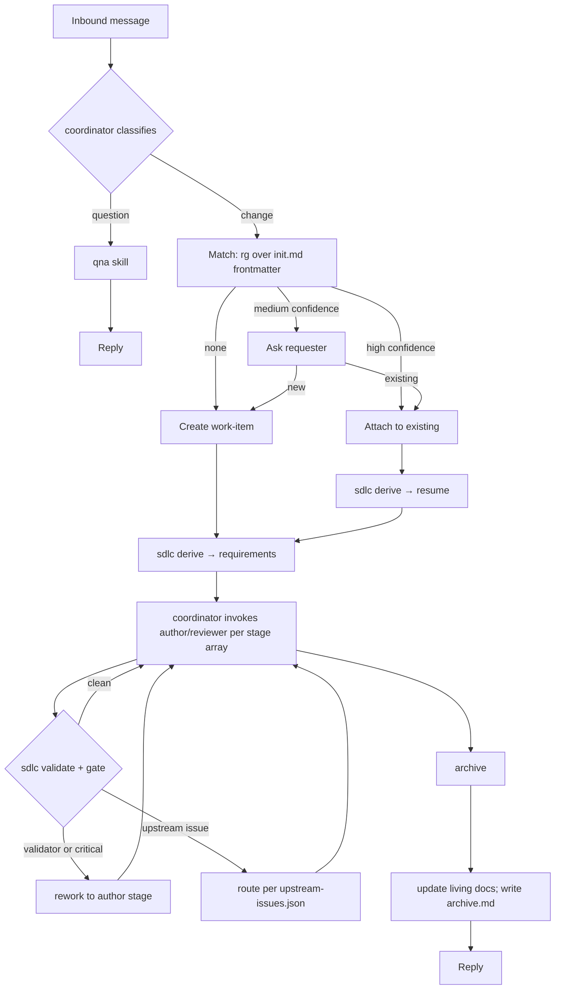

# Project Initiation — Agentic SDLC Toolkit (v0.4.0)

---
document_type: project-init
project_slug: agentic-sdlc
version: 0.4.0
status: draft
created: 2026-09-15
updated: 2026-09-15
platform_scope: opencode-only
first_target: opencode
deployment_model: per-repo
---

## 1. Purpose

A portable-*enough* set of agents, skills, and one deterministic CLI that lets a software project be managed end-to-end by AI coding agents — intake, triage, work-item lifecycle, question-answering — with a human able to step in at declared checkpoints but not required to drive.

Load-bearing invariant, unchanged: **work-item state is a pure function of the artifacts on disk and the stage array.** No state file. No counter. Cold-resumable.

Two commitments:

- **Structure only what must be checked.** Relational fields (IDs, references, revisions) are structured so a deterministic validator can walk the graph. Content fields are prose.
- **Mechanical and semantic findings are separate.** Structural defects are auto-critical and non-negotiable. Semantic judgment is the reviewer's job alone.

---

## 2. Problem Statement

Ad-hoc agent use produces four recurring failures: context bloat, untracked work, inconsistent rigor, and state that lives only in a session. A fifth failure the design targets: **artifacts that look structured but are never checked**, so a cycle in the plan or an orphan requirement survives review and surfaces as an implementation defect.

---

## 3. Goals / Non-Goals

**Goals (v1)**

- G1. A coordinator that classifies inbound messages as question or change and routes.
- G2. A durable, filesystem-based lifecycle under `docs/work-items/` with state derived from artifacts + the stage array.
- G3. One deterministic CLI (`sdlc`) plus thin opencode shims for every mechanical step: derive, validate, gate, approve, raise/resolve upstream, archive, list.
- G4. Agent and skill definitions authored directly for opencode.
- G5. Per-repo install — no shared service.
- G6. Stage selection by written criteria, recorded with rationale.
- G7. Type tracked independently of stages.
- G8. Graph-level integrity of artifacts validated mechanically (cycles, orphans, dangling references, revision staleness) and reported as auto-critical.

**Non-Goals (v1)**

- NG1. Multi-repo orchestration.
- NG2. **Portability to any platform other than opencode.** Phase 2.
- NG3. Parallel work-items per repo.
- NG4. A GUI.
- NG5. Per-field lineage (`based_on` stays per-artifact).
- NG6. Compilers or canonical-source tooling. Deferred until a second target exists.

---

## 4. Glossary

| Term | Definition |
|---|---|
| Coordinator | Classifies inbound messages, matches/creates work-items, delegates stages. No specialist work. |
| Work-item | A unit of change under `docs/work-items/<slug>/`. |
| Stage | One atomic step producing exactly one artifact, or a terminal side-effect. |
| Stage array | Ordered array of stage names recorded in `requirements.json`. Frozen after requirements gate clears. |
| Type | Work category (`feature`, `bugfix`, `refactor`, `chore`, `docs`, `spike`, `hotfix`, `security`). Orthogonal to stages. |
| Gate | `critical_count == 0` and no validator findings. |
| Validator | Deterministic graph checks. Findings are auto-critical. |
| Reviewer | LLM agent that answers a stage's semantic checklist. Never performs mechanical checks. |
| Upstream issue | A finding raised by a later stage against an earlier artifact. |
| `based_on` | Per-author-artifact map `{upstream_artifact: revision_seen}`. |
| Derivation | Pure function `derive(stage_registry, work_item_dir) → current_stage`. |

---

## 5. Roles & Actors

| Actor | Type | Responsibility |
|---|---|---|
| Stakeholder / developer | Human | Sends requests, answers clarifications, approves at checkpoints. |
| coordinator | Agent | Classifies, matches/creates, delegates. No specialist work. |
| author | Agent | Parameterized by stage. Authors `requirements.json`, `design.json`, `plan.json`, `implementation-log.json`, or `findings.md`. Each stage has its own prompt template; artifacts stay separate per stage. |
| stage-reviewer | Subagent | Reviews whichever artifact it is pointed at, against that stage's semantic checklist. Never reviews its own prior output. |
| archiver | Agent + CLI | Moves work-item to `done/`, updates living docs, writes `archive.md`. |

Skills (invoked by coordinator or author, not agents in their own right):

- `qna` — stateless Q&A over the codebase or web. No writes to `docs/work-items/`.
- `work-item-scaffold` — agent picks slug + summary; script scaffolds.
- `archive-work-item` — script moves folder; agent decides living-doc updates.

Author consolidation rationale: the five author roles differ by prompt and output schema, not by capability. One agent with five templates reduces surface without violating PRIN-001, because each invocation still receives only its stage's declared inputs.

---

## 6. Request Flow



---

## 7. Coordinator Decision Logic

### 7.1 Classification

- Question seeks information, no repo modification. Change requires modification or names itself as feature/bugfix/refactor/improvement. Ambiguous → ask one clarifying question; never default silently.

Escalation: if a question requires substantial exploration (threshold in `config.yaml`), propose promoting it to a `spike` work-item.

### 7.2 Work-item matching

1. **Shortlist (deterministic).** `rg` over `docs/work-items/*/init.md` frontmatter for title, tags, summary. Excludes `done/`.
2. **Judge (LLM).** Coordinator judges the shortlist against the request.

| Confidence | Behavior |
|---|---|
| High | Attach automatically. |
| Medium | Present shortlist; ask. |
| Low / none | Create new. |

### 7.3 Stages, not paths

**There are no named paths.** The stage registry defines every stage once. `requirements.json` records the ordered subset that applies to this work-item.

**Type:** `feature`, `bugfix`, `refactor`, `chore`, `docs`, `spike`, `hotfix`, `security`. Orthogonal to stages.

**Stage registry (all stages, defined once):**

```yaml
stages:
  requirements:
    agent: author
    template: requirements
    output: requirements.json
  requirements-review:
    agent: stage-reviewer
    reviews: requirements.json
    output: requirements-review.json
    semantic_checks: checks/requirements-review.yaml
  design:
    agent: author
    template: design
    output: design.json
  design-review:
    agent: stage-reviewer
    reviews: design.json
    output: design-review.json
    semantic_checks: checks/design-review.yaml
  planning:
    agent: author
    template: planning
    output: plan.json
  planning-review:
    agent: stage-reviewer
    reviews: plan.json
    output: plan-review.json
    semantic_checks: checks/plan-review.yaml
  investigation:
    agent: author
    template: investigation
    output: findings.md
  implementation:
    agent: author
    template: implementation
    output: implementation-log.json
    checkpoint_before: true
  implementation-review:
    agent: stage-reviewer
    reviews: implementation-log.json
    output: implementation-review.json
    semantic_checks: checks/implementation-review.yaml
  archive:
    script: sdlc-archive
```

**Canonical stage arrays (examples, not a registry):**

| Situation | Stage array |
|---|---|
| Trivial single-file change | `[requirements, implementation, implementation-review, archive]` |
| Docs-only | `[requirements, implementation, archive]` |
| Well-understood, no new surface | `[requirements, requirements-review, planning, planning-review, implementation, implementation-review, archive]` |
| Architectural / security | `[..., design, design-review, ...]` inserted before `planning` |
| Time-boxed investigation | `[requirements, investigation, archive]` |
| Production incident | `[requirements, implementation, implementation-review, archive]` with `implementation-review` marked post-hoc and an approval required before `requirements` |

**Selection criteria** (the requirements author decides; recorded in `requirements.json.stage_rationale`):

- Any `security` type, or any change touching an architectural boundary or adding an external dependency → include `design` + `design-review`.
- Any change with non-trivial planning surface → include `planning` + `planning-review`.
- Documentation-only → omit `implementation-review`.
- Trivial, single-file, no behavior ambiguity → omit review stages other than `implementation-review`.
- Time-boxed investigation whose output is knowledge, not code → replace `implementation*` with `investigation`.

**Review override.** A `stage-reviewer` may raise an upstream issue against `requirements.json`, forcing the requirements stage to re-run and revise the stage array. Explicit and logged, never silent.

**Freeze.** The stage array is locked after the requirements gate clears. It changes only while `requirements-review` is open, or while an open upstream issue targets `requirements`.

### 7.4 Derivable state

State is a pure function of artifacts on disk and the stage array. No `status.json`. No stored `current_stage`.

Order of precedence:

1. **Bootstrap.** `requirements.json` absent → `requirements`.
2. **Blocked / abandoned.** `init.md` frontmatter short-circuits.
3. **Validator first.** Any structural finding blocks forward motion. Return the earliest implicated stage.
4. **Upstream issues.** Open issues targeting an author stage take priority; route to the earliest target in array order.
5. **Walk stages in order.** First stage whose artifact is missing, stale, or whose review is missing/stale/closed is current.

```python
def derive(registry, work_item_dir) -> CurrentState:
    init = load(work_item_dir / "init.md")
    if init.status == "abandoned":
        return Current(stage="abandoned", reason=init.abandoned.reason)
    if init.status == "blocked":
        return Current(stage="blocked", reason=init.blocked.reason)

    req = load(work_item_dir / "requirements.json")
    if req is None:
        return Current(stage="requirements", reason="absent")

    stages = [registry[s] for s in req["stages"]]

    findings = validate(work_item_dir, registry, req)
    if findings:
        earliest = min(findings, key=lambda f: req["stages"].index(f.stage))
        return Current(stage=earliest.stage, reason=f"validator: {earliest.code}")

    up = load(work_item_dir / "upstream-issues.json")
    if up:
        open_targets = [i["target_stage"] for i in up["issues"]
                        if i["status"] == "open"]
        if open_targets:
            earliest = min(open_targets, key=req["stages"].index)
            return Current(stage=earliest, reason="open upstream issue")

    for stage in stages:
        art = load(work_item_dir / stage.output) if stage.output else None

        if stage.kind == "author":
            if art is None:
                return Current(stage=stage.name, reason="artifact absent")
            for upstream_name, seen_rev in art["based_on"].items():
                current = load(work_item_dir / upstream_name)["revision"]
                if current > seen_rev:
                    return Current(stage=stage.name,
                                   reason=f"stale: {upstream_name} at rev {current}")

        if stage.kind == "review":
            if art is None:
                return Current(stage=stage.name, reason="review absent")
            author_art = load(work_item_dir / stage.reviews)
            last = art["rounds"][-1]
            if last["reviewed_revision"] < author_art["revision"]:
                return Current(stage=stage.name, reason="stale review")
            if not last["gate_cleared"]:
                if len(art["rounds"]) < MAX_ROUNDS:
                    return Current(stage=stage.author_of, reason="gate closed")
                return Current(stage="blocked", reason="max rounds reached")

    return Current(stage="done", reason="all stages gate-cleared")
```

**Invariants:**

1. No out-of-order artifacts. Enforced by scaffold and validator.
2. `reviewed_revision ≤ author.revision`. Validator raises on violation.
3. Stage array is frozen after the requirements gate clears.

**`escalated` is retired.** Max rounds transitions to `init.md` status `blocked` with reason `max_rounds_reached`. One terminal condition, one representation.

### 7.5 State holes — folded into `init.md`

Blocked and abandoned states live in `init.md` frontmatter (see §9.1). Approvals remain separate files — the audit value of a distinct, human-authored record is worth the file.

### 7.6 Upstream issues and `based_on`

`upstream-issues.json` at the work-item root. Append-only in effect; resolution updates status in place; entries never deleted.

1. **Raising.** Any author or review stage appends. `target_stage` must be strictly earlier in the stage array and must be an author stage. Validated at write time by `sdlc raise-upstream`.
2. **Resolution.** Only the target stage resolves, in the same write that revises its artifact. `resolved_by_revision: N` or `null` + decision note.
3. **Verification.** The target's review stage re-runs (revision changed → review stale). Inadequate fixes raise a new issue with `supersedes: "UP-001"`. Never re-open.
4. **Multiple open issues.** Route to the earliest target in array order.
5. **Orphaned issues.** If the array changes and an issue targets a stage no longer present, ignore in derivation and note in `warnings`. Never delete.

`based_on` chain on every author artifact:

```json
{ "revision": 2, "based_on": { "requirements.json": 2 } }
```

Derivation marks a stage stale if any artifact in its `based_on` has a newer current revision.

**Self-resolution guard.** `sdlc derive` emits `stale_open: true` when `target_artifact.revision > target_revision_seen` while the issue is still open. It does not auto-resolve.

### 7.7 Review findings and gates

Three finding categories, two streams.

| Source | Types | Blocks? |
|---|---|---|
| Validator | cycle, dangling reference, uncovered requirement, missing AC, revision inversion, schema violation | Yes — non-negotiable |
| Reviewer | semantic defects, gaps, ambiguities | `critical` blocks; `minor` does not |

`gate_cleared = (critical_count == 0) AND (no validator findings)`.

Round counting: increments only when critical findings exist. Minor-only rounds clear the gate. No escalation of minors in v1; a human may reclassify by appending a round.

---

## 8. Repository Layout

**Per-work-item:**

```
docs/work-items/
  <slug>/
    init.md
    requirements.json
    requirements-review.json
    design.json                    # iff array includes design
    design-review.json
    plan.json
    plan-review.json
    implementation-log.json
    implementation-review.json
    findings.md                    # iff array includes investigation
    upstream-issues.json           # iff ≥1 issue raised
    approvals/
      implementation.json          # iff checkpoint_before
  done/
    2026-09-15-14-32-<slug>/
      ...frozen...
      archive.md
  index.md
```

**Toolkit:**

```
.agentic-sdlc/
  config.yaml
  stages.yaml                      # registry only; no named paths
  checks/
    requirements-review.yaml
    design-review.yaml
    plan-review.yaml
    implementation-review.yaml
  agents/
    coordinator.md
    author.md
    stage-reviewer.md
    archiver.md
  skills/
    qna/
      SKILL.md
    work-item-scaffold/
      SKILL.md
      scripts/scaffold.py
      references/init-template.md
    archive-work-item/
      SKILL.md
      scripts/archive.py
      references/adr-template.md
      references/capability-template.md
      references/glossary-format.md
  schemas/
  bin/
    sdlc
```

OpenCode installation places thin `.opencode/tools/*.ts` shims that exec `sdlc <subcommand>` and return JSON. No logic in the shims. Whether a `run-next` shim that invokes a subagent exists depends on OQ-001.

`living_docs` registry:

```yaml
living_docs:
  decisions: docs/decisions/
  capabilities: docs/capabilities/
  glossary: docs/glossary.md
  architecture: docs/architecture/   # human-owned; archiver never creates
```

---

## 9. Artifact Contracts

**Design rules.**

- Structure relational fields only. Any field a check reads is structured; everything else is prose.
- Every structured artifact carries `revision`; authored artifacts carry `based_on`.
- IDs are stable and prefixed: `REQ-`, `AC-`, `DEC-`, `T-`, `UP-`, `F-`, `ASM-`.
- Markdown for narrative (`init.md`, `findings.md`, `archive.md`); JSON for artifacts the validator walks.

### 9.1 `init.md`

```markdown
---
slug: add-oauth-login
created_at: 2026-09-15T14:32:00Z
requester: alice@example.com
classification: change
type: feature
status: active                # active | blocked | abandoned
related_work_items: []
blocked:
  reason: awaiting PR #123
  since: 2026-09-16T10:00:00Z
  blocked_by: "@bob"
abandoned:
  reason: superseded by add-sso-login
  abandoned_at: 2026-09-17T09:00:00Z
tags: [auth, oauth]
---
# Request
# Coordinator notes
```

### 9.2 `requirements.json`

```json
{
  "revision": 2,
  "based_on": {},
  "summary": "Add OAuth login via Google and GitHub providers.",
  "type": "feature",
  "stages": ["requirements", "requirements-review", "design", "design-review",
             "planning", "planning-review", "implementation",
             "implementation-review", "archive"],
  "stage_rationale": "Introduces an external identity dependency; touches the auth boundary.",
  "scope": { "in": ["..."], "out": ["..."] },
  "assumptions": [{ "id": "ASM-1", "text": "..." }],
  "requirements": [
    {
      "id": "REQ-001",
      "text": "Users may authenticate via Google OAuth 2.0.",
      "acceptance_criteria": [
        { "id": "AC-001", "text": "..." },
        { "id": "AC-002", "text": "..." }
      ]
    }
  ],
  "open_questions": []
}
```

### 9.3 `design.json`

```json
{
  "revision": 1,
  "based_on": { "requirements.json": 2 },
  "approach": "...",
  "affected_components": [
    { "name": "auth-service", "new": false, "change": "..." },
    { "name": "auth-oauth",   "new": true,  "change": "..." }
  ],
  "requirement_responses": [
    { "requirement_id": "REQ-001", "how": "..." }
  ],
  "decisions": [
    { "id": "DEC-001", "text": "...", "rationale": "...",
      "addresses": ["REQ-001"], "supersedes": null }
  ],
  "failure_modes": [
    { "component": "auth-oauth", "mode": "...", "response": "..." }
  ]
}
```

### 9.4 `plan.json`

```json
{
  "revision": 1,
  "based_on": { "design.json": 1 },
  "tasks": [
    {
      "id": "T-001",
      "description": "...",
      "files": ["..."],
      "depends_on": [],
      "covers": ["REQ-001"],
      "verifies_criteria": [],
      "completion_condition": "...",
      "size": "small"
    }
  ]
}
```

### 9.5 `implementation-log.json`

```json
{
  "revision": 1,
  "based_on": { "plan.json": 1 },
  "tasks": [
    {
      "task_id": "T-001",
      "status": "done",
      "what_changed": "...",
      "files_touched": ["..."],
      "tests_run": ["..."],
      "notes": ""
    }
  ],
  "deviations": [
    { "from_task": "T-002", "reason": "..." }
  ]
}
```

### 9.6 `findings.md`

Frontmatter: `revision`, `based_on`. Body: Question, Method, Findings, Confidence, Recommendations.

### 9.7 `<stage>-review.json`

One file per review stage. Round history inside. Every checklist item answered with evidence.

```json
{
  "stage": "design-review",
  "reviews": "design.json",
  "rounds": [
    {
      "round": 1,
      "reviewed_revision": 1,
      "findings": [
        { "id": "F-001", "severity": "critical", "check_id": "DR-003",
          "text": "...", "evidence": "...", "target_artifact": null }
      ],
      "critical_count": 1,
      "gate_cleared": false,
      "checks_answered": {
        "DR-001": "§requirement_responses",
        "DR-003": "absent"
      }
    }
  ]
}
```

Validator checks:

- every `check_id` in the stage checklist appears in `checks_answered` for every round,
- `reviewed_revision` is monotone non-decreasing,
- `critical_count` equals the count of `severity: critical` findings,
- `gate_cleared == (critical_count == 0)`.

### 9.8 `upstream-issues.json`

```json
{
  "work_item": "add-oauth-login",
  "issues": [
    {
      "id": "UP-001",
      "raised_by_stage": "implementation-review",
      "raised_at_round": 1,
      "raised_at": "2026-09-15T14:32:00Z",
      "target_stage": "design",
      "target_artifact": "design.json",
      "target_revision_seen": 1,
      "text": "...",
      "status": "open",
      "resolution": null,
      "supersedes": null
    }
  ]
}
```

### 9.9 `approvals/<stage>.json`

```json
{
  "stage": "implementation",
  "approver": "alice@example.com",
  "approved_at": "2026-09-15T15:00:00Z",
  "work_item_revision": { "requirements.json": 2, "plan.json": 1 }
}
```

### 9.10 `archive.md`

Audit property: if `archive.md` exists, it must contain either non-empty `docs_updated` or a non-null `no_update_reason`. Absence means the archiver failed.

```markdown
---
archived_at: 2026-09-15T16:00:00Z
work_item: add-oauth-login
docs_updated:
  - { doc: docs/decisions/0007-oauth.md, change: created, source_artifact: design.json }
no_update_reason: null
---
# Summary
# Outcomes
# Follow-ups
```

---

## 10. Validator vs. Reviewer

Two finding streams. They never overlap.

| Validator (`sdlc validate`) | Reviewer (LLM) |
|---|---|
| Every `REQ` has ≥1 `AC`. | Are the criteria testable by a third party without asking the author? |
| Every `REQ` is covered by ≥1 task. | Is that coverage adequate, or nominal? |
| Every `AC` is verified by ≥1 task. | Do verification steps demonstrate the criterion? |
| `depends_on` is acyclic. | Are dependency edges *semantically* correct? |
| Every reference resolves. | — |
| `reviewed_revision ≤ author.revision`; `based_on` ≤ current. | — |
| Every plan task has an implementation-log entry. | Is the entry substantively complete? |
| Every checklist item answered. | Is the evidence actually responsive to the check? |

**Rule for adding a validator check.** Every check must be one you would defend as *provably wrong* if it fires. If justifying a finding needs a paragraph, it belongs to the reviewer.

**Rule for the reviewer.** Never performs mechanical checks; never argues with a validator finding.

**Rule for evidence.** Every reviewer answer cites a section, quotes a line, or states `absent`.

---

## 11. The `sdlc` CLI

```
sdlc derive <slug>
sdlc validate <slug> [--stage X]
sdlc gate <slug> <stage>
sdlc approve <slug> <stage>
sdlc raise-upstream <slug> ...
sdlc resolve-upstream <slug> ...
sdlc archive <slug>
sdlc list
```

`derive` calls `validate` internally. OpenCode shims exec the corresponding subcommand and return JSON.

**Language:** Python for the CLI. Node/TS only for the shims, which are trivial.

**Skills with bundled scripts:**

| Skill | Why a skill |
|---|---|
| `work-item-scaffold` | Agent chooses slug and summary; script scaffolds. |
| `archive-work-item` | Script moves folder; agent decides living-doc updates. |
| `qna` | Stateless Q&A; no writes; no stage. |

---

## 12. Semantic Check Lists

Under `.agentic-sdlc/checks/<stage>-review.yaml`:

```yaml
- id: DR-003
  question: >
    For each new external dependency or boundary crossing, does the
    design name its failure modes and the response to each?
  default_severity: critical
  evidence: cite the design section addressing it, or state "absent"
```

Five to eight checks per stage.

**`requirements-review.yaml`**
- REQ-001: Is each AC falsifiable by a third party without asking the author?
- REQ-002: Do criteria state *what*, not *how*?
- REQ-003: Is scope bounded, with explicit out-of-scope?
- REQ-004: Are unstated assumptions surfaced as `ASM-*`?
- REQ-005: Does the stage array follow §7.3 criteria, or is it asserted?
- REQ-006: Are open questions genuinely open, not deferrals?

**`design-review.yaml`**
- DR-001: Does each requirement have a proportionate design element?
- DR-002: Are failure modes named for each new dependency or boundary?
- DR-003: Is cross-cutting concern handling explicit, including deferrals?
- DR-004: Does any decision contradict an earlier one without `supersedes`?
- DR-005: Is the component list complete — no phantom components downstream?

**`plan-review.yaml`**
- PR-001: Does each task have a verifiable completion condition?
- PR-002: Is there a task that verifies each AC?
- PR-003: Are `depends_on` edges semantically right, not merely acyclic?
- PR-004: Is any task large enough that its failure would be undiagnosable?
- PR-005: Does any task touch files outside the design's component list without justification?

**`implementation-review.yaml`**
- IR-001: Does the log account for every plan task, including deviations?
- IR-002: Are test results reported, or merely asserted?
- IR-003: Do deviations carry a reason and a follow-up?
- IR-004: Does any file touched contradict the design's component boundaries?

Versioned in git. A check that never fires in fifty reviews is either redundant or badly worded; the record lets you tell.

---

## 13. Architecture Principles

| ID | Principle |
|---|---|
| PRIN-001 | Context hygiene by delegation. Subagents receive only their stage's declared inputs. |
| PRIN-002 | Script what's deterministic. |
| PRIN-003 | Work-item state is a pure function of artifacts and the stage array. No state file. Cold-resumable. |
| PRIN-004 | Append-only trail. Revisions, rounds, and upstream issues accumulate. |
| PRIN-005 | No self-review. Structurally enforced. |
| PRIN-006 | Platform-native. v1 is opencode-only; portability is Phase 2. |
| PRIN-007 | Per-repo, no shared service. |
| PRIN-008 | Explicit rigor selection. Stage array chosen by written criteria, recorded with rationale. |
| PRIN-009 | Approvals are files, not chat acknowledgements. |
| PRIN-010 | Binary gating. `critical_count == 0` and no validator findings. |
| PRIN-011 | Structure relational fields only. |
| PRIN-012 | Mechanical and semantic findings are separate streams. |
| PRIN-013 | One agent, many templates. Author roles differ by prompt, not capability. |

---

## 14. Non-Functional Requirements

| ID | Requirement |
|---|---|
| NFR-001 | Any agent invocation is resumable cold. |
| NFR-002 | Duplicate-match search must not invoke an LLM over the full corpus. |
| NFR-003 | Install to a fresh repo is a single command. |
| NFR-004 | No destructive operations without a declared approval checkpoint. |
| NFR-005 | The toolkit functions with review or implementation stages omitted without breaking archive or audit trail. |
| NFR-006 | Derivation is O(stages) reads of small artifacts. |
| NFR-007 | `sdlc validate` completes in under one second on a work-item with up to 200 plan tasks. |

---

## 15. Assumptions

| ID | Assumption |
|---|---|
| ASM-001 | opencode's subagent, skill, tool, and config primitives are stable enough to build against. |
| ASM-002 | Target repos are git repositories; work-item state is committed alongside code. |
| ASM-003 | One active pipeline per repo is acceptable in v1. |
| ASM-004 | opencode custom tools may exec any backing binary; only the shim is TS/JS. |
| ASM-005 | opencode allows a custom tool or slash-command to invoke a subagent programmatically. Load-bearing — see OQ-001. |

---

## 16. Open Questions

| ID | Question |
|---|---|
| OQ-001 | Does opencode allow a custom tool or slash-command to invoke a subagent programmatically? If yes, the pipeline collapses to a single `run-next` tool call. If no, the coordinator stays in the loop per stage. Resolve before Phase 1 coding. |
| OQ-002 | Which stages require a human approval checkpoint by default? Current: `implementation` before start; hotfix before entry. |
| OQ-003 | Should `qna` cite sources always, or may it answer speculatively? |
| OQ-004 | How are binary or large files touched by implementation handled in `implementation-log.json`? |
| OQ-005 | Upstream-issue resolution: target-stage resolves (proposed), or raiser verifies? |
| OQ-006 | Should `quick` carry a requirements review? Proposed: no. |
| OQ-007 | When a second platform target appears, is a compiler needed, or does convention suffice? Phase 2. |

---

## 17. Risks

| ID | Risk | Mitigation |
|---|---|---|
| RISK-001 | Stage-selection criteria too coarse; frequent overrides. | Track override frequency; tighten from data. |
| RISK-002 | Author consolidation causes prompt drift across templates. | One template file per stage; reviewer checks output against stage schema. |
| RISK-003 | Duplicate-match false positives. | Conservative high-confidence threshold; bias toward asking. |
| RISK-004 | Context hygiene violated. | Explicit per-agent `inputs` contract; validator checks declared inputs match stage registry. |
| RISK-005 | `based_on` chain broken. | Schema-validate every author artifact; `derive` rejects missing `based_on` or `revision`. |
| RISK-006 | Upstream issues proliferate. | Cap open issues per work-item (default 5); beyond cap, escalate to human. |
| RISK-007 | Artifact hand-edited out of order. | `sdlc validate` checks ordering invariants. |
| RISK-008 | Semantic checklists become stale. | Version in git; correlate check IDs against escaped defects; retire checks that never fire. |

---

## 18. Phasing

Each phase is a working, testable vertical slice. No phase begins until the prior phase's success criteria are met.

**Phase 1 — minimal vertical slice.**
`requirements → implementation → implementation-review → archive`, on a single work-item.
Agents: coordinator, author (requirements + implementation templates), stage-reviewer, archiver.
CLI: `derive`, `validate` (subset: schema, `based_on`, `reviewed_revision`), `gate`, `archive`, `list`.
Artifacts: `init.md`, `requirements.json`, `implementation-log.json`, `implementation-review.json`, `archive.md`.
Proves: end-to-end flow, cold resumability, binary gating, archive audit trail.

**Phase 2 — review and planning.**
Adds `requirements-review`, `planning`, `planning-review`.
Adds: `based_on` staleness detection, `upstream-issues.json`, `raise-upstream`, `resolve-upstream`, full validator graph checks.
Proves: multi-stage derivation, upstream routing, revision cascades.

**Phase 3 — design.**
Adds `design`, `design-review`.
Proves: architectural work-items run end-to-end.

**Phase 4 — remaining stages and modifiers.**
Adds `investigation`, `checkpoint_before` approvals, hotfix post-hoc review, living-doc updates on archive, semantic checklists as versioned artifacts.

---

## 19. Success Criteria (v1 Definition of Done)

- A request goes from natural-language message to an archived, fully-audited work-item with zero manual file editing.
- Every canonical stage array from §7.3 has at least one successful end-to-end run.
- Duplicate-match correctly attaches a repeat request without asking, and asks on a genuinely ambiguous one.
- `sdlc validate` catches, with fixtures: a cycle in `depends_on`, an uncovered requirement, a dangling reference, a revision inversion, and a stale `based_on`.
- Derivation correctly routes on: open upstream issue, stale review, stale `based_on`, closed gate with rework, max-rounds → blocked, blocked status, abandoned status.
- Canonical agents and skills install into a fresh repo via a single command.
- The archiver always writes `archive.md` with either `docs_updated` or `no_update_reason`.
- `sdlc derive` and `sdlc validate` are pure functions: same inputs, same outputs, no writes.

---

## 20. Prior Art

Patterns adopted rather than reinvented: append-only severity-tagged review trail; filesystem as source of truth (sharpened to "state is a pure function"); no self-review (structurally enforced); approvals as files; living-docs graduation on archive (davelush template); snag-list pattern for minors; stage arrays (pi-super-dev, Stride); HITL gates calibrated to blast radius (ai-sdlc); hotfix post-landing remediation.

---

## Appendix A — Changes from v0.3.0

| Area | Change |
|---|---|
| Agents | 9 → 4. `qna` becomes a skill. Five author roles consolidated into one parameterized `author` (PRIN-013). |
| Paths | Named paths and modifiers removed. `requirements.json.stages` carries the ordered array, chosen from a fixed registry. |
| `escalated` | Retired. Max rounds → `init.md` status `blocked` with reason `max_rounds_reached`. |
| Portability | Claim dropped honestly. v1 is opencode-only; portability is Phase 2 (NG2, PRIN-006). |
| Shims | "No logic in shims" qualified — pending OQ-001; the `run-next` shim may or may not exist. |
| Phasing | New §18. Phase 1 is a minimal vertical slice, not the full toolkit. |
| Stage registry | `stages.yaml` no longer defines paths. It defines stages only. |
| Principles | Added PRIN-013 (one agent, many templates). PRIN-006 sharpened to platform-native. |

---

## Appendix B — Derivation example (design upstream issue)

```
Stage array: [requirements, requirements-review, design, design-review,
              planning, planning-review, implementation,
              implementation-review, archive]

t0: through implementation complete.
t1: implementation-review round 1:
      gate_cleared: true; upstream-issues.json UP-001 open, target=design.
    derive → design.
t2: design.json revision 2, based_on { requirements.json: 2 },
      resolves UP-001 with resolved_by_revision: 2.
    derive → design-review (stale: reviewed_revision 1 < 2).
t3: design-review round 2 → gate_cleared: true.
    derive → planning is stale (plan.based_on.design.json == 1, design.revision == 2).
t4: plan.json revision 2 with based_on.design.json: 2.
    derive → planning-review (stale).
... cascades through implementation, implementation-review, archive.
```

Every step is derivable from files. No counter. No memory.
