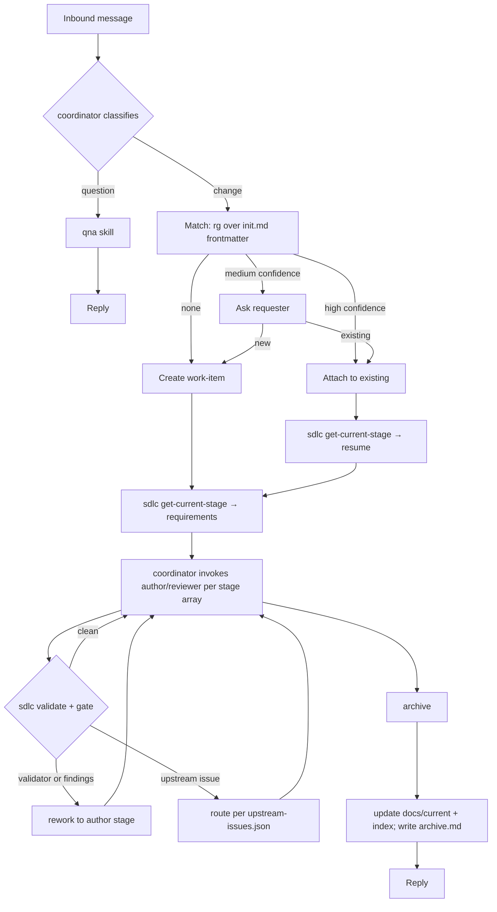

# Project Initiation — Agentic SDLC Toolkit (v0.6.0)

---
document_type: project-init
project_slug: agentic-sdlc
version: 0.6.0
status: draft
created: 2026-09-15
updated: 2026-09-17
platform_scope: opencode-only
first_target: opencode
deployment_model: per-repo
---

## 1. Purpose

A portable-*enough* set of agents, skills, and one deterministic CLI that lets a software project be managed end-to-end by AI coding agents — intake, triage, work-item lifecycle, question-answering — with a human able to step in at declared checkpoints but not required to drive.

Load-bearing invariant: **no hidden state.** Current stage is derived from versioned artifacts. Non-derivable control state lives in `workflow.json`, which is itself a versioned artifact. No session memory. No un-versioned scratch. Cold-resumable.

Two commitments:

- **Structure only what must be checked.** Relational fields (IDs, references, revisions) are structured so a deterministic validator can walk the graph. Content fields are prose.
- **Mechanical and semantic findings are separate.** Structural defects are auto-blocking and non-negotiable. Semantic judgment is the reviewer's job alone.

---

## 2. Problem Statement

Ad-hoc agent use produces four recurring failures: context bloat, untracked work, inconsistent rigor, and state that lives only in a session. A fifth failure the design targets: **artifacts that look structured but are never checked**, so a cycle in the plan or an orphan requirement survives review and surfaces as an implementation defect.

---

## 3. Goals / Non-Goals

**Goals (v1)**

- G1. A coordinator that classifies inbound messages as question or change and routes.
- G2. A durable, filesystem-based lifecycle under `docs/work-items/` with current stage derived from versioned artifacts.
- G3. One deterministic CLI (`sdlc`) plus thin opencode shims for every mechanical step: get-current-stage, validate, gate, approve, raise/resolve upstream, archive, list.
- G4. Agent and skill definitions authored directly for opencode.
- G5. Per-repo install — no shared service.
- G6. Stage selection by written criteria, recorded with rationale.
- G7. Type tracked independently of stages.
- G8. Graph-level integrity of artifacts validated mechanically (cycles, orphans, dangling references, revision staleness).
- G9. Single runtime dependency: Node. CLI, scripts, and opencode shims all run on Node/TypeScript.

**Non-Goals (v1)**

- NG1. Multi-repo orchestration.
- NG2. **Portability to any platform other than opencode.** Phase 2.
- NG3. Parallel work-items per repo.
- NG4. A GUI.
- NG5. Per-field lineage (`based_on` stays per-artifact).
- NG6. Compilers or canonical-source tooling. Deferred until a second target exists.

---

## 4. Glossary

| Term | Definition |
|---|---|
| Coordinator | Classifies inbound messages, matches/creates work-items, delegates stages. No specialist work. |
| Work-item | A unit of change under `docs/work-items/<slug>/`. |
| Stage | One atomic step producing exactly one artifact, or a terminal side-effect. |
| Stage registry | All stages defined once in `.agentic-sdlc/stages.yaml`. Registry only; no named paths. |
| Stage array | Ordered list of stage names recorded in `workflow.json`. Frozen after the requirements gate clears. |
| Type | Work category. Registry-driven in `.agentic-sdlc/types.yaml`. Orthogonal to stages. |
| Gate | `findings.length == 0`. Observations do not block. |
| Validator | Deterministic graph checks. All findings block. |
| Reviewer | LLM agent that answers a stage's semantic checklist. Never performs mechanical checks. |
| Finding | A blocking defect. Validator findings are always blocking; reviewer findings are blocking by construction. |
| Observation | A non-blocking reviewer note. Recorded; never blocks; never counts toward rounds. |
| Upstream issue | A finding raised by a later stage against an earlier author stage. |
| `based_on` | Per-author-artifact map `{upstream_artifact: revision_seen}`. |
| `getCurrentStage` | Pure function `getCurrentStage(stage_registry, work_item_dir) → CurrentState`. |
| `workflow.json` | Versioned control artifact: stage array, status, type, freeze state, stage history, blocked/abandoned reasons. |

---

## 5. Roles & Actors

| Actor | Type | Responsibility |
|---|---|---|
| Stakeholder / developer | Human | Sends requests, answers clarifications, approves at checkpoints. |
| coordinator | Agent | Classifies, matches/creates, delegates. No specialist work. |
| author | Agent | Parameterized by stage. Authors `requirements.json`, `design.json`, `plan.json`, `implementation-log.json`, or `findings.md`. Each stage has its own prompt template; artifacts stay separate per stage. |
| stage-reviewer | Subagent | Reviews whichever artifact it is pointed at, against that stage's semantic checklist. Never reviews its own prior output. |
| archiver | Agent + CLI | Moves work-item to `done/`, updates `docs/current/` and its index, writes `archive.md`. |

Skills (invoked by coordinator or author, not agents in their own right):

- `qna` — stateless Q&A over the codebase or web. No writes to `docs/work-items/`. Policy skill, not a capability skill.
- `work-item-scaffold` — agent picks slug, summary, type, and initial stage proposal; script scaffolds `init.md` and `workflow.json`.
- `archive-work-item` — script moves folder; agent decides living-doc updates.

**Agent properties.** Each agent definition declares persona, permissions, model, and temperature explicitly:

| Agent | Persona | Permissions | Model / Temperature |
|---|---|---|---|
| coordinator | Router, classifier, matcher | Read repo, create work-item dir, write `init.md` + `workflow.json`, invoke agents | Low temp |
| author | Technical author/engineer | Read declared stage inputs; write only its stage artifact via `sdlc write`; raise upstream issues | Low temp for `implementation`; moderate for `requirements`/`design`/`planning`/`investigation` if the platform supports per-invocation overrides. Otherwise two variants: `author-creative` and `author-precise`. |
| stage-reviewer | Adversarial reviewer | Read target artifact + checklist; write only `<stage>-review.json` | Low temp |
| archiver | Librarian | Move work-item; update `docs/current/` and index; write `archive.md` | Low temp |

**Approval authenticity.** No agent in the table above is granted `sdlc approve`. That omission is deliberate, not incidental: absent an explicit restriction, an approval checkpoint is a formality an agent could satisfy itself, which would make `checkpoint_before` (NFR-004) decorative rather than structural. `sdlc approve` must be reachable only from a path no agent's tool permissions include — a human typing a command directly, not a tool call any agent can make on its own. Whether opencode's permission model can enforce that scoping is ASM-007 / OQ-010, and it gates Phase 1 alongside OQ-001 (§18).

**Author consolidation.** The five author roles differ by prompt and output schema, not by capability. One agent with five templates reduces surface without violating PRIN-001, because each invocation still receives only its stage's declared inputs. If opencode cannot override model/temperature per invocation, split into `author-creative` (requirements, design, planning, investigation) and `author-precise` (implementation) — never five.

---

## 6. Request Flow



---

## 7. Coordinator Decision Logic

### 7.1 Classification

- Question seeks information, no repo modification. Change requires modification or names itself as feature/bugfix/refactor/improvement. Ambiguous → ask one clarifying question; never default silently.
- **Clarifying questions are scoped to classification and matching only.** The coordinator prompt must state explicitly: do not elicit requirements, acceptance criteria, scope, or design. Those belong to the requirements stage.
- **Escalation.** If answering a question requires substantial exploration beyond the configured threshold, propose promoting it to a `spike` work-item. The threshold is concrete, in `config.yaml`:

```yaml
qna:
  max_files_to_inspect: 5
  max_tool_calls: 10
  escalate_if_multiple_components: true
```

### 7.2 Work-item matching

1. **Shortlist (deterministic).** `rg` over `docs/work-items/*/init.md` frontmatter for title, tags, summary. Excludes `done/`.
2. **Judge (LLM).** Coordinator judges the shortlist against the request.

| Confidence | Behavior |
|---|---|
| High | Attach automatically. |
| Medium | Present shortlist; ask. |
| Low / none | Create new. |

### 7.3 Stages, not paths

**There are no named paths.** The stage registry defines every stage once. `workflow.json` records the ordered subset that applies to this work-item.

**Type.** Registry-driven via `.agentic-sdlc/types.yaml`. Examples, not a fixed list:

```yaml
types:
  - id: feature
    description: New user-visible capability
  - id: bugfix
    description: Corrects behavior
  - id: refactor
    description: Internal structure change, no behavior change
  - id: chore
    description: Maintenance
  - id: docs
    description: Documentation only
  - id: spike
    description: Time-boxed investigation
  - id: hotfix
    description: Production incident remediation
  - id: security
    description: Security fix or hardening
```

The CLI validates `workflow.json.type` against this registry. Adding a type does not require code changes.

**Stage registry (all stages, defined once):**

```yaml
stages:
  requirements:
    agent: author
    template: requirements
    output: requirements.json
    kind: author
  requirements-review:
    agent: stage-reviewer
    reviews: requirements.json
    output: requirements-review.json
    semantic_checks: checks/requirements-review.yaml
    kind: review
    author_of: requirements
  design:
    agent: author
    template: design
    output: design.json
    kind: author
  design-review:
    agent: stage-reviewer
    reviews: design.json
    output: design-review.json
    semantic_checks: checks/design-review.yaml
    kind: review
    author_of: design
  planning:
    agent: author
    template: planning
    output: plan.json
    kind: author
  planning-review:
    agent: stage-reviewer
    reviews: plan.json
    output: plan-review.json
    semantic_checks: checks/plan-review.yaml
    kind: review
    author_of: planning
  investigation:
    agent: author
    template: investigation
    output: findings.md
    kind: author
  implementation:
    agent: author
    template: implementation
    output: implementation-log.json
    checkpoint_before: true
    kind: author
  implementation-review:
    agent: stage-reviewer
    reviews: implementation-log.json
    output: implementation-review.json
    semantic_checks: checks/implementation-review.yaml
    kind: review
    author_of: implementation
  archive:
    script: sdlc-archive
    kind: terminal
```

**Stage array authorship.**

- The **coordinator** proposes the initial stage array at scaffold time, based on classification and type. Written into `workflow.json` with `revision: 1`.
- The **requirements author** may revise the stage array while authoring `requirements.json`. Any revision appends a `stage_history` entry and bumps `workflow.json.revision`. Freeze happens when the requirements gate clears.
- If the array includes `requirements-review`, the requirements gate does not clear until that review passes.
- If the array omits `requirements-review`, the requirements gate clears as soon as `requirements.json` is authored and validates.

**Canonical stage arrays (examples, not a registry):**

| Situation | Stage array |
|---|---|
| Trivial single-file change | `[requirements, implementation, implementation-review, archive]` |
| Docs-only | `[requirements, implementation, archive]` |
| Well-understood, no new surface | `[requirements, requirements-review, planning, planning-review, implementation, implementation-review, archive]` |
| Architectural / security | `[..., design, design-review, ...]` inserted before `planning` |
| Time-boxed investigation | `[requirements, investigation, archive]` |
| Production incident | `[requirements, implementation, implementation-review, archive]` with `implementation-review` marked post-hoc and an approval required before `requirements` |

**Selection criteria** (the requirements author decides; recorded in `workflow.json.stage_rationale`):

- Any `security` type, or any change touching an architectural boundary or adding an external dependency → include `design` + `design-review`.
- Any change with non-trivial planning surface → include `planning` + `planning-review`.
- Documentation-only → omit `implementation-review`.
- Trivial, single-file, no behavior ambiguity → omit review stages other than `implementation-review`.
- Time-boxed investigation whose output is knowledge, not code → replace `implementation*` with `investigation`.

**Review override.** A `stage-reviewer` may raise an upstream issue against `requirements.json`, forcing the requirements stage to re-run and revise the stage array. Explicit and logged, never silent.

**Freeze.** The stage array is locked after the requirements gate clears. It changes only while `requirements-review` is open, or while an open upstream issue targets `requirements`.

**Stage array amendment.** If an upstream issue or a validator finding indicates a stage is missing, the array is amended via an explicit, audited path:

1. Current stage becomes `requirements`.
2. The requirements author revises `workflow.json` — inserting the stage with rationale.
3. `stage_history` records the change.
4. `getCurrentStage` runs again with the new array.

Silent insertion by a later stage is not permitted. `sdlc raise-upstream` rejects a target stage that is not in the array, with an actionable message.

### 7.4 Derivable state

Current stage is a pure function of versioned artifacts. No un-versioned state. `workflow.json` is itself a versioned artifact.

Order of precedence:

1. **Bootstrap.** `workflow.json` absent → `requirements` (coordinator must scaffold first).
2. **Blocked / abandoned.** `workflow.json.status` short-circuits.
3. **Validator first.** Any structural finding blocks forward motion. Return the earliest implicated stage.
4. **Upstream issues.** Open issues targeting an author stage take priority; route to the earliest target in array order.
5. **Walk stages in order.** First stage whose artifact is missing, stale, whose review is missing/stale/closed, or whose checkpoint approval is missing/stale is current.

```python
def getCurrentStage(registry, work_item_dir) -> CurrentState:
    wf = load(work_item_dir / "workflow.json")
    if wf is None:
        return Current(stage="requirements", reason="workflow.json absent")
    if wf["status"] == "abandoned":
        return Current(stage="abandoned", reason=wf["abandoned"]["reason"])
    if wf["status"] == "blocked":
        return Current(stage="blocked", reason=wf["blocked"]["reason"])

    req = load(work_item_dir / "requirements.json")
    if req is None:
        return Current(stage="requirements", reason="absent")

    stage_names = wf["stages"]
    stages = [registry[s] for s in stage_names]

    findings = validate(work_item_dir, registry, wf)
    if findings:
        earliest = min(findings, key=lambda f: stage_names.index(f.stage))
        return Current(stage=earliest.stage, reason=f"validator: {earliest.code}")

    up = load(work_item_dir / "upstream-issues.json")
    if up:
        open_targets = [i["target_stage"] for i in up["issues"]
                        if i["status"] == "open"]
        if open_targets:
            earliest = min(open_targets, key=stage_names.index)
            return Current(stage=earliest, reason="open upstream issue")

    for stage in stages:
        art = load(work_item_dir / stage.output) if stage.output else None

        if stage.kind == "author":
            if stage.checkpoint_before:
                appr = load(work_item_dir / f"approvals/{stage.name}.json")
                if appr is None:
                    return Current(stage=stage.name, reason="awaiting_approval")
                if approval_is_stale(appr, work_item_dir):
                    return Current(stage=stage.name, reason="approval_stale")

            if art is None:
                return Current(stage=stage.name, reason="artifact absent")

            for upstream_name, seen_rev in art["based_on"].items():
                current = load(work_item_dir / upstream_name)["revision"]
                if current > seen_rev:
                    return Current(stage=stage.name,
                                   reason=f"stale: {upstream_name} at rev {current}")

        if stage.kind == "review":
            if art is None:
                return Current(stage=stage.name, reason="review absent")
            author_art = load(work_item_dir / stage.reviews)
            last = art["rounds"][-1]
            if last["reviewed_revision"] < author_art["revision"]:
                return Current(stage=stage.name, reason="stale review")
            if not last["gate_cleared"]:
                if len(art["rounds"]) < MAX_ROUNDS:
                    return Current(stage=stage.author_of, reason="gate closed")
                return Current(stage="blocked", reason="max_rounds_reached")

    return Current(stage="done", reason="all stages gate-cleared")
```

`MAX_ROUNDS` above is not a hardcoded constant — it reads from `config.yaml`'s `review.max_rounds` (§7.8), consistent with PRIN-015. The same file also holds the open-upstream-issue cap that RISK-006 mitigates against.

**Invariants:**

1. No out-of-order artifacts. Enforced by scaffold and validator.
2. `reviewed_revision ≤ author.revision`. Validator raises on violation.
3. Stage array is frozen after the requirements gate clears; amendments require the explicit path in §7.3.
4. Every write to a work-item file is atomic — temp file plus rename, never an in-place partial write (NFR-009). A crash mid-write leaves the previous valid file intact. Correspondingly, `sdlc validate` treats an unparseable file as a blocking finding, never as an absent stage — a corrupted-but-present file must never be silently read as "not started."

**`escalated` is retired.** Max rounds transitions to `workflow.json.status = "blocked"` with reason `max_rounds_reached`. One terminal condition, one representation.

### 7.5 State holes — in `workflow.json`, not `init.md`

`init.md` is immutable after scaffold. It records only intake information: slug, created_at, requester, classification, initial type, tags, original request text, coordinator intake notes. Nothing that evolves.

Anything that evolves and is not derivable from the artifact graph lives in `workflow.json`:

- `status` (`active` | `blocked` | `abandoned`)
- `blocked` / `abandoned` reasons
- `stages` and `stage_history`
- `stage_rationale`
- `type` (may change if requirements reframes the work)
- `frozen_at`

Approvals remain separate files — the audit value of a distinct, human-authored record is worth the file.

### 7.6 Upstream issues and `based_on`

`upstream-issues.json` at the work-item root. Append-only in effect; resolution updates status in place; entries never deleted.

1. **Raising.** Any author or review stage appends via `sdlc raise-upstream`. `target_stage` must be strictly earlier in the current stage array and must be an author stage. If the target is not in the array, the write is rejected with an actionable message: either target an existing earlier author stage, or route to `requirements` to amend the array via §7.3.
2. **Resolution.** Only the target stage resolves, in the same write that revises its artifact. `resolved_by_revision: N` or `null` + decision note.
3. **Verification.** The target's review stage re-runs (revision changed → review stale). Inadequate fixes raise a new issue with `supersedes: "UP-001"`. Never re-open.
4. **Multiple open issues.** Route to the earliest target in array order.
5. **Orphaned issues.** If the array changes and an issue targets a stage no longer present, ignore in getCurrentStage and note in `warnings`. Never delete.

`based_on` chain on every author artifact:

```json
{ "revision": 2, "based_on": { "requirements.json": 2 } }
```

`getCurrentStage` marks a stage stale if any artifact in its `based_on` has a newer current revision.

**Self-resolution guard.** `sdlc get-current-stage` emits `stale_open: true` when `target_artifact.revision > target_revision_seen` while the issue is still open. It does not auto-resolve.

### 7.7 Review findings and gates

Two reviewer streams, one validator stream.

| Source | Stream | Blocks? |
|---|---|---|
| Validator | `findings` | Yes — non-negotiable |
| Reviewer | `findings` | Yes |
| Reviewer | `observations` | No |

`gate_cleared = (findings.length == 0)`.

Round counting: increments only when `findings.length > 0`. Observations-only rounds clear the gate. No escalation of observations in v1; a human may promote an observation to a finding by editing the review file and appending a round.

Rationale for splitting: if every semantic nitpick blocks, reviews either loop to max rounds or the reviewer learns to suppress real minor defects. Observations preserve the signal without blocking.

### 7.8 Configuration reference

Every tunable limit lives in `.agentic-sdlc/config.yaml`, never hardcoded in the CLI — changing a threshold is a config edit, not a code change (PRIN-015). §7.1 already showed the `qna` block; the full file also carries the round and issue caps referenced in §7.4 and RISK-006:

```yaml
qna:
  max_files_to_inspect: 5
  max_tool_calls: 10
  escalate_if_multiple_components: true

review:
  max_rounds: 3                 # rounds before a stage's status becomes blocked
  max_open_upstream_issues: 5   # beyond this, escalate to human (RISK-006)
```

`sdlc validate` treats a `config.yaml` missing `review.max_rounds` as a blocking finding — there is no implicit fallback a work-item can silently inherit.

---

## 8. Repository Layout

**Per-work-item:**

```
docs/work-items/
  <slug>/
    init.md                        # immutable after scaffold
    workflow.json                  # stage array, status, type, history
    requirements.json
    requirements-review.json
    design.json                    # iff array includes design
    design-review.json
    plan.json
    plan-review.json
    implementation-log.json
    implementation-review.json
    findings.md                    # iff array includes investigation
    upstream-issues.json           # iff ≥1 issue raised
    approvals/
      implementation.json          # iff checkpoint_before
  done/
    2026-09-15-14-32-<slug>/
      ...frozen...
      archive.md
  index.md
```

**Toolkit:**

```
.agentic-sdlc/
  config.yaml
  stages.yaml                      # registry only; no named paths
  types.yaml                       # allowed type ids
  checks/
    requirements-review.yaml
    design-review.yaml
    plan-review.yaml
    implementation-review.yaml
  agents/
    coordinator.md
    author.md
    stage-reviewer.md
    archiver.md
  skills/
    qna/
      SKILL.md
    work-item-scaffold/
      SKILL.md
      scripts/scaffold.ts
      references/init-template.md
      references/workflow-template.json
    archive-work-item/
      SKILL.md
      scripts/archive.ts
      references/adr-template.md
      references/capability-template.md
      references/glossary-format.md
  schemas/                        # JSON Schema (2020-12), one file per artifact type; validated via ajv (§11)
  bin/
    sdlc                           # Node entry point
```

**Tests:**

```
test/
  fixtures/                        # golden work-item dirs, one per validator/getCurrentStage case
    cycle/
    orphan-requirement/
    dangling-reference/
    revision-inversion/
    stale-based-on/
    ...                            # one fixture per routing case in §19's Definition of Done
  unit/
```

**Runtime.** Node only. CLI and scripts are TypeScript compiled to JS, or JS with JSDoc. Dependencies kept minimal: `yaml`, `ajv`, `commander`. No Python.

OpenCode installation places thin `.opencode/tools/*.ts` shims that exec `sdlc <subcommand>` and return JSON. No logic in the shims. Whether a `run-next` shim that invokes a subagent exists depends on OQ-001.

**Living docs.**

- All living docs live under `docs/current/`.
- `docs/current/index.md` (or `agents.md`) is the memory index: one line per doc describing what it covers, so an agent can decide when to open which.
- Each living doc carries frontmatter: `owner: human|agent`, `last_updated`, `source_work_item`.
- The archiver updates the index when it creates or updates a living doc.

No registry is required in v1. If a project later needs multiple living-doc roots, add `.agentic-sdlc/living_docs.yaml`.

`docs/architecture/` remains human-owned; the archiver never creates it.

---

## 9. Artifact Contracts

**Design rules.**

- Structure relational fields only. Any field a check reads is structured; everything else is prose.
- Every structured artifact carries `revision`; authored artifacts carry `based_on`.
- IDs are stable and prefixed: `REQ-`, `AC-`, `DEC-`, `T-`, `UP-`, `F-`, `OB-`, `ASM-`.
- Markdown for narrative (`init.md`, `findings.md`, `archive.md`); JSON for artifacts the validator walks.
- Config and checklists are YAML. Work-item machine artifacts are JSON. Agents do not read or write raw YAML for work-item artifacts.

### 9.1 `init.md` (immutable after scaffold)

```markdown
---
slug: add-oauth-login
created_at: 2026-09-15T14:32:00Z
requester: alice@example.com
classification: change
initial_type: feature
tags: [auth, oauth]
---
# Request
<verbatim inbound request>

# Coordinator notes
<intake notes: matching result, initial stage proposal rationale>
```

### 9.2 `workflow.json`

```json
{
  "revision": 2,
  "status": "active",
  "type": "feature",
  "stages": ["requirements", "requirements-review", "design", "design-review",
             "planning", "planning-review", "implementation",
             "implementation-review", "archive"],
  "stage_rationale": "Introduces an external identity dependency; touches the auth boundary.",
  "frozen_at": null,
  "blocked": null,
  "abandoned": null,
  "stage_history": [
    { "revision": 1,
      "stages": ["requirements", "implementation", "implementation-review", "archive"],
      "reason": "initial coordinator proposal",
      "at": "2026-09-15T14:32:00Z" },
    { "revision": 2,
      "stages": ["requirements", "requirements-review", "design", "design-review",
                 "planning", "planning-review", "implementation",
                 "implementation-review", "archive"],
      "reason": "requirements: external identity dependency, boundary crossing",
      "at": "2026-09-15T15:10:00Z" }
  ]
}
```

Blocked example:

```json
{
  "revision": 3,
  "status": "blocked",
  "blocked": {
    "reason": "max_rounds_reached",
    "since": "2026-09-16T10:00:00Z",
    "detail": "design-review round 3 did not clear"
  }
}
```

### 9.3 `requirements.json`

```json
{
  "revision": 2,
  "based_on": {},
  "summary": "Add OAuth login via Google and GitHub providers.",
  "scope": { "in": ["..."], "out": ["..."] },
  "assumptions": [{ "id": "ASM-1", "text": "..." }],
  "requirements": [
    {
      "id": "REQ-001",
      "text": "Users may authenticate via Google OAuth 2.0.",
      "acceptance_criteria": [
        { "id": "AC-001", "text": "..." },
        { "id": "AC-002", "text": "..." }
      ]
    }
  ],
  "open_questions": []
}
```

Note: `type`, `stages`, and `stage_rationale` moved to `workflow.json`.

### 9.4 `design.json`

```json
{
  "revision": 1,
  "based_on": { "requirements.json": 2 },
  "approach": "...",
  "affected_components": [
    { "name": "auth-service", "new": false, "change": "..." },
    { "name": "auth-oauth",   "new": true,  "change": "..." }
  ],
  "requirement_responses": [
    { "requirement_id": "REQ-001", "how": "..." }
  ],
  "decisions": [
    { "id": "DEC-001", "text": "...", "rationale": "...",
      "addresses": ["REQ-001"], "supersedes": null }
  ],
  "failure_modes": [
    { "component": "auth-oauth", "mode": "...", "response": "..." }
  ]
}
```

### 9.5 `plan.json`

```json
{
  "revision": 1,
  "based_on": { "design.json": 1 },
  "tasks": [
    {
      "id": "T-001",
      "description": "...",
      "files": ["..."],
      "depends_on": [],
      "covers": ["REQ-001"],
      "verifies_criteria": [],
      "completion_condition": "...",
      "size": "small"
    }
  ]
}
```

### 9.6 `implementation-log.json`

Kept separate from `plan.json`. `plan.json` is the reviewed intent; `implementation-log.json` is the execution record. Merging them would invalidate the planning review on every implementation edit and destroy the planned-vs-actual comparison.

```json
{
  "revision": 1,
  "based_on": { "plan.json": 1 },
  "tasks": [
    {
      "task_id": "T-001",
      "status": "done",
      "what_changed": "...",
      "files_touched": ["..."],
      "tests_run": ["..."],
      "notes": ""
    }
  ],
  "deviations": [
    { "from_task": "T-002", "reason": "..." }
  ]
}
```

If implementation discovers the plan is wrong, raise an upstream issue against `planning`. Do not silently edit `plan.json`.

### 9.7 `findings.md`

Frontmatter: `revision`, `based_on`. Body: Question, Method, Findings, Confidence, Recommendations.

### 9.8 `<stage>-review.json`

One file per review stage. Round history inside. Every checklist item answered with evidence.

```json
{
  "stage": "design-review",
  "reviews": "design.json",
  "rounds": [
    {
      "round": 1,
      "reviewed_revision": 1,
      "findings": [
        { "id": "F-001", "check_id": "DR-002",
          "text": "...", "evidence": "...", "target_artifact": null }
      ],
      "observations": [
        { "id": "OB-001", "check_id": "DR-004",
          "text": "...", "evidence": "..." }
      ],
      "gate_cleared": false,
      "checks_answered": {
        "DR-001": "§requirement_responses",
        "DR-002": "absent"
      }
    }
  ]
}
```

Validator checks:

- every `check_id` in the stage checklist appears in `checks_answered` for every round,
- `reviewed_revision` is monotone non-decreasing,
- `gate_cleared == (findings.length == 0)`,
- finding and observation `id`s are unique within the artifact,
- every `check_id` referenced in a finding or observation appears in the stage checklist.

### 9.9 `upstream-issues.json`

```json
{
  "work_item": "add-oauth-login",
  "issues": [
    {
      "id": "UP-001",
      "raised_by_stage": "implementation-review",
      "raised_at_round": 1,
      "raised_at": "2026-09-15T14:32:00Z",
      "target_stage": "design",
      "target_artifact": "design.json",
      "target_revision_seen": 1,
      "text": "...",
      "status": "open",
      "resolution": null,
      "supersedes": null
    }
  ]
}
```

### 9.10 `approvals/<stage>.json`

```json
{
  "stage": "implementation",
  "work_item": "add-oauth-login",
  "approver": "alice@example.com",
  "approved_at": "2026-09-15T15:00:00Z",
  "approval_type": "pre_stage",
  "work_item_revision": { "requirements.json": 2, "plan.json": 1 },
  "notes": "Approved after design review."
}
```

**Use.** Stage registry has `checkpoint_before: true`. `getCurrentStage` sees the stage is next. If the approval file is missing, current stage is that stage with reason `awaiting_approval`. If the file exists but `work_item_revision` does not match current revisions, the approval is stale; current stage is still that stage, reason `approval_stale`. `sdlc approve <slug> <stage>` validates revisions and writes the file. For hotfix, `approval_type` can be `post_hoc`.

**Enforcement.** No agent is granted `sdlc approve` (§5, PRIN-016); it is reachable only from a human-triggered invocation path. That restriction, not the file format, is what makes `checkpoint_before` a structural gate rather than a self-certifiable formality — see ASM-007 / OQ-010.

### 9.11 `archive.md`

Audit property: if `archive.md` exists, it must contain either non-empty `docs_updated` or a non-null `no_update_reason`. Absence means the archiver failed.

```markdown
---
archived_at: 2026-09-15T16:00:00Z
work_item: add-oauth-login
docs_updated:
  - { doc: docs/current/decisions/0007-oauth.md, change: created, source_artifact: design.json }
  - { doc: docs/current/index.md, change: updated, source_artifact: design.json }
no_update_reason: null
---
# Summary
# Outcomes
# Follow-ups
```

---

## 10. Validator vs. Reviewer

Two streams. They never overlap.

| Validator (`sdlc validate`) — all findings block | Reviewer (LLM) — findings block; observations do not |
|---|---|
| Every `REQ` has ≥1 `AC`. | Are the criteria testable by a third party without asking the author? |
| Every `REQ` is covered by ≥1 task. | Is that coverage adequate, or nominal? |
| Every `AC` is verified by ≥1 task. | Do verification steps demonstrate the criterion? |
| `depends_on` is acyclic. | Are dependency edges *semantically* correct? |
| Every reference resolves. | — |
| `reviewed_revision ≤ author.revision`; `based_on` ≤ current. | — |
| Every plan task has an implementation-log entry. | Is the entry substantively complete? |
| Every checklist item answered. | Is the evidence actually responsive to the check? |
| Approval file present and revision-current where `checkpoint_before`. | — |

**Rule for adding a validator check.** Every check must be one you would defend as *provably wrong* if it fires. If justifying a finding needs a paragraph, it belongs to the reviewer.

**Rule for the reviewer.** Never performs mechanical checks; never argues with a validator finding. Findings are blocking by construction; observations are non-blocking notes.

**Rule for evidence.** Every reviewer answer cites a section, quotes a line, or states `absent`.

---

## 11. The `sdlc` CLI

```
sdlc get-current-stage <slug>
sdlc validate <slug> [--stage X]
sdlc write <slug> <stage> [--file X | stdin]
sdlc gate <slug> <stage>
sdlc approve <slug> <stage>
sdlc raise-upstream <slug> ...
sdlc resolve-upstream <slug> ...
sdlc archive <slug>
sdlc list
```

`get-current-stage` calls `validate` internally. OpenCode shims exec the corresponding subcommand and return JSON.

**`sdlc write` behavior.** This is the only path by which an author artifact reaches disk — §5's "write only its stage artifact via `sdlc write`" and Appendix C's "agents (via CLI)" both depend on this command actually existing, which the CLI list above previously did not reflect. It:

- confirms `<stage>` matches the work-item's current stage per `getCurrentStage`; rejects otherwise with an actionable message naming the actual current stage,
- validates the payload against that stage's JSON Schema (`schemas/<stage>.json`) before writing anything,
- computes `revision` itself — 1 if the artifact is absent, else the previous `revision + 1` — rather than trusting the caller,
- computes `based_on` from the current revisions of the stage's declared upstream artifacts (per the stage registry), rather than trusting the caller to supply it,
- writes atomically: temp file, then rename (NFR-009),
- refuses to write outside `docs/work-items/<slug>/`.

It does not decide *what* the artifact says — that stays the author agent's job. It only guarantees that whatever is written is structurally honest, which is the same division of labor as §10's validator-vs-reviewer split, applied to the write path instead of the read path.

**`sdlc raise-upstream` behavior.** Appends a new issue to `upstream-issues.json`:

- assigns `UP-XXX`,
- records `raised_by_stage`, `raised_at_round`, `raised_at`,
- records `target_stage`, `target_artifact`, `target_revision_seen`, `text`,
- sets `status: open`,
- optionally sets `supersedes`,
- validates that `target_stage` is strictly earlier in the current stage array,
- validates that `target_stage` is an author stage,
- **rejects with an actionable message if the target stage is not in the array**: either target an existing earlier author stage, or route to `requirements` to amend the array (§7.3).

It does **not** modify the target artifact. It does **not** route. `getCurrentStage` routes on the next run.

**Language.** Node/TypeScript only. No Python dependency. Shims are TS; CLI is TS compiled to JS (or JS with JSDoc). Minimal deps: `yaml`, `ajv`, `commander`.

**Skills with bundled scripts:**

| Skill | Why a skill |
|---|---|
| `work-item-scaffold` | Agent chooses slug, summary, type, initial stage proposal; script scaffolds. |
| `archive-work-item` | Script moves folder; agent decides living-doc and index updates. |
| `qna` | Policy skill: stateless, no writes, citation requirement, escalation threshold. |

`qna` is not about capability. It exists to encode policy: no writes to `docs/work-items/`, stateless, cite sources, escalate to a spike work-item when the configured exploration threshold is exceeded. If opencode already provides a generic Q&A command, `qna` can be a prompt-only skill or slash command.

**`work-item-scaffold` details.**

Agent decides: slug, summary, type, requester, classification, initial stage array proposal.

Script does:

- validates slug is unique and filesystem-safe,
- creates `docs/work-items/<slug>/`,
- writes `init.md` from template with only immutable intake information,
- writes `workflow.json` with `revision: 1`, `status: active`, proposed stages, type, empty `stage_history` (or one entry recording the initial proposal),
- creates `approvals/` if any stage in the proposed array has `checkpoint_before`,
- updates `docs/work-items/index.md`,
- refuses to overwrite an existing work-item.

It does **not** author requirements, design, plan, or reviews. It does not create `upstream-issues.json`.

**Testing strategy.** §19's Definition of Done requires `sdlc validate` to catch specific defects "with fixtures" — this is where those fixtures live. Each case under `test/fixtures/` (§8) is a hand-built, intentionally-broken work-item directory: a cycle in `depends_on`, an uncovered requirement, a dangling reference, a revision inversion, a stale `based_on`. Running `sdlc validate` against a fixture *is* the test; the finding's `code` field is the expected output, so no separate assertion framework is needed for this layer.

`getCurrentStage` gets narrower unit tests along the same lines: each routing case in §19 (open upstream issue, stale review, stale `based_on`, closed gate with rework, max-rounds → blocked, blocked status, abandoned status, missing approval, stale approval) is a fixture paired with an expected `CurrentState`. Phase 1 does not ship without both fixture sets in place — they're what makes §19's exit criteria checkable rather than merely asserted.

---

## 12. Semantic Check Lists

Under `.agentic-sdlc/checks/<stage>-review.yaml`:

```yaml
- id: DR-002
  question: >
    For each new external dependency or boundary crossing, does the
    design name its failure modes and the response to each?
  evidence: cite the design section addressing it, or state "absent"
```

Five to eight checks per stage. No `default_severity` field: findings block; observations do not. Severity is the stream, not a per-item property.

**`requirements-review.yaml`**
- REQ-001: Is each AC falsifiable by a third party without asking the author?
- REQ-002: Do criteria state *what*, not *how*?
- REQ-003: Is scope bounded, with explicit out-of-scope?
- REQ-004: Are unstated assumptions surfaced as `ASM-*`?
- REQ-005: Does the stage array follow §7.3 criteria, or is it asserted?
- REQ-006: Are open questions genuinely open, not deferrals?

**`design-review.yaml`**
- DR-001: Does each requirement have a proportionate design element?
- DR-002: Are failure modes named for each new dependency or boundary?
- DR-003: Is cross-cutting concern handling explicit, including deferrals?
- DR-004: Does any decision contradict an earlier one without `supersedes`?
- DR-005: Is the component list complete — no phantom components downstream?

**`plan-review.yaml`**
- PR-001: Does each task have a verifiable completion condition?
- PR-002: Is there a task that verifies each AC?
- PR-003: Are `depends_on` edges semantically right, not merely acyclic?
- PR-004: Is any task large enough that its failure would be undiagnosable?
- PR-005: Does any task touch files outside the design's component list without justification?

**`implementation-review.yaml`**
- IR-001: Does the log account for every plan task, including deviations?
- IR-002: Are test results reported, or merely asserted?
- IR-003: Do deviations carry a reason and a follow-up?
- IR-004: Does any file touched contradict the design's component boundaries?

Versioned in git. A check that never fires in fifty reviews is either redundant or badly worded; the record lets you tell.

---

## 13. Architecture Principles

| ID | Principle |
|---|---|
| PRIN-001 | Context hygiene by delegation. Subagents receive only their stage's declared inputs. |
| PRIN-002 | Script what's deterministic. |
| PRIN-003 | No hidden state. Current stage is derived from versioned artifacts; non-derivable control state lives in `workflow.json`, itself versioned. Cold-resumable. |
| PRIN-004 | Append-only trail. Revisions, rounds, and upstream issues accumulate. |
| PRIN-005 | No self-review. Structurally enforced. |
| PRIN-006 | Platform-native. v1 is opencode-only; portability is Phase 2. |
| PRIN-007 | Per-repo, no shared service. |
| PRIN-008 | Explicit rigor selection. Stage array chosen by written criteria, recorded with rationale. |
| PRIN-009 | Approvals are files, not chat acknowledgements. |
| PRIN-010 | Binary gating. `findings.length == 0`. Observations do not block. |
| PRIN-011 | Structure relational fields only. |
| PRIN-012 | Mechanical and semantic findings are separate streams. |
| PRIN-013 | One agent, many templates. Author roles differ by prompt, not capability. Split only if the platform cannot override model or temperature per invocation. |
| PRIN-014 | Single runtime. Node/TypeScript for CLI, scripts, and shims. No secondary interpreter. |
| PRIN-015 | Registry-driven configuration. Stages, types, and checks are YAML; code reads them; adding a type or check does not require code change. |
| PRIN-016 | Approval authenticity. `sdlc approve` is reachable only via a human-triggered path, never through any agent's tool permissions. A checkpoint an agent can satisfy itself is not a checkpoint. |

---

## 14. Non-Functional Requirements

| ID | Requirement |
|---|---|
| NFR-001 | Any agent invocation is resumable cold. |
| NFR-002 | Duplicate-match search must not invoke an LLM over the full corpus. |
| NFR-003 | Install to a fresh repo is a single command. |
| NFR-004 | No destructive operations without a declared approval checkpoint. |
| NFR-005 | The toolkit functions with review or implementation stages omitted without breaking archive or audit trail. |
| NFR-006 | Current-stage derivation is O(stages) reads of small artifacts. |
| NFR-007 | `sdlc validate` completes in under one second on a work-item with up to 200 plan tasks. |
| NFR-008 | The toolkit runs on Node only. No Python or other interpreter is required at install or runtime. |
| NFR-009 | Every CLI-mediated write to a work-item file is atomic (temp file + rename); a process crash never leaves a partially-written artifact on disk. |

---

## 15. Assumptions

| ID | Assumption |
|---|---|
| ASM-001 | opencode's subagent, skill, tool, and config primitives are stable enough to build against. |
| ASM-002 | Target repos are git repositories; work-item state is committed alongside code. |
| ASM-003 | One active pipeline per repo is acceptable in v1. |
| ASM-004 | opencode custom tools may exec any backing binary; only the shim is TS/JS. |
| ASM-005 | opencode allows a custom tool or slash-command to invoke a subagent programmatically. Load-bearing — see OQ-001. |
| ASM-006 | Node is available wherever opencode runs. If true, dropping Python is free. If false, this assumption fails and the single-runtime principle is revisited. |
| ASM-007 | opencode's permission model can scope a subagent's tool access narrowly enough to exclude one specific `sdlc` subcommand (`approve`) while still allowing others (`write`, `gate`, ...). Load-bearing for PRIN-016 — see OQ-010. |

---

## 16. Open Questions

| ID | Question |
|---|---|
| OQ-001 | Does opencode allow a custom tool or slash-command to invoke a subagent programmatically? If yes, the pipeline collapses to a single `run-next` tool call. If no, the coordinator stays in the loop per stage. Resolve before Phase 1 coding. |
| OQ-002 | Which stages require a human approval checkpoint by default? Current: `implementation` before start; hotfix before entry. |
| OQ-003 | Should `qna` cite sources always, or may it answer speculatively? |
| OQ-004 | How are binary or large files touched by implementation handled in `implementation-log.json`? |
| OQ-005 | Upstream-issue resolution: target-stage resolves (proposed), or raiser verifies? |
| OQ-006 | Should the "trivial, single-file" scenario (§7.3) carry a `requirements-review`? Proposed: no. (Previously worded around a `quick` type that doesn't exist in `types.yaml` — reworded to match the actual scenario name.) |
| OQ-007 | When a second platform target appears, is a compiler needed, or does convention suffice? Phase 2. |
| OQ-008 | Does opencode allow per-invocation model/temperature override for a subagent? If no, split `author` into `author-creative` and `author-precise`. |
| OQ-009 | Does `docs/current/index.md` suffice as the memory index, or is a machine-readable index (`docs/current/index.json`) needed for agent lookup at scale? |
| OQ-010 | Can an agent's tool permissions be scoped to exclude one specific `sdlc` subcommand (`approve`) while still allowing others (`write`, `gate`)? If opencode can't express that, `checkpoint_before` needs a different enforcement path — e.g., `approve` only ever run from a human's own terminal, never exposed to any agent-accessible tool. Resolve before Phase 1 coding, alongside OQ-001. |

---

## 17. Risks

| ID | Risk | Mitigation |
|---|---|---|
| RISK-001 | Stage-selection criteria too coarse; frequent overrides. | Track override frequency; tighten from data. |
| RISK-002 | Author consolidation causes prompt drift across templates. | One template file per stage; reviewer checks output against stage schema. |
| RISK-003 | Duplicate-match false positives. | Conservative high-confidence threshold; bias toward asking. |
| RISK-004 | Context hygiene violated. | Explicit per-agent `inputs` contract; validator checks declared inputs match stage registry. |
| RISK-005 | `based_on` chain broken. | Schema-validate every author artifact; `getCurrentStage` rejects missing `based_on` or `revision`. |
| RISK-006 | Upstream issues proliferate. | Cap open issues per work-item (default 5); beyond cap, escalate to human. |
| RISK-007 | Artifact hand-edited out of order. | `sdlc validate` checks ordering invariants. |
| RISK-008 | Semantic checklists become stale. | Version in git; correlate check IDs against escaped defects; retire checks that never fire. |
| RISK-009 | Observations accumulate unread and hide real defects. | `sdlc list` surfaces observation counts; archive includes an observation summary; humans may promote an observation to a finding. |
| RISK-010 | `workflow.json` treated as a free-form state file. | Schema-validate; only `sdlc` subcommands write it; `stage_history` is append-only; every write bumps `revision`. |
| RISK-011 | Node-only runtime assumption fails on some target machine. | Assumption ASM-006; verified at install; if it fails, revisit PRIN-014. |
| RISK-012 | `checkpoint_before` approval is effectively satisfied by an agent, not a human, because permission scoping (OQ-010) turns out not to be enforceable. | Fall back to running `sdlc approve` only from a path no agent-accessible tool can reach — a human's own terminal or an out-of-band UI, never invoked programmatically by an agent. |
| RISK-013 | A crash mid-write corrupts a work-item file despite atomic-write intent (e.g., an unusual filesystem breaks temp-then-rename). | `sdlc validate` treats unparseable JSON as a blocking finding, never as an absent/empty stage (Invariant 4, §7.4); recovery is restoring from git, not silent regeneration. |

---

## 18. Phasing

Each phase is a working, testable vertical slice. No phase begins until the prior phase's success criteria are met.

**Phase 0 — spikes (blocking; no toolkit code written against unresolved answers).**
Resolve OQ-001 (can a custom tool or slash-command invoke a subagent programmatically?) and OQ-010 (can an agent's permissions be scoped to exclude `sdlc approve` specifically?) against a real opencode instance. Both are load-bearing shape decisions, not implementation detail: OQ-001 decides whether the coordinator stays in the loop per stage or the pipeline collapses to a single `run-next` call; OQ-010 decides whether `checkpoint_before` (PRIN-016, NFR-004) is structurally enforced or merely conventional. Phase 1 does not begin until both have answers — a negative answer changes what Phase 1 builds, so "we don't know yet" is not a safe starting position.

**Phase 1 — minimal vertical slice.**
`requirements → implementation → implementation-review → archive`, on a single work-item.
Agents: coordinator, author (requirements + implementation templates), stage-reviewer, archiver.
CLI (Node): `get-current-stage`, `validate` (subset: schema, `based_on`, `reviewed_revision`), `write`, `gate`, `archive`, `list`.
Artifacts: `init.md`, `workflow.json`, `requirements.json`, `implementation-log.json`, `implementation-review.json`, `archive.md`.
Tests: `test/fixtures/` covering the Phase 1 subset of validator checks, plus `getCurrentStage` unit tests for Phase 1's routing cases (§11's Testing strategy).
Proves: end-to-end flow, cold resumability, binary gating, archive audit trail, Node-only runtime, atomic writes survive a mid-write crash.

**Phase 2 — review and planning.**
Adds `requirements-review`, `planning`, `planning-review`.
Adds: `based_on` staleness detection, `upstream-issues.json`, `raise-upstream`, `resolve-upstream`, full validator graph checks.
Proves: multi-stage derivation, upstream routing, revision cascades.

**Phase 3 — design.**
Adds `design`, `design-review`.
Proves: architectural work-items run end-to-end.

**Phase 4 — remaining stages and modifiers.**
Adds `investigation`, `checkpoint_before` approvals, hotfix post-hoc review, living-doc and index updates on archive, semantic checklists as versioned artifacts.

---

## 19. Success Criteria (v1 Definition of Done)

- A request goes from natural-language message to an archived, fully-audited work-item with zero manual file editing.
- Every canonical stage array from §7.3 has at least one successful end-to-end run.
- Duplicate-match correctly attaches a repeat request without asking, and asks on a genuinely ambiguous one.
- `sdlc validate` catches, with fixtures: a cycle in `depends_on`, an uncovered requirement, a dangling reference, a revision inversion, and a stale `based_on`.
- `getCurrentStage` correctly routes on: open upstream issue, stale review, stale `based_on`, closed gate with rework, max-rounds → blocked, blocked status, abandoned status, missing approval, stale approval.
- Canonical agents and skills install into a fresh repo via a single command.
- The archiver always writes `archive.md` with either `docs_updated` or `no_update_reason`, and always updates `docs/current/index.md` when a living doc is created or changed.
- `sdlc get-current-stage` and `sdlc validate` are pure functions: same inputs, same outputs, no writes.
- Installation and runtime require only Node; no Python is invoked.

---

## 20. Prior Art

Patterns adopted rather than reinvented: append-only severity-tagged review trail; filesystem as source of truth (sharpened to "no hidden state, all state versioned"); no self-review (structurally enforced); approvals as files; living-docs graduation on archive (davelush template); snag-list pattern for minors (now observations); stage arrays (pi-super-dev, Stride); HITL gates calibrated to blast radius (ai-sdlc); hotfix post-landing remediation.