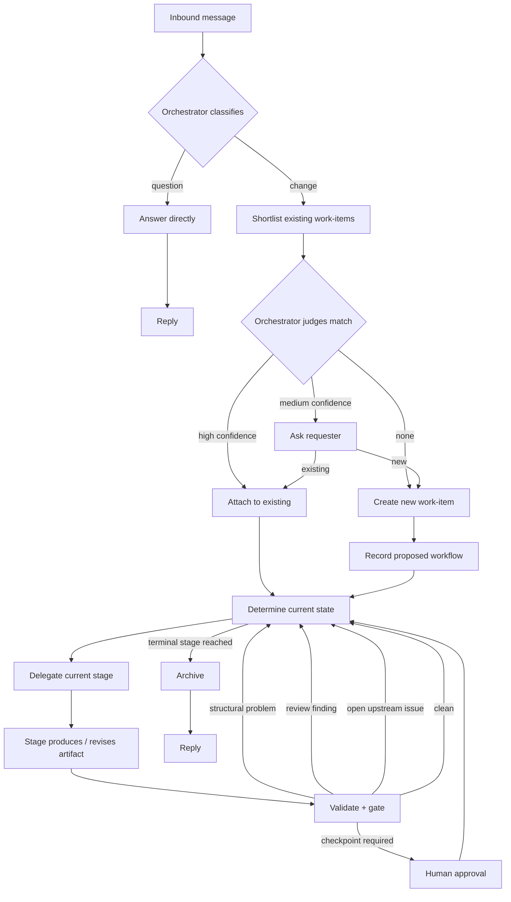

# Specification — Agentic SDLC Toolkit (Functional Core)

## 0. About this document

This is the functional contract only: what the system must do, and what it
must guarantee, independent of how any of it is built. It deliberately
omits implementation details which MAY change freely as long as they continue to satisfy this document.

---

## 1. Purpose

A portable-enough set of agents, skills, and one deterministic CLI that
lets a software project be managed end-to-end by AI coding agents —
intake, triage, work-item lifecycle, question-answering — with a human
able to step in at declared checkpoints but not required to drive.

Load-bearing invariant: **no hidden state.** A work-item's current status
is always derivable from its own versioned files plus its own versioned
workflow definition. Nothing needed to resume a work-item may live only in
a chat session or an agent's memory.

Two commitments:

* **Structure only what must be checked.** Relational facts (IDs,
  references, versions, stage order) are structured so they can be
  validated automatically. Content stays prose.
* **Mechanical and semantic findings are separate.** Structural defects
  are automatically blocking. Judgment calls belong to a reviewer.

### 1.1 Data-driven workflow

The system has no built-in knowledge of stage names. A project defines
its own stages (`specification`, `build`, `verify`, `release` — or
anything else) and its own workflows made of them. Renaming a stage,
changing an artifact's filename, or reshaping a workflow must be a
configuration change, never a code change.

---

## 2. Problem statement

Ad-hoc agent use produces four recurring failures: context bloat,
untracked work, inconsistent rigor, and state that only lives in a
session. A fifth: artifacts that look structured but were never actually
checked — cycles, orphaned requirements, dangling references, stale
versions — which survive review and surface during implementation.

The toolkit addresses these by separating durable artifacts from session
context, deterministic validation from semantic review, workflow
definition from workflow execution, and stage *names* from stage
*semantics*.

---

## 3. Goals / Non-goals

### Goals

1. An orchestrator classifies inbound messages as question or change and
   routes them accordingly.
2. Every work-item has a durable, filesystem-resident lifecycle.
3. All mechanical operations go through one deterministic tool; no agent
   hand-edits lifecycle state.
4. Workflow selection is data-driven and recorded with a rationale.
5. Work-item type is tracked independently of its workflow shape.
6. Graph-level artifact integrity is checked automatically: cycles,
   orphans, dangling references, stale versions, invalid references.
7. Different work-items may use entirely different workflows,
   concurrently, without special-casing.
8. A stage may be renamed, replaced, dropped, or reordered by
   configuration alone.
9. Work-item status is a pure function of the workflow definition and the
   work-item's own versioned artifacts — nothing else.
10. Agents can be restricted to only the actions their role needs.
11. Human approval is never something an agent can do on the human's
    behalf.
12. Installation is self-contained per repository; no shared service.

### Non-goals

* Portability beyond the initial target platform, in v1.
* Parallel execution *within* a single work-item.
* A GUI.
* Field-level lineage (lineage is tracked per artifact, not per field).
* Tooling for a second target platform (deferred until one exists).

---

## 4. Glossary

| Term | Definition |
|---|---|
| Orchestrator | Classifies requests, matches or creates work-items, proposes a workflow, delegates each stage. |
| Work-item | A single unit of change, tracked from intake to archive. |
| Workflow | The complete recorded process definition for one work-item: its stage sequence, type, lock point, and rationale. |
| Stage sequence | The ordered list of stage IDs a workflow specifies. One component of a workflow, not a synonym for it. |
| Stage | One executable step in a workflow; its behavior is defined once, centrally, and reused by name. |
| Type | A work category (e.g. feature, bugfix, incident), tracked independently of the workflow shape. |
| Author artifact | The substantive output a stage produces. |
| Review | A stage that evaluates another stage's output against a checklist. |
| Gate | The condition that lets a workflow move past a review: no blocking findings. |
| Finding | A blocking defect. |
| Observation | A non-blocking note. |
| Upstream issue | A problem raised by a later stage against an earlier stage's artifact. |
| `based_on` | The record, on every author artifact, of which upstream artifact versions it was written against — used to detect staleness. |
| Checkpoint | A point where human approval is required before the workflow can proceed. It is associated with the start of a stage. |
| Terminal stage | The stage whose completion ends the workflow and archives the work-item. |
| Work-item status | The derived, always-current answer to "what state is this work-item in and what, if anything, is it waiting on." |

---

## 5. Actors and responsibilities

| Actor | Responsibility |
|---|---|
| Stakeholder / developer (human) | Sends requests, answers classification/matching questions, performs approvals. |
| Orchestrator (agent) | Classifies requests, matches or creates work-items, proposes a workflow, delegates stages. |
| Author (agent) | Produces the artifact for whichever stage it's assigned. |
| Reviewer (agent) | Reviews an artifact against that stage's checklist. |
| Archiver (agent) | Keeps durable project documentation current and finalizes archival. |
| The deterministic tool | Performs every mechanical operation: writes, validation, state derivation, gating. |

**Archiver scope.** The archiver may update durable project documentation
and finalize the archive move. It may not edit code, edit any other
project file, approve anything, amend a workflow, delete a work-item, or
write a stage's own artifacts. Its documentation edits are its own
judgment call; the actual archive move is a mechanical, validated
operation.

**Agents are given only what their role needs** — which stages they may
be delegated, which other agents (if any) they may invoke, and which
operations they may perform — rather than broad, ambient access.

---

## 6. Workflow model

**Per work-item.** Every work-item carries its own workflow: a stage
sequence, its type, and a short rationale for why that shape was
chosen. Two work-items may use completely different workflows with
no special handling required.

**Data-driven.** Stage behavior (who performs it, what it produces, what
it depends on, whether it's reviewed, whether it needs approval, whether
it ends the workflow) is defined once, centrally, by stage ID — not
inferred from the name and not hardcoded per workflow.

**Optional templates.** Named workflow templates may exist to propose a
starting shape, but once a work-item is created its own recorded workflow
is authoritative; changing a template afterward never silently changes an
existing work-item. A work-item may also use a fully custom stage
sequence not found in any template.

**Terminal reachability.** Every workflow MUST end in a stage whose
completion finalizes and archives the work-item. A workflow that doesn't
is rejected before it's ever recorded, and if one is somehow found on
disk, it's flagged as invalid.

### 6.1 Multiple concurrent work-items

A repository MAY hold multiple active work-items at once, each with its
own independent workflow, and there is no restriction requiring them to
use the same stage sequence or to be worked one at a time.

### 6.2 Lock

A workflow becomes fixed ("locked") either immediately at creation, or —
if configured — once a specific early stage completes. Before locking,
the orchestrator may still adjust the workflow shape (on behalf of a
designated authoring stage) as understanding develops. After locking,
the workflow is fixed; changing it afterward requires the human-only
amendment path (§5), and every change of any kind is recorded with a
reason, so the shape a work-item ultimately used is always auditable.

---

## 7. Request flow

The flow makes no assumption about what any stage is named.

---

## 8. Orchestrator decision logic

**Classification.** A request is a *question* (seeks information, no
repository change requested) or a *change*. Genuinely ambiguous requests
get one clarifying question. Classification MUST NOT try to extract
requirements, scope, or design in passing — that belongs to the workflow
stages, not intake.

**Matching.** Matching an incoming request to an existing work-item is
deliberately two-step: a cheap, deterministic shortlist first, then a
judgment call over just that shortlist. High confidence attaches
automatically; medium confidence asks the requester; low/no match creates
a new work-item. The system MUST NOT run judgment over the entire
work-item history for every request — that doesn't scale and isn't
necessary.

**Workflow selection.** The orchestrator proposes a type, a stage sequence,
where (if anywhere) the workflow locks early, and a rationale. It may
choose a template or construct a custom sequence. It never infers
behavior from a stage's name — only from that stage's registered
definition.

---

## 9. Work-item status

Status is always derivable from the work-item's own files — never from
memory, never from a session. This is the "cold-resumable" guarantee: a
work-item can be picked back up after any interruption with no loss of
fidelity.

A work-item is in exactly one of these states at any time:

| Status | Meaning |
|---|---|
| `uninitialized` | Created but not yet given a workflow. |
| `invalid` | Something structurally wrong was found (bad reference, broken sequence, corrupted data) — needs a fix before anything else can proceed. |
| `active` | In progress, currently sitting at a specific stage. |
| `blocked` | Review has gone back and forth as many times as policy allows without clearing; needs a human to intervene. The work-item is still sitting at the stage whose review cap it hit. |
| `done` | Finished and archived. |

When multiple conditions could technically apply at once, resolution
follows a fixed, predictable order (structural problems take priority
over normal lifecycle waiting, which takes priority over "still active"),
so status is never ambiguous. `stage` is meaningful when status is
`active` or `blocked` — a blocked work-item is still sitting at the
stage that exhausted its review cap (§11), and a human resolving the
block needs to see where. Every other status means there is no "current
stage" to speak of.

**What advances an active work-item:** its current stage's artifact gets
written, or a required review clears its gate, or a required human
checkpoint gets approved, or an open upstream issue targeting it gets
resolved. Any one of the reverse conditions — no artifact yet, review not
yet done or stale, checkpoint not yet approved, an issue still open
against it — is what makes a work-item sit at that stage in the first
place.

---

## 10. Upstream issues and staleness tracking

Any stage — author or reviewer — may raise a problem against an *earlier*
stage's artifact rather than trying to work around it. Only the targeted
stage can resolve its own issue, and resolution happens together with
revising the artifact, not as a separate acknowledgment. An issue is
never reopened; if a fix turns out to be inadequate, a new issue is
raised that explicitly supersedes the old one. To keep issues from piling
up unmanageably, there's a configurable cap on how many may be open
against a work-item at once.

Every artifact records which versions of its upstream inputs it was
actually written against. If an upstream artifact is later revised,
anything downstream that was based on the old version becomes visibly
stale — this is how the system catches "artifact reviewed and approved
against now-outdated inputs" without needing a separate propagation
mechanism.

---

## 11. Reviews and gates

Two kinds of review output exist: **findings**, which block progress, and
**observations**, which don't. A review's gate clears exactly when it has
zero open findings — nothing more nuanced than that. Observations from
earlier rounds stay visible for context but never affect whether the gate
is open.

Every review round is preserved (nothing is overwritten), so the full
back-and-forth of a review is auditable after the fact.

There is a configurable cap on how many review rounds a single stage may
go through. Once that cap is hit without the gate clearing, the work-item
becomes `blocked` — a state a human must resolve, not something that
silently keeps retrying.

---

## 12. Human-only operations

Two operations are categorically unavailable to any agent: **approval**,
and amending a workflow **after** it has locked.

**Approval.** A checkpoint requires an approval on record before its
stage may proceed. An approval is tied to a specific snapshot of the
work-item — if anything it depended on changes afterward, the approval
becomes stale and a fresh one is required. This freshness is computed,
not left to interpretation.

**Post-lock amendment.** Once a workflow is locked (§6.2), its shape can
still change, but only through direct human action.

Neither is exposed as something an agent can invoke on a human's
behalf, regardless of how it's asked.

---

## 13. Configuration

Runtime policy (review round caps, open-issue caps, and similar tunables)
is configurable per project. Whatever policy applies to a work-item is
fixed at the moment that work-item is created — later changes to project
policy never retroactively change how an in-flight work-item is
evaluated. This preserves cold-resumability: what a work-item is waiting
on doesn't shift underneath it because someone edited a config file.

A project-local installation and a global (user-level) installation are
alternatives, not layers that merge — whichever one is actually active
determines which configuration applies, with built-in defaults filling
any gaps.

---

## 14. Repository layout (conceptual)

Everything about a work-item's lifecycle — its intake record, its
workflow definition, every artifact it has produced, any issues raised
against it, and any approvals it has received — lives together under a
predictable, per-work-item location in the repository, as plain versioned
files. Finished work-items move to an archive location, timestamped and
intact.

**There is deliberately no separate navigation index.** The filesystem
layout itself is the index; nothing needs to be kept in sync with it.

Separately, a project may keep a small set of "living" documents —
durable knowledge like decisions or architecture notes — that get updated
only when a finished work-item actually affects them, never on every
work-item regardless of relevance.

---

## 15. Artifact contracts (conceptual)

Every artifact a stage produces carries enough metadata to support
traceability: a version number, and — for anything authored — a record
of which upstream versions it was written against (§10). The system
computes both; nothing an agent writes gets to choose its own version
number or backdate what it was based on.

The domain content of any given artifact (what a "design" actually
contains, what fields a "specification" needs) is defined by the
project, per artifact type — this document defines only the
metadata every artifact needs in common, not domain vocabulary.

---

## 16. Validator vs. reviewer

This split is one of the system's core architectural commitments and is
kept deliberately strict:

* **The validator** answers only questions that are mechanically,
  provably true or false — every reference resolves, the sequence is
  well-formed, versions are monotone, required metadata is present. If a
  check can't be explained as "provably wrong when it fires," it doesn't
  belong in the validator.
* **The reviewer** answers everything that requires judgment — is this
  adequate, is this proportionate, is this actually correct, is a
  deviation justified.

Ordinary "not done yet" conditions (an artifact hasn't been written, a
checkpoint hasn't been approved, a review round hasn't happened) are
*lifecycle* conditions that determine status (§9) — they are never
reported as validator findings.

---

## 17. The deterministic tool

Every mechanical operation on a work-item — creating one, checking its
current status, validating it, recording a stage's output, evaluating a
review gate, raising or resolving an upstream issue, amending a workflow, archiving one, listing
all of them — goes through one deterministic tool. No agent performs
these by hand-editing files, and approval specifically is never made
available to any agent (§12).

---

## 18. Agent integration (conceptual)

The orchestrator, author, reviewer, and archiver roles (§5) map onto
whatever agent/sub-agent mechanism the target platform provides. Each
role is restricted to exactly the tool operations and delegation targets
it needs — an author can't approve things, a reviewer can't edit project
files, nobody but a human can perform the operations in §12 — and this
restriction is enforced at the platform's permission layer, backed up by
the validator independently catching anything that slips through
(§5).

---

## 19. Architecture principles

| Principle |
|---|
| Context hygiene by delegation — agents see only what their stage needs. |
| Automate what's deterministic; reserve judgment for reviewers. |
| No hidden state. |
| Every decision leaves a versioned audit trail. |
| One platform target in v1; no shared service. |
| Workflow rigor is data-driven, not hardcoded. |
| Approvals are recorded artifacts, not chat acknowledgements. |
| Gating is binary: findings block, observations don't. |
| Only relational fields are structured; content stays prose. |
| Mechanical and semantic findings are kept strictly separate. |
| One author role, many stage-specific templates, by default. |
| Approval capability is categorically excluded from every agent's toolset. |
| State derivation contains no workflow-specific stage-name assumptions. |
| No derived navigation index — the filesystem is the index. |

---

## 20. Non-functional requirements

* Any work-item can be resumed cold, from its own versioned files alone,
  after any interruption.
* Matching incoming requests to existing work-items never requires
  judgment over the full work-item history.
* Installation completes in one step.
* Workflows work with any valid subset and ordering of registered stages.
* Status determination scales linearly with workflow length, not
  exponentially or worse.
* Changing stage names or reshaping a workflow requires no code change.
* Multiple live work-items may use different workflows concurrently.

---

## 21. Assumptions

* The target platform supports project-local agents, restricted
  permissions, and custom tooling of the kind this system needs.
* Multiple live work-items are supported within one repository.
* Project-local configuration is committed to the repository.

---

## 22. Risks

| Risk | Mitigation |
|---|---|
| Workflow-selection criteria turn out too coarse. | Track amendments over time; improve templates from evidence. |
| One author role produces inconsistent rigor across stage types. | Stage-specific prompts and checklists; split roles only if evidence requires it. |
| Duplicate-matching produces false positives. | Conservative confidence threshold; ambiguous cases ask rather than guess. |
| Upstream issues proliferate unmanageably. | Hard cap on open issues per work-item. |
| Artifacts get hand-edited out of band. | Validator independently detects inconsistencies this would cause. |
| Reviewer checklists go stale. | Versioned like code; reviewed for effectiveness periodically. |
| Non-blocking observations get ignored. | Surfaced in status listings and archive summaries, not buried. |
| An agent bypasses a human-only operation via raw shell access. | Human-only operations require direct interactive action; never exported as agent-invocable tools. |

---

## 24. Success criteria — v1 definition of done

* A request goes from natural-language message to an archived, fully
  audited work-item with no manual file editing.
* At least two materially different workflow shapes complete end-to-end.
* Renaming a stage is purely a configuration change — verified by an
  actual test that renames one and changes no code.
* A work-item can use a stage sequence that appears nowhere in any
  template.
* A workflow whose last stage doesn't terminate the work-item is rejected
  before it's ever recorded.
* Validation catches: dependency cycles, dangling references, version
  inversions, stale `based_on`, invalid stage references, and a review
  improperly targeting a later stage.
* Status determination correctly handles every case in §9, including
  edge cases: uninitialized, invalid, an open upstream issue, a stale
  review, a closed gate with rounds remaining, the round cap reached,
  missing or stale approval, and terminal completion.
* No separate navigation index exists or is required anywhere in the
  system.
* Listing work-items works from filesystem state alone.
* A fresh repository can be set up in one installation step.
* No agent can invoke approval, under any configuration.
* Approval is reachable only through direct human action.
* Status determination never performs a write, under any circumstance.
* Every operation that writes lifecycle state does so atomically.