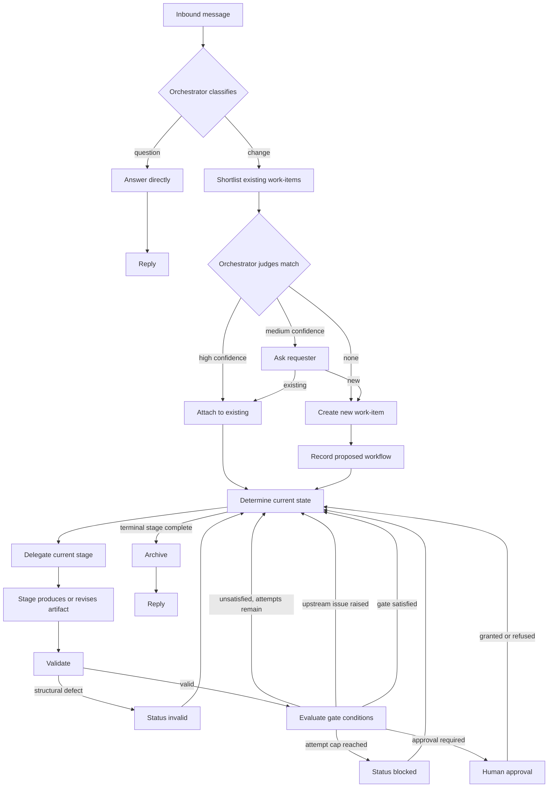

# Specification — Agentic SDLC Toolkit (Functional Core)

## 0. About this document

This is the functional contract: what the system must do, and what it must
guarantee. It defines the logical workflow, lifecycle behavior, artifacts,
state, validation, gating, and human-only operations. It does not prescribe
how these requirements are implemented. Artifact representation, authoring
mechanisms, tooling, agent composition, and other implementation details
MAY vary, provided every requirement and invariant in this document is
satisfied.

**Conventions.** The key words MUST, MUST NOT, SHOULD, and MAY are to be
interpreted as described in RFC 2119. SHOULD indicates a strong
recommendation; deviating requires justified, weighed reasons.

**Scope.** v1 targets the opencode platform. Portability beyond it is a
non-goal (§3).

**Terminology.** A *record* is the durable, versioned representation of a
logical artifact or lifecycle fact. Requirements are phrased against
records; §14 specifies the v1 storage instantiation (plain files in the
repository).

---

## 1. Purpose

A portable-enough set of agents, skills, and deterministic lifecycle
tooling that lets a software project be managed end-to-end by AI coding
agents — intake, triage, work-item lifecycle, question-answering — with a
human able to step in at declared checkpoints and blocked states, but not
required to drive.

Load-bearing invariant: **no hidden state.** A work-item's current status
is always derivable from its own versioned records plus its own versioned
workflow definition, including the policy snapshot recorded at its creation
(§13). Nothing needed to resume a work-item may live only in a chat session
or an agent's memory.

Two commitments:

* **Structure only what must be checked.** Relational facts (IDs,
  references, versions, stage order) are structured so they can be
  validated automatically. Content stays prose.
* **Mechanical defects and semantic judgments are separate.** Structural
  defects are detected by validation and halt the workflow (§9, §16).
  Judgment calls belong to the stage or activity responsible for evaluating
  them; their findings block only where configured (§11).

### 1.1 Data-driven workflow

The system has no built-in knowledge of stage names. A project defines its
own stages (`specification`, `build`, `verify`, `release` — or anything
else) and its own workflows made of them. Changing stage definitions,
artifact addressing, or workflow shape MUST be a configuration change,
never a code change.

---

## 2. Problem statement

Ad-hoc agent use produces four recurring failures: context bloat,
untracked work, inconsistent rigor, and state that only lives in a
session. A fifth: artifacts that look structured but were never actually
checked — cycles, orphaned artifacts, dangling references, stale versions
— which survive review and surface during implementation.

The toolkit addresses these by separating durable artifacts from session
context, deterministic validation from semantic evaluation, workflow
definition from workflow execution, and stage *names* from stage
*semantics*.

---

## 3. Goals / Non-goals

### Goals

1. An orchestrator classifies inbound messages as question or change and
   routes them accordingly.
2. Every work-item has a durable, repository-resident lifecycle.
3. All authoritative lifecycle operations go through the deterministic
   lifecycle interface; no agent hand-edits lifecycle state.
4. Workflow selection is data-driven and recorded with a rationale.
5. Work-item type is tracked independently of its workflow shape.
6. Graph-level artifact integrity is checked automatically: cycles,
   orphans, dangling references, stale versions, invalid references.
7. Different work-items may use entirely different workflows, concurrently,
   without special-casing.
8. A stage may be renamed, replaced, dropped, or reordered by configuration
   alone.
9. Work-item status is a pure function of the workflow definition and the
   work-item's own versioned records — including its policy snapshot (§13)
   — and nothing else.
10. Agents can be restricted to only the actions their role needs.
11. Human approval is never something an agent can do on the human's behalf.
12. Installation is self-contained: a project-local or a user-level
    installation — mutually exclusive alternatives, never a shared service.

### Non-goals

* Portability beyond the initial target platform, in v1.
* Parallel execution *within* a single work-item.
* A GUI.
* Field-level lineage (lineage is tracked per artifact, not per field).
* Tooling for a second target platform (deferred until one exists).

---

## 4. Glossary

| Term                              | Definition                                                                                                                        |
| --------------------------------- | ---------------------------------------------------------------------------------------------------------------------------------- |
| Orchestrator                      | Classifies requests, matches or creates work-items, proposes a workflow, delegates each stage.                                     |
| Work-item                         | A single unit of change, tracked from intake to archive.                                                                           |
| Workflow                          | The complete recorded process definition for one work-item: its stage sequence, type, lock point, rationale, and policy snapshot.  |
| Stage sequence                    | The ordered list of stage IDs a workflow specifies. One component of a workflow, not a synonym for it.                             |
| Stage                             | One executable step in a workflow; its behavior is defined once, centrally, and reused by name.                                    |
| Type                              | A work category (e.g. feature, bugfix, incident), tracked independently of the workflow shape.                                     |
| Record                            | The durable, versioned representation of a logical artifact or lifecycle fact; in v1, a plain file in the repository (§14).        |
| Artifact                          | The logical, versioned output produced or revised by a stage.                                                                      |
| Gate                              | A lifecycle condition that determines whether the workflow may proceed past a defined point.                                       |
| Checkpoint                        | A human-approval gate condition evaluated at the start of a stage (§11, §12).                                                      |
| Finding                           | A defect or unmet condition produced by an evaluation activity, configured as blocking or non-blocking (§11). |
| Structural defect                 | A mechanically detectable corruption of a work-item's records — unresolvable reference, malformed sequence, corrupted record, invalid workflow or condition definition. It makes the work-item `invalid` (§9, §16). |
| Observation                       | A non-blocking note produced by an evaluation activity.                                                                            |
| Upstream issue                    | A problem raised by a later stage against an earlier stage's artifact.                                                             |
| `based_on`                        | The record, on every author artifact, of which upstream artifact versions it was written against — used to detect staleness.       |
| Policy snapshot                   | The runtime policy (attempt caps, issue caps, and similar tunables) recorded on a work-item at creation; it governs that work-item for its lifetime (§13). |
| Terminal stage                    | The stage whose completion ends the workflow and archives the work-item.                                                           |
| Work-item status                  | The derived, always-current answer to "what state is this work-item in and what, if anything, is it waiting on."                   |
| Deterministic lifecycle interface | The authoritative boundary through which lifecycle state is created, changed, validated, derived, gated, and archived (§17).       |

---

## 5. Actors and responsibilities

| Actor                           | Responsibility                                                                             |
| ------------------------------- | ------------------------------------------------------------------------------------------ |
| Stakeholder / developer (human) | Sends requests, answers classification/matching questions, performs approvals.             |
| Orchestrator (agent)            | Classifies requests, matches or creates work-items, proposes a workflow, delegates stages. |
| Author (agent)                  | Produces the artifact for whichever stage it is assigned.                                  |
| Evaluator (agent)               | Performs any configured semantic evaluation of a stage output or other artifact.           |
| Archiver (agent)                | Keeps durable project documentation current and finalizes archival.                        |

The **deterministic lifecycle interface** is a system component, not an
actor: it performs the authoritative lifecycle operations defined in §17.

**Archiver scope.** The archiver may update durable project documentation
and finalize the archive move. It may not edit code, modify any record
other than its documentation edits, approve anything, amend a workflow,
delete a work-item, or write a stage's own artifacts. Its documentation
edits are its own judgment call; the actual archive move is a mechanical,
validated operation.

**Author role default.** By default a single author role serves all stages,
differentiated by stage-specific prompts and checklists. A project MAY
split author roles per stage in configuration.

**Least access.** Agents are given only what their role needs — which
stages they may be delegated, which other agents (if any) they may invoke,
and which operations they may perform — rather than broad, ambient access.

---

## 6. Workflow model

**Per work-item.** Every work-item carries its own workflow: a stage
sequence, its type, a lock point, and a short rationale for why that shape
was chosen. Two work-items may use completely different workflows with no
special handling required.

**Data-driven.** Stage behavior (who performs it, what it produces, what it
depends on, what conditions must be satisfied before the workflow can
proceed, whether it needs approval, whether it ends the workflow) is
defined once, centrally, by stage ID — not inferred from the name and not
hardcoded per workflow.

**Optional templates.** Named workflow templates may exist to propose a
starting shape, but once a work-item is created its own recorded workflow
is authoritative; changing a template afterward never silently changes an
existing work-item. A work-item may also use a fully custom stage sequence
not found in any template.

**Terminal reachability.** Every workflow MUST end in a stage whose
completion finalizes and archives the work-item. A workflow whose final
stage is not terminal MUST be rejected before it is ever recorded; if one
is found on disk, the validator flags it and the work-item's status is
`invalid` (§9). Within that constraint, a workflow MAY use any subset and
ordering of the registered stages.

### 6.1 Multiple concurrent work-items

A repository MAY hold multiple active work-items at once, each with its own
independent workflow, and there is no restriction requiring them to use the
same stage sequence or to be worked one at a time.

### 6.2 Lock

A workflow becomes fixed ("locked") either immediately at creation or — if
configured — when a named early stage completes; the workflow records which
applies. Before the lock point, the orchestrator may adjust the workflow
shape as understanding develops; every adjustment is recorded like any
lifecycle operation (§17). After locking, the workflow is fixed; changing
it requires the human-only amendment path (§12), and every change is
recorded with a reason, so the shape a work-item ultimately used is always
auditable.

---

## 7. Request flow

The flow makes no assumption about what any stage is named, what activities
it performs, or how its artifact is physically represented.

---

## 8. Orchestrator decision logic

**Classification.** A request is a *question* (seeks information, no
repository change requested) or a *change*. Genuinely ambiguous requests
SHOULD receive exactly one clarifying question before classification is
decided. Classification MUST NOT extract requirements, scope, or design in
passing — that belongs to the workflow stages, not intake.

**Matching.** Matching an incoming request to an existing work-item MUST be
two-step: a bounded, deterministic shortlist first, then a judgment call
over only that shortlist. High confidence attaches automatically; medium
confidence asks the requester; low or no match creates a new work-item.
The system MUST NOT run judgment over the entire work-item history for
every request.

**Workflow selection.** The orchestrator proposes a type, a stage sequence,
where (if anywhere) the workflow locks early, and a rationale. It may
choose a template or construct a custom sequence. It never infers behavior
from a stage's name — only from that stage's registered definition.

## 9. Work-item status

Status is always derivable from the work-item's own records — never from
memory, never from a session. This is the cold-resumable guarantee (§1): a
work-item can be picked back up after any interruption with no loss of
fidelity.

A non-archived work-item is in exactly one of these states at any time:

| Status          | Meaning                                                                                                                                                                                                                                                     |
| --------------- | ----------------------------------------------------------------------------------------------------------------------------------------------------------------------------------------------------------------------------------------------------------- |
| `uninitialized` | Created but not yet given a workflow.                                                                                                                                                                                                                       |
| `invalid`       | A structural defect (§4) was found. The defect must be corrected — through normal stage operations or human amendment — before anything else can proceed. |
| `active`        | In progress, currently sitting at a specific stage.                                                                                                                                                                                                         |
| `blocked`       | The attempt cap of a required gate at the current stage was reached without satisfaction (§11) and a human must intervene. The work-item remains at that stage.                                                                                             |
| `done`          | Finished and archived.                                                                                                                                                                                                                                      |

**Derivation.** Status is derived by evaluating, in order, the first
condition that holds:

1. No workflow is recorded → `uninitialized`.
2. A structural defect is present → `invalid`.
3. The attempt cap of a required gate at the current stage is exhausted
   without the gate being satisfied → `blocked`.
4. Otherwise → `active`.

A work-item whose terminal stage has completed and whose archive move has
finished is `done`. Status is not re-derived for archived work-items:
defects discovered after archival are reported by validation but do not
change status.
Because status is derived, correcting a defect or satisfying a condition
restores normal status automatically; there is no separate "un-block" or
"un-invalidate" operation.

Derivation is deterministic, contains no stage-name assumptions (§1.1), and
never performs a write (§17). `stage` is meaningful when status is `active`
or `blocked` — a blocked work-item remains at the stage whose gate
exhausted its attempts (§11), and a human resolving the block needs to see
where. Every other status means there is no current stage to speak of.

**Sitting at a stage.** An `active` work-item sits at its current stage
while any of these holds:

* the stage has no recorded artifact for the current attempt;
* the stage's gate is unsatisfied — including a required approval that is
  missing or stale (§12);
* the stage's artifact is stale relative to the upstream versions it was
  based on (§10);
* an open upstream issue targets the stage (§10).

The work-item leaves the stage when all of these are resolved: the artifact
is recorded and current, the gate is satisfied, and no open issue targets
the stage.

---

## 10. Upstream issues and staleness

Any stage may raise a problem against an *earlier* stage's artifact rather
than trying to work around it. Raising an issue against an earlier stage
moves the work-item's current stage to the targeted stage; the workflow
returns to the raising stage only by advancing forward again once the
targeted stage's conditions are satisfied.

Only the targeted stage can resolve its own issue, and resolution happens
together with revising the artifact, not as a separate acknowledgment. An
issue is never reopened; if a fix turns out to be inadequate, a new issue
is raised that records which open issue it supersedes, and the superseded
issue is closed as superseded. The validator checks supersession
references.

A configurable cap limits how many issues may be open against a work-item
at once. When the cap is reached, no new issue may be raised until an open
one is resolved. A stage that cannot proceed without raising one stays
unsatisfied; the gate's attempt cap (§11) then applies as usual.

Every artifact records which versions of its upstream inputs it was
actually written against (`based_on`, §15). If an upstream artifact is
later revised, anything downstream that was based on the old version
becomes visibly stale. Staleness is detected by validation (§16) and
handled as a lifecycle condition (§9): the workflow does not advance past
the stage that produced the stale artifact until that artifact is
re-authored or explicitly re-affirmed against the current upstream
versions. No separate propagation mechanism exists.

---

## 11. Gates and lifecycle conditions

A gate is a lifecycle condition that determines whether the workflow may
proceed past a defined point. A gate is independent of any particular stage
type or evaluation mechanism.

A workflow MAY have no gate at a particular point, or MAY define one or
more conditions that must be satisfied before proceeding. Gate conditions
are defined by the workflow and evaluated according to their nature:

* deterministic conditions are evaluated automatically;
* conditions requiring judgment are evaluated by the responsible stage or
  activity;
* human-only conditions require direct human action — a human-approval
  condition evaluated at the start of a stage is a checkpoint (§12).

A gate is binary: it is satisfied only when all of its required conditions
are satisfied; otherwise the workflow remains at the applicable stage. A
condition MAY depend on artifact state, outputs of the current or another
stage, resolved upstream issues, or other explicitly defined workflow
conditions; no dedicated stage type is required to satisfy one.

Structural defects are not gate conditions: a validation failure makes the
work-item `invalid` (§9, §16).

Where an evaluation produces **findings**, each finding is configured as
blocking or non-blocking. Blocking findings prevent the gates they are
attached to from being satisfied. **Observations** never affect gate satisfaction (§4).

Every evaluation round or attempt that contributes to a gate is preserved
as a versioned record, so the lifecycle remains auditable.

A configurable cap limits repeated attempts to satisfy a gate. Once that
cap is reached without the gate becoming satisfied, the work-item becomes
`blocked` (§9) — a state a human must resolve, not something that silently
keeps retrying.

---

## 12. Human-only operations

Two operations are categorically unavailable to any agent: **approval**,
and amending a workflow **after** it has locked.

**Approval.** A checkpoint requires an approval on record before its stage
may proceed (§11). An approval is a recorded artifact that identifies the
human who granted it and the snapshot of the work-item it covers — not a
chat acknowledgement. If anything it depended on changes afterward, the
approval becomes stale and a fresh one is required; staleness is computed,
not left to interpretation. Approval MUST be performable only through a
human-only path that is not exposed to agents as an invocable operation.
No agent may grant, record, renew, or revoke an approval on a human's
behalf.

**Post-lock amendment.** Once a workflow is locked (§6.2), its shape can
still change, but only through direct human action via the deterministic
lifecycle interface (§17).

Neither operation is exposed as something an agent can invoke on a human's
behalf.

---

## 13. Configuration

Runtime policy — gate attempt caps, open-issue caps, and similar tunables —
is configurable per project. At the moment a work-item is created, the
policy in effect is recorded on it as a **policy snapshot** (§4). The
snapshot is one of the work-item's own versioned records and governs that
work-item for its lifetime; later changes to project policy never
retroactively affect an in-flight work-item. This preserves
cold-resumability (§1): what a work-item is waiting on does not shift
underneath it because someone edited a config file.

A project-local installation and a global (user-level) installation are
alternatives, not layers that merge: exactly one is active, it determines
which configuration applies, and built-in defaults fill any gaps.

---

## 14. Storage and layout (v1: filesystem)

Everything about a work-item's lifecycle — its intake record, its workflow
definition (including its policy snapshot), every artifact it has produced,
any issues raised against it, and any approvals it has received — lives
together under a predictable, per-work-item location, as durable versioned
records. Finished work-items move to an archive location, timestamped and
intact (§9).

**v1 instantiation.** Records are plain files in the repository filesystem.
The requirements in this document are phrased against records, not files;
an implementation MAY use a different durable, versioned storage medium
provided every requirement and invariant here is satisfied.

**No required index.** Listing, matching, and status derivation work from
the work-items' own records alone. A separately maintained index MUST NOT
be required. A derived index MAY exist for convenience only if it is fully
rebuildable from the records and is never authoritative.

A logical artifact MAY be represented by one physical file or by multiple
related files, provided that the artifact remains a single versioned
lifecycle object and all required metadata, lineage, validation, and
versioning guarantees remain intact.

Separately, a project may keep a small set of "living" documents — durable
knowledge like decisions or architecture notes — that get updated only when
a finished work-item actually affects them, never on every work-item
regardless of relevance.

---

## 15. Artifact contracts (conceptual)

Every artifact a stage produces carries enough metadata to support
traceability: a version number, and — for anything authored — a record of
which upstream versions it was written against (`based_on`, §10). The
system computes both; nothing an agent writes gets to choose its own
version number or backdate what it was based on.

An artifact is the logical output of a stage. Its physical representation
does not alter its identity, version, lineage, or lifecycle semantics.

The domain content of any given artifact (what a "design" actually
contains, what fields a "specification" needs) is defined by the project,
per artifact type — this document defines only the metadata every artifact
needs in common, not domain vocabulary.

---

## 16. Validator vs. evaluator

This split is one of the system's core architectural commitments and is
kept deliberately strict:

* **The validator** answers only questions that are mechanically, provably
  true or false — every reference resolves, the sequence is well-formed,
  versions are monotone, required metadata is present, `based_on` staleness,
  condition definitions are well-formed. If a check can't be explained as
  "provably wrong when it fires," it doesn't belong in the validator. The
  lifecycle defines the consequences of its results: a structural defect
  makes the work-item `invalid` (§9); detected staleness holds the workflow
  at the producing stage (§10).
* **The evaluator** answers questions that require judgment — is this
  adequate, is this proportionate, is this actually correct, is a deviation
  justified. It produces findings, configured blocking or non-blocking, and
  observations (§11).

Ordinary "not done yet" conditions (an artifact hasn't been written, a
checkpoint hasn't been approved, a gate condition hasn't been satisfied)
are *lifecycle* conditions that determine status (§9), not validation
results.

---

## 17. Deterministic lifecycle operations

Every authoritative lifecycle operation on a work-item — creating one,
checking its current status, validating it, recording a stage's output,
evaluating gate conditions, raising or resolving an upstream issue,
amending a workflow, archiving one, and listing all of them — goes through
the deterministic lifecycle interface. Every operation records who
performed it and when.

No agent may bypass these controls by directly modifying lifecycle state.

Status derivation is read-only: determining a work-item's status MUST NOT
write anything. Every operation that writes lifecycle state MUST be
atomic: an interrupted or failed write leaves the prior state intact.

Artifact content authoring is separate from lifecycle-state management. A
stage's substantive artifact content may be authored through whatever
mechanism the implementation provides, as long as recording, versioning,
validation, lineage, gating, and lifecycle state remain under the
authoritative lifecycle rules defined by this specification.

Approval specifically is never made available to any agent (§12).

---

## 18. Agent integration (conceptual)

The orchestrator, author, evaluator, and archiver roles (§5) map onto
whatever agent/sub-agent mechanism the target platform provides. Each role
is restricted to exactly the lifecycle operations and delegation targets it
needs — an author cannot approve things, an evaluator cannot author or
modify artifacts or project documents, and nobody but a human can perform
the operations in §12.

These restrictions MUST be enforced by the implementation (for example
through permission and toolset configuration); the validator independently
detects lifecycle inconsistencies that bypass them (§5, §20).

---

## 19. Assumptions

* v1 targets the opencode platform, which supports project-local agents,
  restricted permissions, and custom tooling of the kind this system needs.
* Multiple live work-items are supported within one repository.
* Project-local configuration is committed to the repository.

---

## 20. Risks

| Risk                                                            | Mitigation                                                                                        |
| --------------------------------------------------------------- | ------------------------------------------------------------------------------------------------- |
| Workflow-selection criteria turn out too coarse.                | Track amendments over time; improve templates from evidence.                                      |
| One author role produces inconsistent rigor across stage types. | Stage-specific prompts and checklists; split roles only if evidence requires it.                  |
| Duplicate-matching produces false positives.                    | Conservative confidence threshold; ambiguous cases ask rather than guess.                         |
| Upstream issues proliferate unmanageably.                       | Hard cap on open issues per work-item.                                                            |
| Artifacts get hand-edited out of band.                          | Validator independently detects inconsistencies this would cause.                                 |
| Evaluation criteria go stale.                                   | Versioned like code; reviewed for effectiveness periodically.                                     |
| Non-blocking observations get ignored.                          | Surfaced in status listings and archive summaries, not buried.                                    |
| An agent bypasses a human-only operation via raw shell access.  | Human-only operations run only through a channel not exposed to agents; approval records identify the granting human, and the validator rejects malformed approval records. |

---

## 21. Success criteria — v1 definition of done

* A request goes from natural-language message to an archived, fully
  audited work-item with no manual lifecycle-state editing.
* At least two materially different workflow shapes complete end-to-end.
* Renaming a stage, and adding, dropping, or reordering stages in a
  workflow, are purely configuration changes — verified by tests that
  change no code.
* A work-item can use a stage sequence that appears nowhere in any
  template.
* A workflow whose last stage doesn't terminate the work-item is rejected
  before it's ever recorded.
* Validation catches: dependency cycles, orphans, dangling references,
  version inversions, stale `based_on`, invalid stage references, and
  invalid lifecycle conditions.
* Status determination correctly handles every case in §9, including edge
  cases: uninitialized, invalid, an open upstream issue, an unsatisfied
  gate with attempts remaining, the attempt cap reached, a missing or
  stale approval, and terminal completion.
* Status determination scales linearly with workflow length.
* Listing, matching, and status derivation work from the work-items' own
  records alone (v1: filesystem state); no separately maintained index is
  required.
* A fresh repository can be set up in one installation step.
* Approval is not exposed as an agent-invocable operation under any
  configuration, and is performable only through the human-only path
  (§12).
* Status determination never performs a write, under any circumstance.
* Every operation that writes lifecycle state does so atomically.
* Changing project policy after a work-item is created does not change
  that work-item's gating or status behavior.
* A logical artifact may be represented using different physical
  representations without changing its lifecycle semantics.
