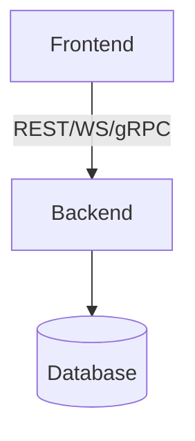

# One-Time Bootstrap: Generate Living Current-State Artifacts

Run **once** when `docs/current/` does not exist. This skill is the only component that creates `docs/current/`. Produces the baseline for ongoing **Knowledge Extraction**.

## Context: Living Documents

These artifacts are updated during the **Knowledge Extraction** step at the end of every development lifecycle:

```
Requirements → Requirements Review → Design → Design Review → Planning → Planning Review → Implementation → Implementation Review → Knowledge Extraction → Done
```

Design implications:
- Every doc must be **incrementally updateable** — append new rows, modify existing rows, delete obsolete rows.
- Every doc must be **<3K tokens** to fit in the context window alongside implementation tasks.
- No document contains immutable historical data except where noted as reference.

## 0. Principles

- **Structured only**: Tables, lists, mermaid. Zero prose paragraphs.
- **Evidence required**: Every row cites a file path.
- **Incremental design**: New items append; changed items update in-place; obsolete items delete.
- **No Graphify**: Do not reference or depend on Graphify.
- **No meta-docs**: Do not generate `bootstrap-summary.md` or `changelog-index.md`. These are not maintained during Knowledge Extraction and add token bloat.
- **No codemaps**: Do not generate codemap.md files; code-structure exploration belongs to the code intelligence tools and the docs themselves.
- **Generated regions**: when the toolkit's docs-gen tooling is present (docs-gen.yaml at the repo root), mechanical reference content is owned by `npm run docs:generate` — whole-file generated documents and `<!-- docs-gen:begin/end -->` marker regions are machine-owned from the start; bootstrap their markers exactly where the tooling's manifest declares them.

## 1. Generate `architecture.md`

Data sources: the source tree and its import/require statements; `package.json`, `requirements.txt`, `Cargo.toml`, `go.mod`, `pom.xml`, `build.gradle`, `Dockerfile`, `docker-compose.yml`, config files.

Output:

```markdown
# architecture.md

## Tech Stack
| Layer | Technology | Version | Evidence |

## Component Boundaries


## Folder Responsibilities
| Folder | Declared Role | Actual Exports/Entry | Mismatch? | Evidence |

## Integration Points
| Boundary | Caller | Callee | Protocol | Evidence |
```

Rules:
- Derive from imports and config files, not READMEs.
- `Mismatch? = YES` when claimed != actual. Note in `Evidence`.
- Only current state. No intent.

## 2. Generate `api-contract.md`

Data sources: route/controller files; middleware/decorator files; OpenAPI/GraphQL schema if present.

Output:

```markdown
# api-contract.md

## Endpoints
| Method | Path | Auth | Request Shape | Response Shape | Source File | Schema Drift? |

## Schema Reconciliation
| Schema File | Endpoints Covered | Drift |
```

Rules:
- Shapes: extract from types/DTOs/validation. If none, mark `inferred`.
- Auth: derive from applied middleware, not comments.
- Schema drift: mark `YES` only on explicit mismatches (field name, type, required flag).

## 3. Generate `glossary.md`

Data sources: ORM models, DB schema/migrations, domain types/interfaces, frontend type definitions.

Output:

```markdown
# glossary.md

## Entity: <Name>
| Field | Type | Nullable | Source |
| Relationships | Type | Target | Source |
| Business Rules | Rule | Location |

## Naming Cross-Check
| Backend Term | Frontend Term | Same Concept? | Action |
```

Rules:
- Only entities in data layer or referenced by API DTOs.
- Business rules: validation, computed fields, DB constraints. No name inference.
- Cross-check: list backend/frontend naming mismatches.

## 4. Generate `capabilities.md`

Data sources: route handlers, service layer public methods, frontend routing/pages, README if present.

Output:

```markdown
# capabilities.md

## Capabilities
| Capability | Evidence | Related Entities | Related Endpoints | Notes |

## Workflows
| Workflow | Steps (≤5) | Entry Point | Exit Point | Evidence |
```

Rules:
- Capability = user-facing feature or system function. Derive from service methods and route logic. Do not invent.
- Workflows: high-level user journeys. Cap at 5 steps.

## 5. Generate `conventions.md`

Data sources: most frequent code patterns; linter config; test structure; error handling code.

Output:

```markdown
# conventions.md

## Patterns
| Pattern | Where Used | Evidence |

## Naming
| Construct | Convention | Evidence |

## Error Handling
| Layer | Pattern | Evidence |

## File Organization
| Rule | Evidence |
```

Rules:
- Patterns: top 3 most common. Only if >20% of source files use them.
- Naming: classes, functions, variables, files, DB tables. Use actual code examples.
- Error handling: throw/catch/log/return patterns. Include HTTP status conventions.

## 6. Generate `operations.md`

Data sources: `package.json` scripts, `Makefile`, `justfile`, CI config, `Dockerfile`, `README` setup, `.env.example`.

Output:

```markdown
# operations.md

## Commands
| Command | Purpose | Evidence |

## Environment
| Variable | Purpose | Required? | Evidence |

## Testing
| Test Command | Coverage Tool | Evidence |

## Deployment
| Target | Command/Trigger | Evidence |
```

Rules:
- Only commands from config files. No invention.
- Env vars: from `.env.example` or docker-compose. `Required?` based on app failure without it.
- No CI config: state `No CI config found`.

## 7. Generate `dependencies.md`

Data sources: `package.json`, `requirements.txt`, `Cargo.toml`, `go.mod`, `pom.xml`, `build.gradle`, `composer.json`.

Output:

```markdown
# dependencies.md

## Key Dependencies
| Name | Version | Role | Evidence |

## Dev Dependencies
| Name | Version | Role | Evidence |
```

Rules:
- Key = runtime deps in >3 source files or framework/core libs.
- Role = what it does in THIS codebase. One line. Not generic.
- Cap at 20 entries per section. Group by category if more.

## 8. Generate `known-issues.md`

Data sources: `TODO`, `FIXME`, `HACK`, `XXX`, `BUG`, `DEPRECATED`; test skips (`.skip`, `.only`, `@Disabled`, `pytest.mark.skip`); issue tracker exports if in repo.

Output:

```markdown
# known-issues.md

## Markers
| Location | Marker | Context (±2 lines) | Severity | Evidence |

## Skipped Tests
| File | Test | Reason |

## Baseline Disclaimer
Machine scan. Undocumented issues exist.
```

Rules:
- Severity: `cosmetic`, `functional`, `risk`, `unknown`. Default `functional`.
- No fabricated severity. Use `unknown` when unclear.
- Cap at 50. Prioritize: `risk` > `functional` > `cosmetic`.

## 9. Generate `decisions.md`

Data sources: existing ADR files in `docs/adr/`, `adr/`, or similar; git log messages; code comments containing explicit rationale ("chose X because Y", "avoided Z due to W").

Output:

```markdown
# decisions.md

## Reference: Existing ADRs
[Copy verbatim from existing ADR log. Do not edit. Do not summarize.]
If no ADRs exist: state `No existing ADRs found.`

## Living: Cycle Decisions
| Date | Context | Decision | Rationale | Status | Evidence |
```

Rules:
- **Reference section**: Immutable. Copy existing ADRs verbatim. These are historical records and do not change.
- **Living section**: Mutable. During Knowledge Extraction, append new decisions made during the current cycle. A "cycle decision" is any architectural choice made during Design/Implementation that:
  - Introduces a new pattern or technology
  - Explicitly rejects an alternative
  - Bounds a shortcut or temporary solution
- Status values: `proposed` (during Design), `accepted` (after Design Review), `deprecated` (superseded by newer decision).
- Do **not** infer decisions from git history. Only include decisions with explicit evidence in code comments, PR descriptions, or design docs.
- If no cycle decisions exist yet: state `No cycle decisions recorded.`

## 10. Cross-Check Pass

The seven mechanical cross-checks and the dead-reference scan are enforced by the toolkit's docs tooling, not by this skill: when docs-gen is present (`docs-gen.yaml` at the repo root), `npm run docs:generate` and `npm run docs:check` run them as hard gate checks after generation and fail the run naming each violation — nothing about check results is rendered or persisted. When the docs tooling is present, emit nothing for this pass; bootstrap the documents and let the gate enforce consistency.

## 11. Excluded Documents

The following are **not** generated because they are not maintained during Knowledge Extraction or provide low value:

| Document | Reason for Exclusion |
|----------|---------------------|
| `bootstrap-summary.md` | One-time meta-report for human review. Not a living document. |
| `changelog-index.md` | Single seed row with no actionable information for an agent. |

## 12. Scope Limit

- Do **not** create `done/` folders or per-RFC findings docs.
- Do **not** fabricate history.
- Do **not** generate prose where a table or list suffices.
- Do **not** include Graphify references or outputs.
- Do **not** generate excluded documents.
- Do **not** exceed 3K tokens per document. If a doc exceeds this, condense by grouping or capping entries.
